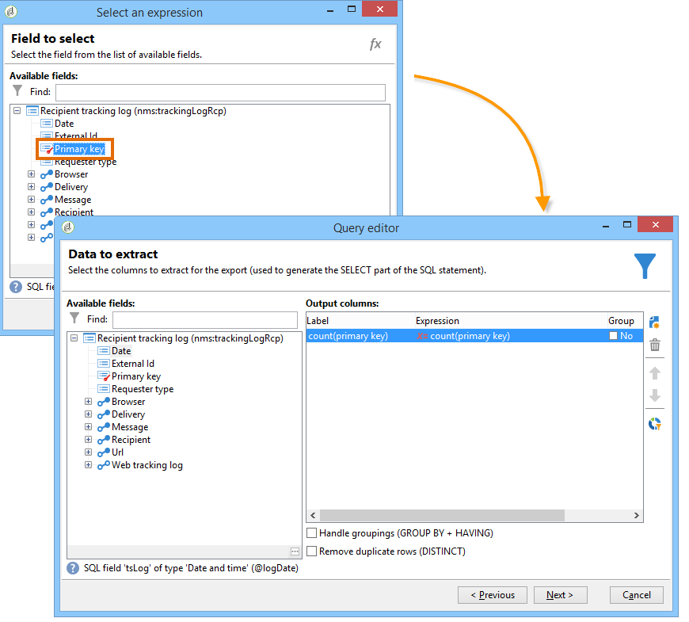

# Query delle informazioni di consegna {#querying-delivery-information}

## Numero di clic per una consegna specifica {#number-of-clicks-for-a-specific-delivery}

In questo esempio, stiamo cercando di recuperare il numero di clic per una consegna specifica. Questi clic vengono registrati grazie ai registri di monitoraggio dei destinatari registrati in un determinato periodo. Il destinatario viene identificato tramite il proprio indirizzo e-mail. Questa query utilizza la tabella **[!UICONTROL Recipient tracking logs]**.

* Quale tabella deve essere selezionata?

   Tabella di tracciamento del registro destinatari (**[!UICONTROL nms:trackingLogRcp]**)

* Campi da selezionare per le colonne di output?

   Chiave primaria (con conteggio) e E-mail

* Su quali criteri verranno filtrate le informazioni?

   Un periodo specifico e un elemento dell&#39;etichetta di consegna

Per eseguire questo esempio, eseguire i seguenti passaggi:

1. Aprire **[!UICONTROL Generic query editor]** e selezionare lo schema **[!UICONTROL Recipient tracking logs]**.

   

1. Nella finestra **[!UICONTROL Data to extract]**, si desidera creare un aggregato per la raccolta delle informazioni. A tal fine, aggiungete la chiave primaria (situata sopra l&#39;elemento **[!UICONTROL Recipient tracking logs]** principale): Il conteggio dei log di tracciamento viene eseguito in questo campo **[!UICONTROL Primary key]**. L&#39;espressione modificata sarà **[!UICONTROL x=count(primary key)]**. Collega la somma dei vari registri di tracciamento a un unico indirizzo e-mail.

   Per eseguire questa operazione:

   * Fare clic sull&#39;icona **[!UICONTROL Add]** a destra del campo **[!UICONTROL Output columns]**. Nella finestra **[!UICONTROL Formula type]**, selezionare l&#39;opzione **[!UICONTROL Edit the formula using an expression]** e fare clic su **[!UICONTROL Next]**. Nella finestra **[!UICONTROL Field to select]**, fare clic su **[!UICONTROL Advanced selection]**.

      

   * Nella finestra **[!UICONTROL Formula type]**, eseguire un processo sulla funzione di aggregazione. Questo processo sarà un conteggio delle chiavi primarie.

      Selezionare **[!UICONTROL Process on an aggregate function]** nella sezione **[!UICONTROL Aggregate]** e fare clic su **[!UICONTROL Count]**.

      

      Fai clic su **[!UICONTROL Next]**.

   * Selezionare il campo **[!UICONTROL Primary key (@id)]**. La colonna di output **[!UICONTROL count (primary key)]** è configurata.

      

1. Selezionare l&#39;altro campo da visualizzare nella colonna di output. Nella colonna **[!UICONTROL Available fields]**, aprire il nodo **[!UICONTROL Recipient]** e scegliere **[!UICONTROL Email]**. Selezionare la casella **[!UICONTROL Group]** su **[!UICONTROL Yes]** per raggruppare i registri di tracciamento per indirizzo e-mail: questo gruppo collega ogni registro al destinatario.

   

1. Configura l’ordinamento delle colonne in modo che vengano visualizzati per primi i destinatari più attivi (con il maggior numero di registri di tracciamento). Selezionare **[!UICONTROL Yes]** nella colonna **[!UICONTROL Descending sort]**.

   

1. Devi quindi filtrare i registri che ti interessano, vale a dire quelli che hanno meno di 2 settimane e che riguardano le consegne relative alle vendite.

   Per eseguire questa operazione:

   * Configurare il filtraggio dei dati. A questo scopo, selezionare **[!UICONTROL Filter conditions]**, quindi fare clic su **[!UICONTROL Next]**.

      

   * Recupero dei registri di monitoraggio in un determinato periodo per una consegna specifica. Sono necessarie tre condizioni di filtraggio: due condizioni di data per impostare il periodo di ricerca tra due settimane prima della data corrente e il giorno prima della data corrente; e un&#39;altra condizione per limitare la ricerca a una consegna specifica.

      Nella finestra **[!UICONTROL Target element]**, configura la data a partire dalla quale verranno presi in considerazione i registri di tracciamento. Fai clic su **[!UICONTROL Add]**. Viene visualizzata una linea di condizione. Modificare la colonna **[!UICONTROL Expression]** facendo clic sulla funzione **[!UICONTROL Edit expression]**. Nella finestra **[!UICONTROL Field to select]**, scegliere **[!UICONTROL Date (@logDate)]**.

      

      Selezionare l&#39;operatore **[!UICONTROL greater than]**. Nella colonna **[!UICONTROL Value]** fare clic su **[!UICONTROL Edit expression]**, quindi nella finestra **[!UICONTROL Formula type]** selezionare **[!UICONTROL Process on dates]**. Infine, in **[!UICONTROL Current date minus n days]**, immettere &quot;15&quot;.

      Fai clic su **[!UICONTROL Finish]**.

      

   * Per selezionare la data di fine della ricerca nel registro di tracciamento, create una seconda condizione facendo clic su **[!UICONTROL Add]**. Nella colonna **[!UICONTROL Expression]**, scegliere di nuovo **[!UICONTROL Date (@logDate)]**.

      Selezionare l&#39;operatore **[!UICONTROL less than]**. Nella colonna **[!UICONTROL Value]**, fare clic su **[!UICONTROL Edit expression]**. Per l&#39;elaborazione delle date, andate alla finestra **[!UICONTROL Formula type]**, immettete &quot;1&quot; in **[!UICONTROL Current date minus n days]**.

      Fai clic su **[!UICONTROL Finish]**.

      

      Ora vogliamo configurare la terza condizione del filtro, ovvero l&#39;etichetta di consegna che la nostra query solleva.

   * Fare clic sulla funzione **[!UICONTROL Add]** per creare un&#39;altra condizione di filtro. Nella colonna **[!UICONTROL Expression]**, fare clic su **[!UICONTROL Edit expression]**. Nella finestra **[!UICONTROL Field to select]**, scegliere **[!UICONTROL Label]** nel nodo **[!UICONTROL Delivery]**.

      Fai clic su **[!UICONTROL Finish]**.

      

      Cercare una consegna contenente la parola &quot;sales&quot;. Poiché non si ricorda l&#39;etichetta esatta, è possibile scegliere l&#39;operatore **[!UICONTROL contains]** e immettere &quot;sales&quot; nella colonna **[!UICONTROL Value]**.

      

1. Fare clic su **[!UICONTROL Next]** fino a raggiungere la finestra **[!UICONTROL Data preview]**: qui non è necessaria alcuna formattazione.
1. Nella finestra **[!UICONTROL Data preview]**, fai clic su **[!UICONTROL Start the preview of the data]** per visualizzare il numero di registri di monitoraggio per ciascun destinatario della consegna.

   Il risultato viene visualizzato in ordine decrescente.

   

   Il numero massimo di registri per un utente è 6 per questa consegna. 5 diversi utenti hanno aperto il messaggio e-mail di consegna o hanno fatto clic su uno dei collegamenti presenti nell’e-mail.

## Destinatari che non hanno aperto alcuna consegna {#recipients-who-did-not-open-any-delivery}

In questo esempio, vogliamo filtrare i destinatari che non hanno aperto un messaggio e-mail negli ultimi 7 giorni.

Per creare questo esempio, procedere come segue:

1. Trascinate e rilasciate un&#39;attività **[!UICONTROL Query]** in un flusso di lavoro e aprite l&#39;attività.
1. Fare clic su **[!UICONTROL Edit query]** e impostare le dimensioni di destinazione e filtro su **[!UICONTROL Recipients]**.

   

1. Selezionare **[!UICONTROL Filtering conditions]**, quindi fare clic su **[!UICONTROL Next]**.
1. Fare clic sul pulsante **[!UICONTROL Add]** e selezionare **[!UICONTROL Tracking logs]**.
1. Impostare l&#39;espressione **[!UICONTROL Operator]** dell&#39;espressione **[!UICONTROL Tracking logs]** su **[!UICONTROL Do not exist such as]**.

   

1. Aggiungete un&#39;altra espressione. Selezionare **[!UICONTROL Type]** nella categoria **[!UICONTROL URL]**.
1. Quindi, impostare **[!UICONTROL Operator]** su **[!UICONTROL equal to]** e **[!UICONTROL Value]** su **[!UICONTROL Open]**.

   

1. Aggiungere un&#39;altra espressione e selezionare **[!UICONTROL Date]**. **[!UICONTROL Operator]** deve essere impostato su  **[!UICONTROL on or after]**.

   

1. Per impostare il valore degli ultimi 7 giorni, fare clic sul pulsante **[!UICONTROL Edit expression]** nel campo **[!UICONTROL Value]**.
1. Nella categoria **[!UICONTROL Function]**, selezionare **[!UICONTROL Current date minus n days]** e aggiungere il numero di giorni di destinazione. Qui vogliamo concentrarci sugli ultimi 7 giorni.

   

La transizione in uscita conterrà i destinatari che non hanno aperto un messaggio e-mail negli ultimi 7 giorni.

Se invece si desidera filtrare i destinatari che hanno aperto almeno un messaggio e-mail, la query deve essere la seguente. Si prega di notare che, in questo caso, il **[!UICONTROL Filtering dimension]** deve essere impostato su **[!UICONTROL Tracking logs (Recipients)]**.

## Destinatari che hanno aperto una consegna {#recipients-who-have-opened-a-delivery}

L&#39;esempio seguente mostra come eseguire il targeting dei profili che hanno aperto una consegna nelle ultime 2 settimane:

1. Per eseguire il targeting dei profili che hanno aperto una consegna, è necessario utilizzare i registri di tracciamento. sono memorizzati in una tabella collegata: per iniziare, seleziona questa tabella nell&#39;elenco a discesa del campo **[!UICONTROL Filtering dimension]**, come mostrato di seguito:

   

1. Per quanto riguarda le condizioni di filtraggio, fate clic sull&#39;icona **[!UICONTROL Edit expression]** dei criteri mostrati nella struttura ad albero secondaria dei registri di tracciamento. Selezionare il campo **[!UICONTROL Date]**.

   

   Fare clic su **[!UICONTROL Finish]** per confermare la selezione.

   Per recuperare solo i registri di monitoraggio di meno di due settimane, selezionare l&#39;operatore **[!UICONTROL Greater than]**.

   

   Fare clic sull&#39;icona **[!UICONTROL Edit expression]** nella colonna **[!UICONTROL Value]** per definire la formula di calcolo da applicare. Selezionare la formula **[!UICONTROL Current date minus n days]** e immettere 15 nel campo correlato.

   

   Fare clic sul pulsante **[!UICONTROL Finish]** della finestra della formula. Nella finestra di filtro, fate clic sulla scheda **[!UICONTROL Preview]** per controllare i criteri di targeting.

   

## Filtrare il comportamento dei destinatari dopo una consegna {#filtering-recipients--behavior-folllowing-a-delivery}

In un flusso di lavoro, le caselle **[!UICONTROL Query]** e **[!UICONTROL Split]** consentono di selezionare un comportamento dopo una consegna precedente. Questa selezione viene eseguita tramite il filtro **[!UICONTROL Delivery recipient]**.

* Obiettivo dell&#39;esempio

   In un flusso di lavoro di distribuzione, esistono diversi modi per monitorare una prima comunicazione e-mail. Questo tipo di operazione prevede l&#39;utilizzo della casella **[!UICONTROL Split]**.

* Contesto

   Viene inviata una consegna &quot;Offerta sportiva estiva&quot;. Quattro giorni dopo la consegna, vengono inviate altre due consegne. Uno di questi è &quot;offerta di sport acquatici&quot;, l&#39;altro è un seguito alla prima &quot;offerta sportiva estiva&quot; consegna.

   La consegna &quot;Offerta Sport acquatici&quot; viene inviata ai destinatari che hanno fatto clic sul collegamento &quot;Sport acquatici&quot; nella prima consegna. Questi clic mostrano che il destinatario è interessato all&#39;argomento. Ha senso indirizzarli verso offerte simili. Tuttavia, i destinatari che non hanno cliccato nell&#39;&quot;offerta sportiva estiva&quot; riceveranno di nuovo lo stesso contenuto.

Nei passaggi seguenti viene illustrato come configurare la casella **[!UICONTROL Split]** integrando due diversi comportamenti:

1. Inserire la casella **[!UICONTROL Split]** nel flusso di lavoro. Questa casella consente di suddividere i destinatari della prima consegna nelle due consegne successive. La suddivisione si verifica in base alle condizioni di filtraggio collegate al comportamento del destinatario durante la prima consegna.

   

1. Aprire la casella **[!UICONTROL Split]**. Nella scheda **[!UICONTROL General]**, immettere un&#39;etichetta: **Dividi in base al comportamento**, ad esempio.

   

1. Nella scheda **[!UICONTROL Subsets]**, definire il primo ramo suddiviso. Ad esempio, immettere l&#39;etichetta **Clic** per il ramo.
1. Selezionare l&#39;opzione **[!UICONTROL Add a filtering condition on the incoming population]**. Fai clic su **[!UICONTROL Edit]**.
1. Nella finestra **[!UICONTROL Targeting and filtering dimension]**, fare doppio clic sul filtro **[!UICONTROL Recipients of a delivery]**.

   

1. Nella finestra **[!UICONTROL Target element]**, selezionare il comportamento che si desidera applicare a questo ramo: **[!UICONTROL Recipients having clicked (email)]**.

   Sotto, selezionate l&#39;opzione **[!UICONTROL Delivery specified by the transition]**. Questa funzionalità recupererà automaticamente le persone di destinazione durante la prima consegna.

   Questa è la consegna &quot;Offerta Sport acquatici&quot;.

   

1. Definire il secondo ramo. Questo ramo includerà l&#39;e-mail di follow-up con lo stesso contenuto del primo invio. Passate alla scheda **[!UICONTROL Subsets]** e fate clic su **[!UICONTROL Add]** per crearla.

   

1. Viene visualizzata un&#39;altra sottoscheda. Denominarlo &quot;**Non è stato fatto clic**&quot;.
1. Fai clic su **[!UICONTROL Add a filtering condition for the incoming population]**. Quindi fai clic su **[!UICONTROL Edit...]**.

   

1. Fare clic su **[!UICONTROL Delivery recipients]** nella finestra **[!UICONTROL Targeting and filtering dimension]**.
1. Nella finestra **[!UICONTROL Target element]**, selezionare il comportamento **[!UICONTROL Recipients who did not click (email)]**. Selezionate l&#39;opzione **[!UICONTROL Delivery specified by the transition]** come mostrato per l&#39;ultimo ramo.

   La casella **[!UICONTROL Split]** è ora completamente configurata.

   

Di seguito è riportato l’elenco dei vari componenti configurati per impostazione predefinita:

* **[!UICONTROL All recipients]**
* **[!UICONTROL Recipients of successfully sent messages,]**
* **[!UICONTROL Recipients who opened or clicked (email),]**
* **[!UICONTROL Recipients who clicked (email),]**
* **[!UICONTROL Recipients of a failed message,]**
* **[!UICONTROL Recipients who didn't open or click (email),]**
* **[!UICONTROL Recipients who didn't click (email).]**

   
