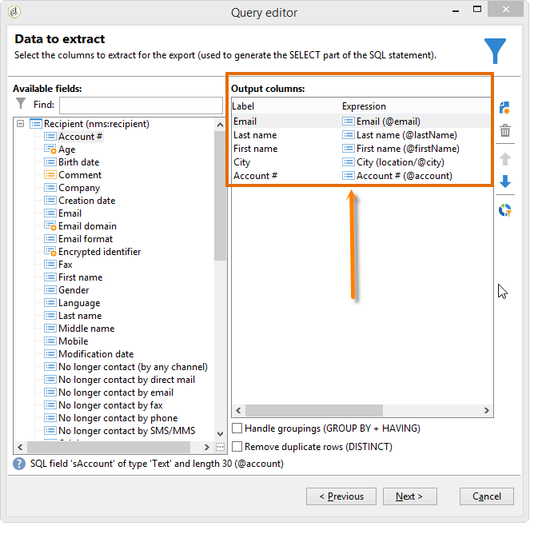
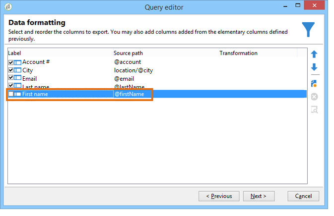

# Query della tabella dei destinatari {#querying-recipient-table}

In questo esempio, vogliamo recuperare i nomi e le e-mail dei destinatari il cui dominio e-mail è &quot;orange.co.uk&quot; e che non vivono a Londra.

* Quale tabella selezionare?

   Tabella destinatari (nms:destinatario)

* Campi da selezionare come colonne di output

   Indirizzo e-mail, nome, città e numero account

* Quali sono le condizioni di filtraggio dei destinatari?

   dominio città e indirizzo e-mail

* È configurato un ordinamento?

   Sì, in base a **[!UICONTROL Account number]** e **[!UICONTROL Last name]**

Per creare questo esempio, procedere come segue:

1. Fate clic su **[!UICONTROL Tools > Generic query editor...]** e scegliete la tabella **Destinatari** (**mms:destinatario**). Quindi fai clic su **[!UICONTROL Next]**.
1. Scegliete: **[!UICONTROL Last name]**, **[!UICONTROL First name]**, **[!UICONTROL Email]**, **[!UICONTROL City]** e **[!UICONTROL Account number]**. Questi campi vengono aggiunti a **[!UICONTROL Output columns]**. Quindi fai clic su **[!UICONTROL Next]**.

   

1. Ordinare le colonne per visualizzarle nell&#39;ordine corretto. Qui vogliamo ordinare i numeri dei conti in ordine decrescente e i nomi in ordine alfabetico. Quindi fai clic su **[!UICONTROL Next]**.

   

1. Nella **[!UICONTROL Data filtering]** finestra, perfezionate la ricerca: scegliete **[!UICONTROL Filtering conditions]** e fate clic su **[!UICONTROL Next]**.
1. La **[!UICONTROL Target element]** finestra consente di immettere le impostazioni del filtro.

   Definite la seguente condizione di filtro: destinatari con un dominio e-mail uguale a &quot;orange.co.uk&quot;. A questo scopo, scegliete il dominio **e-mail (@email)** nella **[!UICONTROL Expression]** colonna, scegliete **uguale a** nella **[!UICONTROL Operator]** colonna e immettete &quot;orange.co.uk&quot; nella **[!UICONTROL Value]** colonna.

   

1. Se necessario, fate clic sul **[!UICONTROL Distribution of values]** pulsante per visualizzare una distribuzione basata sul dominio e-mail dei potenziali clienti. È disponibile una percentuale per ciascun dominio e-mail nel database. I domini diversi da &quot;orange.co.uk&quot; vengono visualizzati fino a quando non viene applicato il filtro.

   Nella parte inferiore della finestra viene visualizzato un riepilogo della query: **Dominio e-mail uguale a &#39;orange.co.uk&#39;**.

1. Fate clic **[!UICONTROL Preview]** per ottenere un&#39;idea del risultato della query: vengono visualizzati solo i domini e-mail &quot;orange.co.uk&quot;.

   

1. Ora cambieremo la query per trovare i contatti che non vivono a Londra.

   Selezionare **[!UICONTROL City (location/@city)]** nella **[!UICONTROL Expression]** colonna, **[!UICONTROL different from]** come operatore e immettere **[!UICONTROL London]** nella **[!UICONTROL Value]** colonna.

   

1. Questo ti porterà alla **[!UICONTROL Data formatting]** finestra. Controllare l&#39;ordine delle colonne. Spostate la colonna &quot;Città&quot; verso l’alto sotto la colonna &quot;Numero conto&quot;.

   Deselezionare la colonna &quot;Nome&quot; per rimuoverla dall&#39;elenco.

   

1. In the **[!UICONTROL Data preview]** window, click **[!UICONTROL Start the preview of the data]**. Questa funzione calcola il risultato della query.

   La **[!UICONTROL Column results]** scheda mostra il risultato della query in colonne.

   Il risultato mostra tutti i destinatari con un dominio e-mail &quot;orange.co.uk&quot; che non vivono a Londra. La colonna &quot;Nome&quot; non viene visualizzata perché era deselezionata durante l’area di visualizzazione precedente. I numeri di conto sono ordinati in ordine decrescente.

   

   La **[!UICONTROL XML result]** scheda mostra il risultato in formato XML.

   

   La **[!UICONTROL Generated QSL queries]** scheda mostra il risultato della query in formato SQL.

   
