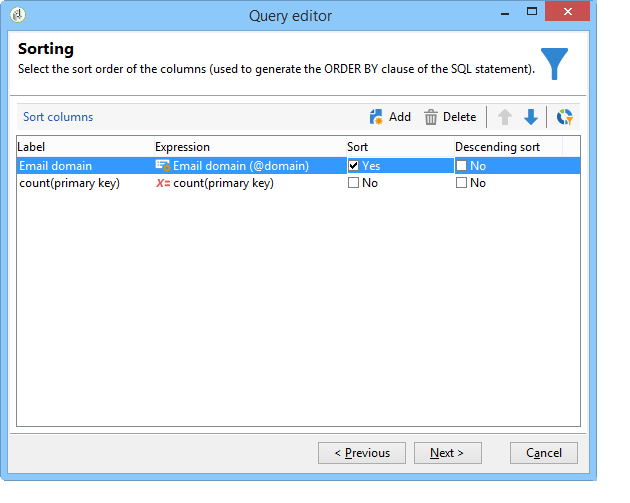

# Query tramite gestione dei raggruppamenti {#querying-using-grouping-management}

In questo esempio, vogliamo eseguire una query per trovare tutti i domini e-mail con targeting più di 30 volte durante le consegne precedenti.

* Quale tabella deve essere selezionata?

   Tabella destinatari (nms:destinatario)

* Campi da selezionare nelle colonne di output?

   Dominio e chiave primaria e di posta elettronica (con conteggio)

* Raggruppamento dati?

   Basato sul dominio e-mail con un numero di chiavi primarie superiore a 30. Questa operazione viene eseguita con l&#39; **[!UICONTROL Group by + Having]** opzione. **[!UICONTROL Group by + Having]** consente di raggruppare i dati (&quot;raggruppare per&quot;) e di selezionare il gruppo (&quot;avere&quot;).

Per creare questo esempio, procedere come segue:

1. Apri la tabella **[!UICONTROL Generic query editor]** e scegli la tabella Destinatario (**nms:destinatario**).

   

1. Nella **[!UICONTROL Data to extract]** finestra, selezionare i **[!UICONTROL Email domain]** campi e **[!UICONTROL Primary key]** . Eseguire un conteggio sul **[!UICONTROL Primary key]** campo.

   Per ulteriori informazioni sui conteggi delle chiavi primarie, consulta [questa sezione](../../platform/using/defining-filter-conditions.md#building-expressions).

1. Controlla la **[!UICONTROL Handle groupings (GROUP BY + HAVING)]** casella.

   

1. Nella **[!UICONTROL Sorting]** finestra, ordinate i domini e-mail in ordine decrescente. Per eseguire questa operazione, selezionare **[!UICONTROL Yes]** la **[!UICONTROL Descending sort]** colonna. Fai clic su **[!UICONTROL Next]**.

   

1. In **[!UICONTROL Data filtering]**, seleziona **[!UICONTROL Filtering conditions]**. Vai alla **[!UICONTROL Target elements]** finestra e fai clic su **[!UICONTROL Next]**.
1. Nella **[!UICONTROL Data grouping]** finestra, selezionare l&#39; **[!UICONTROL Email domain]** oggetto facendo clic su **[!UICONTROL Add]**.

   Questa finestra di raggruppamento dei dati viene visualizzata solo se la casella **[!UICONTROL Handle groupings (GROUP BY + HAVING]**) è stata selezionata.

   

1. Nella **[!UICONTROL Grouping condition]** finestra, indicate un numero di chiavi primarie superiore a 30, in quanto desideriamo che vengano restituiti come risultati solo i domini e-mail con targeting superiore a 30 volte.

   Questa finestra viene visualizzata quando la **[!UICONTROL Manage groupings (GROUP BY + HAVING)]** casella è stata selezionata: in questo caso il risultato del raggruppamento viene filtrato (HAVING).

   

1. Nella **[!UICONTROL Data formatting]** finestra, fate clic su **[!UICONTROL Next]**: qui non è necessaria alcuna formattazione.
1. Nella finestra di anteprima dei dati, fai clic su **[!UICONTROL Launch data preview]**: qui vengono restituiti tre diversi domini e-mail con targeting superiore a 30 volte.

   
