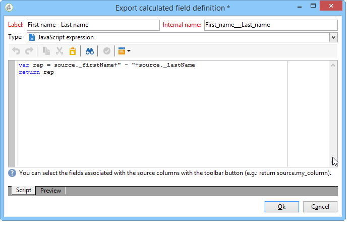

# Query mediante una relazione molti-a-molti {#querying-using-a-many-to-many-relationship}

In questo esempio, vogliamo recuperare i destinatari non contattati negli ultimi 7 giorni. Questa query riguarda tutte le consegne.

Questo esempio mostra anche come configurare un filtro correlato alla scelta di un elemento raccolta (o nodo arancione). Gli elementi della raccolta sono disponibili nella **[!UICONTROL Field to select]** finestra.

* Quale tabella deve essere selezionata?

   Tabella destinatari (**nms:destinatario**)

* Campi da selezionare per la colonna di output

   Chiave primaria, Cognome, Nome e E-mail

* In base a quali criteri vengono filtrate le informazioni

   In base ai registri di consegna dei destinatari che risalgono a 7 giorni prima di oggi

Effettuate le seguenti operazioni:

1. Aprite l’editor di query generico e selezionate la tabella Destinatario **[!UICONTROL (nms:recipient)]**.
1. Nella **[!UICONTROL Data to extract]** finestra selezionare **[!UICONTROL Primary key]**, **[!UICONTROL First name]**, **[!UICONTROL Last name]** e **[!UICONTROL Email]**.

   

1. Nella finestra di ordinamento, ordinate i nomi in ordine alfabetico.

   

1. In the **[!UICONTROL Data filtering]** window, select **[!UICONTROL Filtering conditions]**.
1. Nella **[!UICONTROL Target element]** finestra, la condizione di filtro per l’estrazione di profili senza registro di tracciamento per gli ultimi 7 giorni prevede due passaggi. L’elemento da selezionare è un collegamento molti-molti.

   * Per iniziare, selezionate l&#39;elemento **[!UICONTROL Recipient delivery logs (broadlog)]** raccolta (nodo arancione) per la prima **[!UICONTROL Value]** colonna.

      

      Scegliere l&#39; **[!UICONTROL do not exist as]** operatore. Non è necessario selezionare un secondo valore in questa riga.

   * Il contenuto della seconda condizione di filtro dipende dalla prima. Qui, il **[!UICONTROL Event date]** campo è offerto direttamente nella **[!UICONTROL Recipient delivery logs]** tabella, poiché è presente un collegamento a questa tabella.

      

      Selezionare **[!UICONTROL Event date]** con l&#39; **[!UICONTROL greater than or equal to]** operatore. Selezionare il **[!UICONTROL DaysAgo (7)]** valore. A tale scopo, fare clic **[!UICONTROL Edit expression]** nel **[!UICONTROL Value]** campo. Nella **[!UICONTROL Formula type]** finestra, selezionare **[!UICONTROL Process on dates]** e **[!UICONTROL Current date minus n days]**, dando &quot;7&quot; come valore.

      

      La condizione del filtro è configurata.

      

1. Nella **[!UICONTROL Data formatting]** finestra, passate i cognomi in maiuscolo. Fate clic sulla **[!UICONTROL Last name]** riga nella **[!UICONTROL Transformation]** colonna e selezionate **[!UICONTROL Switch to upper case]** nel menu a discesa.

   

1. Utilizzare la **[!UICONTROL Add a calculated field]** funzione per inserire una colonna nella finestra di anteprima dei dati.

   In questo esempio, aggiungere un campo calcolato con i nomi e i cognomi dei destinatari in un&#39;unica colonna. Fare clic sulla **[!UICONTROL Add a calculated field]** funzione. Nella **[!UICONTROL Export calculated field definition]** finestra, immettete un’etichetta e un nome interno e scegliete il **[!UICONTROL JavaScript Expression]** tipo. Quindi immettete la seguente espressione:

   ```
   var rep = source._firstName+" - "+source._lastName
   return rep
   ```

   

   Fai clic su **[!UICONTROL OK]**. La **[!UICONTROL Data formatting]** finestra è configurata.

   Per ulteriori informazioni sull&#39;aggiunta di campi calcolati, consultare questa sezione.

1. Il risultato viene visualizzato nella **[!UICONTROL Data preview]** finestra. I destinatari che non sono stati contattati negli ultimi 7 giorni vengono visualizzati in ordine alfabetico. I nomi vengono visualizzati in lettere maiuscole e la colonna con il nome e il cognome è stata creata.

   
