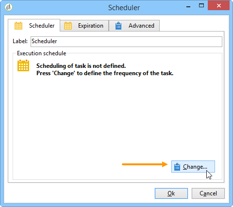
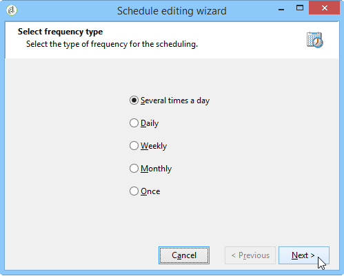
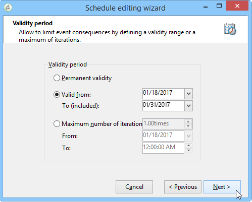

# Modulo di pianificazione {#scheduler}

L&#39;**Utilità di pianificazione** è un&#39;attività persistente che attiva la relativa transizione nei momenti specificati dalla pianificazione.

Dovresti considerare l’attività **[!UICONTROL Scheduler]** come un inizio pianificato. Le regole di posizionamento dell’attività all’interno del grafico sono le stesse dell’attività **[!UICONTROL Start]**. Questa attività non deve avere una transizione in entrata.

## Best practice {#best-practices}

* Non pianificare l’esecuzione di un flusso di lavoro con una frequenza superiore a 15 minuti, in quanto ciò potrebbe ostacolare le prestazioni complessive del sistema e creare blocchi nel database.

* Non utilizzare mai più di un&#39;attività **[!UICONTROL Scheduler]** per ramo in un flusso di lavoro. Vedi [Utilizzo delle attività](workflow-best-practices.md#using-activities).

* L’utilizzo di un’attività di pianificazione può comportare l’esecuzione simultanea di più esecuzioni di un flusso di lavoro. Ad esempio, puoi fare in modo che una pianificazione attivi l’esecuzione del flusso di lavoro ogni ora, ma a volte l’esecuzione dell’intero flusso di lavoro richiede più di un’ora.

  Potrebbe essere necessario saltare l’esecuzione se il flusso di lavoro è già in esecuzione. Per ulteriori informazioni su come impedire l&#39;esecuzione simultanea di un flusso di lavoro, fare riferimento a [questa pagina](monitoring-workflow-execution.md#preventing-simultaneous-multiple-executions).

* Si noti che la transizione può essere attivata diverse ore dopo se il flusso di lavoro eseguiva un&#39;attività a lungo termine, ad esempio un&#39;importazione, oppure se il modulo wfserver è stato interrotto per un certo periodo di tempo. In questo caso, potrebbe essere necessario limitare l&#39;esecuzione dell&#39;operazione attivata dal modulo di pianificazione a un determinato intervallo di tempo.

## Configurazione dell’attività Scheduler {#configuring-scheduler-activity}

Il modulo di pianificazione definisce la pianificazione di attivazione della transizione. Per configurarlo, fare doppio clic sull&#39;oggetto grafico, quindi fare clic su **[!UICONTROL Change...]**

Un assistente ti consente di definire la frequenza e il periodo di validità dell’attività. I passaggi di configurazione sono i seguenti:

1. Selezionare la frequenza di attivazione e fare clic su **[!UICONTROL Next]**.

   

1. Assegna ore e giorni di attivazione. I parametri per questo passaggio dipendono dalla frequenza selezionata nel passaggio precedente. Se scegli di avviare l’attività più volte al giorno, le opzioni di configurazione saranno le seguenti:

   

1. Definisci il periodo di validità della pianificazione o specifica quante volte verrà eseguita.

   

1. Controllare la configurazione e fare clic su **[!UICONTROL Finish]** per salvare.

   
