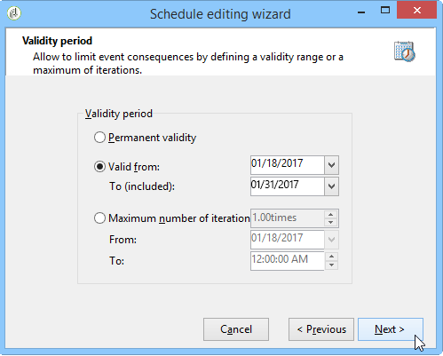

# Scheduler {#scheduler}

L&#39; **utilità** di pianificazione è un&#39;attività persistente che attiva la transizione nei momenti specificati dalla pianificazione.

Dovresti considerare l’attività **[!UICONTROL Scheduler]** come un inizio pianificato. Le regole di posizionamento dell’attività all’interno del grafico sono le stesse dell’attività **[!UICONTROL Start]**. Questa attività non deve avere una transizione in entrata.

## Best practice {#best-practices}

* Non pianificare l&#39;esecuzione di un flusso di lavoro per più di 15 minuti, in quanto potrebbe impedire le prestazioni complessive del sistema e creare blocchi nel database.

* Non utilizzare mai più **[!UICONTROL Scheduler]** attività per ramo in un flusso di lavoro. Consultate [Utilizzo delle attività](../../workflow/using/workflow-best-practices.md#using-activities).

* L&#39;utilizzo di un&#39;attività del pianificatore potrebbe causare l&#39;esecuzione simultanea di diverse esecuzioni di un flusso di lavoro. Ad esempio, è possibile avere un pianificatore che attiva l&#39;esecuzione del flusso di lavoro ogni ora, ma a volte l&#39;esecuzione dell&#39;intero flusso di lavoro richiede più di un&#39;ora.

   È possibile saltare l&#39;esecuzione se il flusso di lavoro è già in esecuzione. Per ulteriori informazioni su come impedire l&#39;esecuzione simultanea di un flusso di lavoro, vedere [questa pagina](../../workflow/using/monitoring-workflow-execution.md#preventing-simultaneous-multiple-executions).

* La transizione può essere attivata diverse ore dopo se il flusso di lavoro esegue un&#39;attività a lungo termine, ad esempio un&#39;importazione, o se il modulo wfserver è stato arrestato per un periodo di tempo. In questo caso, potrebbe essere necessario limitare l&#39;esecuzione dell&#39;attività attivata dal pianificatore a un determinato intervallo di tempo.

## Configurazione dell&#39;attività dell&#39;Utilità di pianificazione {#configuring-scheduler-activity}

Il pianificatore definisce la pianificazione di attivazione della transizione. Per configurarlo, fare doppio clic sull&#39;oggetto grafico, quindi fare clic su **[!UICONTROL Change...]**

Una procedura guidata consente di definire la frequenza e il periodo di validità dell&#39;attività. I passaggi di configurazione sono i seguenti:

1. Selezionate la frequenza di attivazione e fate clic su **[!UICONTROL Next]**.

   

1. Indicate i tempi e i giorni di attivazione. I parametri di questo passaggio dipendono dalla frequenza selezionata nel passaggio precedente. Se scegliete di avviare l&#39;attività più volte al giorno, le opzioni di configurazione saranno le seguenti:

   

1. Definire il periodo di validità della pianificazione o specificare quante volte verrà eseguita.

   

1. Controllare la configurazione e fare clic **[!UICONTROL Finish]** per salvarla.

   
