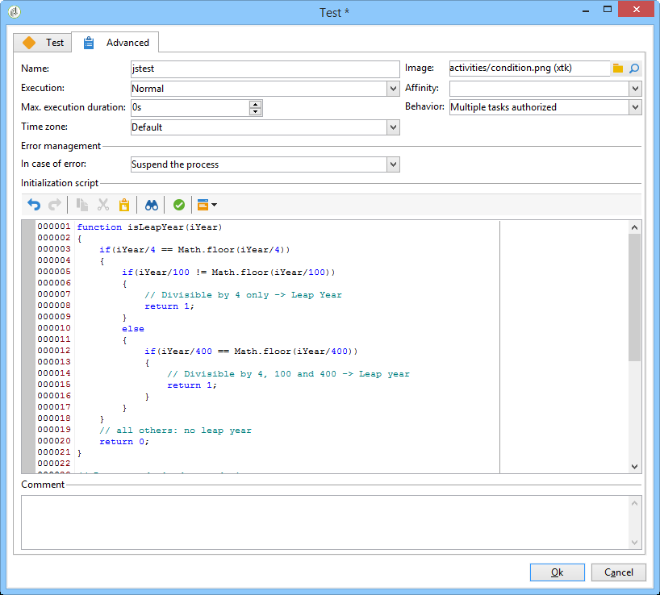

# Invio di un’e-mail di compleanno{#sending-a-birthday-email}

## Introduzione {#introduction}

Questo caso d’uso illustra come pianificare l’invio periodico di un’e-mail a un elenco di destinatari il giorno del loro compleanno.

Per impostare questo caso di utilizzo, abbiamo creato il seguente flusso di lavoro di targeting:


Questo flusso di lavoro (esecuzione giornaliera) seleziona tutti i destinatari la cui data di nascita è la data corrente.

 Questo caso di utilizzo si trova anche sotto forma di video. For more on this, refer to the [Creating a workflow](https://docs.adobe.com/content/help/en/campaign-classic-learn/tutorials/automating-with-workflows/creating-a-workflow.html) video.

A questo scopo, create una campagna e fate clic sulla **[!UICONTROL Targeting and workflows]** scheda. Per ulteriori informazioni, vedere [Creazione della destinazione principale in una sezione del flusso di lavoro](../../campaign/using/marketing-campaign-deliveries.md#building-the-main-target-in-a-workflow) .

Effettuate quindi le seguenti operazioni:

## Pianificazione dell&#39;invio {#configuring-the-scheduler}

1. Innanzitutto, aggiungete un **pianificatore** per attivare l&#39;invio giornaliero. Nell&#39;esempio seguente, la consegna viene creata ogni giorno alle 6 del mattino.

   


## Identificazione dei destinatari il cui compleanno è {#identifying-recipients-whose-birthday-it-is}

Dopo aver configurato l&#39; **[!UICONTROL Scheduler]** attività in modo che il flusso di lavoro inizi ogni giorno, identificate tutti i destinatari la cui data di nascita è uguale alla data corrente.

A questo scopo, eseguire i seguenti passaggi:

1. Trascinate e rilasciate un&#39; **[!UICONTROL Query]** attività nel flusso di lavoro e fate doppio clic su di essa.
1. Fate clic sul collegamento **Modifica query** e selezionate **[!UICONTROL Filtering conditions]**.

   

1. Fate clic sulla prima cella della **[!UICONTROL Expression]** colonna e fate clic **[!UICONTROL Edit expression]** per aprire l&#39;editor di espressioni.

   

1. Fate clic **[!UICONTROL Advanced selection]** per selezionare la modalità di filtro.

   

1. Selezionare **[!UICONTROL Edit the formula using an expression]** e fare clic **[!UICONTROL Next]** per visualizzare l&#39;editor di espressioni.
1. Nell&#39;elenco delle funzioni, fare doppio clic **[!UICONTROL Day]**, accessibile tramite il **[!UICONTROL Date]** nodo. Questa funzione restituisce il numero che rappresenta il giorno corrispondente alla data passata come parametro.

   

1. Nell’elenco dei campi disponibili, fate doppio clic **[!UICONTROL Birth date]**. Nella sezione superiore dell&#39;editor viene visualizzata la seguente formula:

   ```
   Day(@birthDate)
   ```

   Fate clic **[!UICONTROL Finish]** per confermare.

1. Nell&#39;editor di query, selezionare la prima cella della **[!UICONTROL Operator]** colonna nella prima cella **[!UICONTROL equal to]**.

   

1. Quindi, fare clic sulla prima cella della seconda colonna (**[!UICONTROL Value]**), quindi fare clic **[!UICONTROL Edit expression]** per aprire l&#39;editor di espressioni.
1. Nell&#39;elenco delle funzioni, fare doppio clic **[!UICONTROL Day]**, accessibile tramite il **[!UICONTROL Date]** nodo.
1. Fare doppio clic sulla **[!UICONTROL GetDate]** funzione per recuperare la data corrente.

   

   Nella sezione superiore dell&#39;editor viene visualizzata la seguente formula:

   ```
   Day(GetDate())
   ```

   Fate clic **[!UICONTROL Finish]** per confermare.

1. Ripetete questa procedura per recuperare il mese di nascita corrispondente al mese corrente. A tale scopo, fare clic sul **[!UICONTROL Add]** pulsante e ripetere i passaggi da 3 a 10, sostituendoli **[!UICONTROL Day]** con **[!UICONTROL Month]**.

   La query completa è la seguente:

   

Collegate il risultato dell&#39; **[!UICONTROL Query]** attività a un&#39; **[!UICONTROL Email delivery]** attività per inviare un&#39;e-mail all&#39;elenco di tutti i destinatari alla data del loro compleanno.

## Inclusi i destinatari nati il 29 febbraio (facoltativo) {#including-recipients-born-on-february-29th--optional-}

Se si desidera includere tutti i destinatari nati il 29 febbraio, questo caso d&#39;uso illustra come pianificare l&#39;invio periodico di un&#39;e-mail a un elenco di destinatari per il loro compleanno, che si tratti o meno di un anno bisestile.

Le fasi di implementazione principali per questo caso di utilizzo sono:

* Selezione dei destinatari
* Selezione se si tratta o meno di un anno bisestile
* Selezione dei destinatari nati il 29 febbraio

Per impostare questo caso di utilizzo, abbiamo creato il seguente flusso di lavoro di targeting:


Se l&#39;anno in corso non **è un anno** bisestile e il flusso di lavoro è in esecuzione il 1 marzo, dobbiamo selezionare tutti i destinatari che avrebbero avuto il loro compleanno ieri (29 febbraio) e aggiungerli all&#39;elenco dei destinatari. In ogni altro caso non è richiesta alcuna azione aggiuntiva.

### Passaggio 1: Selezione dei destinatari {#step-1--selecting-the-recipients}

Dopo aver configurato l&#39; **[!UICONTROL Scheduler]** attività in modo che il flusso di lavoro inizi ogni giorno, identificate tutti i destinatari il cui anniversario è il giorno corrente.

>[!NOTE]
>
>Se l&#39;anno corrente è un anno bisestile, tutti i beneficiari nati il 29 febbraio vengono automaticamente inclusi.


La selezione dei destinatari il cui compleanno corrisponde alla data corrente viene presentata nella sezione [Identificare i destinatari il cui compleanno è](#identifying-recipients-whose-birthday-it-is) .

### Passaggio 2: Selezionare se si tratta o meno di un anno bisestile {#step-2--select-whether-or-not-it-is-a-leap-year}

L&#39; **[!UICONTROL Test]** attività consente di verificare se si tratta di un anno bisestile e se la data corrente è il 1 marzo.

Se il test viene verificato (l&#39;anno non è un anno bisestile - non c&#39;è il 29 febbraio - e la data corrente è effettivamente il 1 marzo), la **[!UICONTROL True]** transizione è abilitata e i destinatari nati il 29 febbraio saranno aggiunti alla consegna del 1 marzo. In caso contrario, la **[!UICONTROL False]** transizione viene abilitata e la consegna viene recapitata solo ai destinatari nati alla data corrente.

Copiate e incollate il codice riportato di seguito nella **[!UICONTROL Initialization script]** sezione della **[!UICONTROL Advanced]** scheda.

```
function isLeapYear(iYear)
{
    if(iYear/4 == Math.floor(iYear/4))
    {
        if(iYear/100 != Math.floor(iYear/100))
        {
            // Divisible by 4 only -> Leap Year
            return 1;
        }
        else
        {
            if(iYear/400 == Math.floor(iYear/400))
            {
                // Divisible by 4, 100 and 400 -> Leap year
                return 1;
            }
        }
    }
    // all others: no leap year
    return 0;
}

// Return today's date and time
var currentTime = new Date()
// returns the month (from 0 to 11)
var month = currentTime.getMonth() + 1
// returns the day of the month (from 1 to 31)
var day = currentTime.getDate()
// returns the year (four digits)
var year = currentTime.getFullYear()

// is current year a leap year?
vars.currentIsALeapYear = isLeapYear(year);

// is current date the first of march?
if(month == 3 && day == 1) {
  // today is 1st of march
vars.firstOfMarch = 1;
}
```



Aggiungi la seguente condizione nella **[!UICONTROL Conditional forks]** sezione:

```
vars.currentIsALeapYear == 0 && vars.firstOfMarch == 1
```


### Passaggio 3: Selezionare i destinatari nati il 29 febbraio {#step-3--select-any-recipients-born-on-february-29th}

Create un&#39; **[!UICONTROL Fork]** attività e collegate una delle transizioni in uscita a un&#39; **[!UICONTROL Query]** attività.

In questa query, selezionare tutti i destinatari la cui data di nascita è il 29 febbraio.


Combinate i risultati con un&#39; **[!UICONTROL Union]** attività.

Collegate i risultati dei due rami **[!UICONTROL Test]** attività a un&#39; **[!UICONTROL Email delivery]** attività per inviare un&#39;e-mail all&#39;elenco di tutti i destinatari il giorno del loro compleanno, anche a quelli nati il 29 febbraio durante un anno non bisestile.

## Creazione di una consegna ricorrente {#creating-a-recurring-delivery-in-a-targeting-workflow}

Aggiungi un&#39;attività di consegna **** ricorrente in base al modello e-mail di compleanno che desideri inviare.

>[!CAUTION]
>
>Affinché i flussi di lavoro possano essere eseguiti, è necessario avviare i flussi di lavoro tecnici relativi al processo della campagna. For more on this, refer to the [List of campaign process workflows](../../workflow/using/campaign.md) section.
>
>Se per la campagna sono abilitati i passaggi di approvazione, le consegne verranno inviate solo dopo che tali passaggi saranno stati confermati. Per ulteriori informazioni, vedere [Scelta dei processi da approvare](../../campaign/using/marketing-campaign-approval.md#choosing-the-processes-to-be-approved) .


