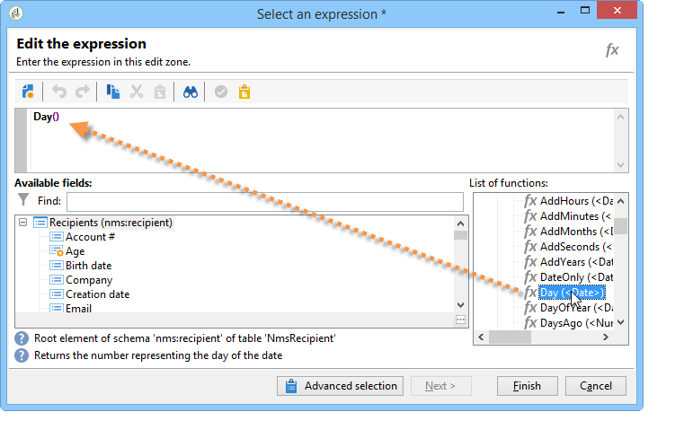

# Inviare un’e-mail di compleanno{#sending-a-birthday-email}


## Introduzione {#introduction}

Questo caso d’uso illustra come pianificare l’invio di un’e-mail ricorrente a un elenco di destinatari il giorno del loro compleanno.

Per impostare questo caso d’uso, abbiamo creato il seguente flusso di lavoro di targeting:


Questo flusso di lavoro (eseguito quotidianamente) seleziona tutti i destinatari il cui compleanno cade nella data corrente.

 Questo caso d’uso si può trovare anche sotto forma di video. Per ulteriori informazioni, consulta [Creazione di un flusso di lavoro](https://experienceleague.adobe.com/docs/campaign-classic-learn/tutorials/automating-with-workflows/creating-a-workflow.html) video.

A questo scopo, crea una campagna e fai clic sul pulsante **[!UICONTROL Targeting and workflows]** scheda. Per ulteriori informazioni, consulta [Creazione del target principale in un flusso di lavoro](../../campaign/using/marketing-campaign-deliveries.md#building-the-main-target-in-a-workflow) sezione.

Quindi segui questi passaggi:

## Pianificazione dell’invio {#configuring-the-scheduler}

1. Innanzitutto, aggiungi **Scheduler** per attivare l’invio della consegna ogni giorno. Nell’esempio seguente, la consegna viene creata ogni giorno alle 6.

   


## Identificazione dei destinatari del compleanno {#identifying-recipients-whose-birthday-it-is}

Dopo aver configurato **[!UICONTROL Scheduler]** in modo che il flusso di lavoro inizi ogni giorno, identifica tutti i destinatari la cui data di nascita è uguale alla data corrente.

A questo scopo, esegui i seguenti passaggi:

1. Trascina una **[!UICONTROL Query]** nel flusso di lavoro e fare doppio clic su di esso.
1. Fai clic su **Modifica query** collega e seleziona **[!UICONTROL Filtering conditions]**.

   

1. Fare clic sulla prima cella del **[!UICONTROL Expression]** e fai clic su **[!UICONTROL Edit expression]** per aprire l’editor di espressioni.

   

1. Clic **[!UICONTROL Advanced selection]** per selezionare la modalità di filtro.

   

1. Seleziona **[!UICONTROL Edit the formula using an expression]** e fai clic su **[!UICONTROL Next]** per visualizzare l’editor di espressioni.
1. Nell&#39;elenco delle funzioni, fare doppio clic su **[!UICONTROL Day]**, accessibile tramite **[!UICONTROL Date]** nodo. Questa funzione restituisce il numero che rappresenta il giorno corrispondente alla data passata come parametro.

   

1. Nell&#39;elenco dei campi disponibili fare doppio clic su **[!UICONTROL Birth date]**. La sezione superiore dell’editor visualizza quindi la seguente formula:

   ```
   Day(@birthDate)
   ```

   Fai clic su **[!UICONTROL Finish]** per confermare.

1. Nell’editor delle query, nella prima cella del **[!UICONTROL Operator]** colonna, seleziona **[!UICONTROL equal to]**.

   

1. Fare quindi clic sulla prima cella della seconda colonna (**[!UICONTROL Value]**) e fai clic su **[!UICONTROL Edit expression]** per aprire l’editor di espressioni.
1. Nell&#39;elenco delle funzioni, fare doppio clic su **[!UICONTROL Day]**, accessibile tramite **[!UICONTROL Date]** nodo.
1. Fai doppio clic su **[!UICONTROL GetDate]** per recuperare la data corrente.

   

   La sezione superiore dell’editor visualizza la seguente formula:

   ```
   Day(GetDate())
   ```

   Fai clic su **[!UICONTROL Finish]** per confermare.

1. Ripetere questa procedura per recuperare il mese di nascita corrispondente al mese corrente. A questo scopo, fai clic su **[!UICONTROL Add]** e ripetere i passaggi da 3 a 10, sostituendo **[!UICONTROL Day]** con **[!UICONTROL Month]**.

   La query completa è la seguente:

   

Collega il risultato della **[!UICONTROL Query]** attività a un **[!UICONTROL Email delivery]** per inviare un’e-mail all’elenco di tutti i destinatari il giorno del loro compleanno.

## Inclusione di destinatari nati il 29 febbraio (facoltativo) {#including-recipients-born-on-february-29th--optional-}

Se desideri includere tutti i destinatari nati il 29 febbraio, questo caso d’uso illustra come pianificare l’invio di un’e-mail ricorrente a un elenco di destinatari per il loro compleanno, indipendentemente dal fatto che si tratti di un anno bisestile o meno.

I passaggi principali di implementazione per questo caso d’uso sono:

* Selezione dei destinatari
* Scegliere se si tratta o meno di un anno bisestile
* Selezione dei destinatari nati il 29 febbraio

Per impostare questo caso d’uso, abbiamo creato il seguente flusso di lavoro di targeting:


Se l&#39;anno corrente **non è un anno bisestile** e il flusso di lavoro viene eseguito il 1° marzo, è necessario selezionare tutti i destinatari che sarebbero diventati festeggiati ieri (29 febbraio) e aggiungerli all’elenco dei destinatari. In tutti gli altri casi non è necessaria alcuna azione aggiuntiva.

### Passaggio 1: selezione dei destinatari {#step-1--selecting-the-recipients}

Dopo aver configurato **[!UICONTROL Scheduler]** in modo che il flusso di lavoro inizi ogni giorno, identifica tutti i destinatari il cui anniversario è il giorno corrente.

>[!NOTE]
>
>Se l&#39;anno corrente è un anno bisestile, vengono automaticamente inclusi tutti i destinatari nati il 29 febbraio.


La selezione dei destinatari il cui compleanno corrisponde alla data corrente è presentata nella [Identificazione dei destinatari del compleanno](#identifying-recipients-whose-birthday-it-is) sezione.

### Passaggio 2: selezionare se si tratta o meno di un anno bisestile {#step-2--select-whether-or-not-it-is-a-leap-year}

Il **[!UICONTROL Test]** L’attività ti consente di verificare se si tratta di un anno bisestile e se la data corrente è il 1° marzo.

Se il test viene verificato (l&#39;anno non è bisestile - non c&#39;è il 29 febbraio - e la data corrente è effettivamente il 1° marzo), il **[!UICONTROL True]** La transizione è abilitata e i destinatari nati il 29 febbraio verranno aggiunti alla consegna del 1° marzo. In caso contrario, **[!UICONTROL False]** la transizione è abilitata e solo i destinatari nati nella data corrente riceveranno la consegna.

Copia e incolla il codice seguente in **[!UICONTROL Initialization script]** sezione del **[!UICONTROL Advanced]** scheda.

```
function isLeapYear(iYear)
{
    if(iYear/4 == Math.floor(iYear/4))
    {
        if(iYear/100 != Math.floor(iYear/100))
        {
            // Divisible by 4 only -> Leap Year
            return 1;
        }
        else
        {
            if(iYear/400 == Math.floor(iYear/400))
            {
                // Divisible by 4, 100 and 400 -> Leap year
                return 1;
            }
        }
    }
    // all others: no leap year
    return 0;
}

// Return today's date and time
var currentTime = new Date()
// returns the month (from 0 to 11)
var month = currentTime.getMonth() + 1
// returns the day of the month (from 1 to 31)
var day = currentTime.getDate()
// returns the year (four digits)
var year = currentTime.getFullYear()

// is current year a leap year?
vars.currentIsALeapYear = isLeapYear(year);

// is current date the first of march?
if(month == 3 && day == 1) {
  // today is 1st of march
vars.firstOfMarch = 1;
}
```


Aggiungi la seguente condizione in **[!UICONTROL Conditional forks]** sezione:

```
vars.currentIsALeapYear == 0 && vars.firstOfMarch == 1
```


### Passaggio 3: selezionare i destinatari nati il 29 febbraio {#step-3--select-any-recipients-born-on-february-29th}

Creare un **[!UICONTROL Fork]** e collegare una delle transizioni in uscita a un **[!UICONTROL Query]** attività.

In questa query, seleziona tutti i destinatari la cui data di nascita è il 29 febbraio.


Combinare i risultati con un **[!UICONTROL Union]** attività.

Collega i risultati dei due **[!UICONTROL Test]** rami di attività a un **[!UICONTROL Email delivery]** attività per inviare un’e-mail all’elenco di tutti i destinatari il giorno del loro compleanno, anche a quelli nati il 29 febbraio durante un anno non bisestile.

## Creazione di una consegna ricorrente {#creating-a-recurring-delivery-in-a-targeting-workflow}

Aggiungi un **Consegna ricorrente** attività basata sul modello e-mail di compleanno che desideri inviare.

>[!CAUTION]
>
>Affinché i flussi di lavoro possano essere eseguiti, è necessario avviare i flussi di lavoro tecnici relativi al pacchetto Campaign. Per ulteriori informazioni, consulta [Elenco dei flussi di lavoro tecnici](about-technical-workflows.md) sezione.
>
>Se i passaggi di approvazione sono abilitati per la campagna, le consegne verranno inviate solo dopo che tali passaggi sono stati confermati. Per ulteriori informazioni, consulta [Scelta dei processi da approvare](../../campaign/using/marketing-campaign-approval.md#choosing-the-processes-to-be-approved) sezione.


