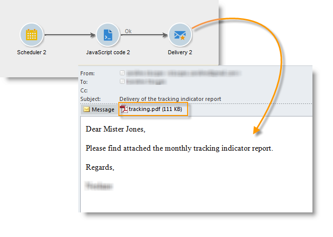
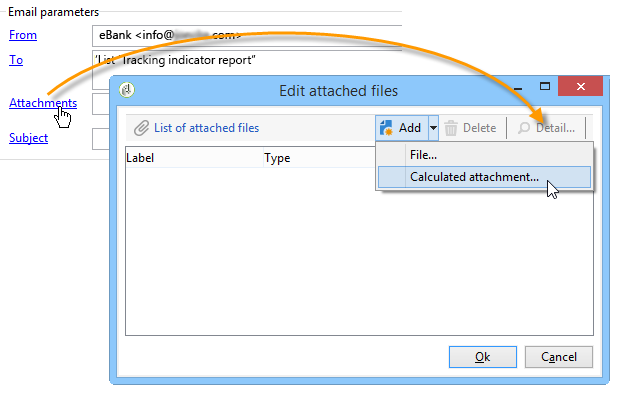

# Invio di un report a un elenco{#sending-a-report-to-a-list}

Questo caso d&#39;uso descrive come generare un rapporto mensile **[!UICONTROL Tracking indicators]** in formato PDF e come inviarlo a un elenco di destinatari.



Le fasi di implementazione principali per questo caso di utilizzo sono:

* Creazione di un elenco dei destinatari che riceveranno la consegna (fare riferimento a: [Passaggio 1: Creazione dell&#39;elenco destinatari](#step-1--creating-the-recipient-list)).
* Creazione di un modello di consegna che consenta di generare una nuova consegna ogni volta che viene eseguito il flusso di lavoro (consultate: [Passaggio 2: Creazione del modello di consegna](#step-2--creating-the-delivery-template)).
* Creazione di un flusso di lavoro per generare il rapporto in formato PDF e inviarlo all’elenco dei destinatari (consultare: [Passaggio 3: Creazione del flusso di lavoro](#step-3--creating-the-workflow)).

## Passaggio 1: Creazione dell&#39;elenco destinatari {#step-1--creating-the-recipient-list}

Passare all&#39;universo **[!UICONTROL Profiles and targets]**, fare clic sul collegamento **[!UICONTROL Lists]**, quindi sul pulsante **[!UICONTROL Create]**. Selezionare **[!UICONTROL New list]** e creare un nuovo elenco di destinatari a cui inviare il rapporto.


Per ulteriori informazioni sulla creazione di elenchi, vedere la sezione [sezione](../../platform/using/creating-and-managing-lists.md).

## Passaggio 2: Creazione del modello di consegna {#step-2--creating-the-delivery-template}

1. Passate al nodo **[!UICONTROL Resources > Templates > Delivery templates]** dell&#39; di Adobe Campaign Explorer e duplicate il modello **[!UICONTROL Email delivery]** out-of-the-box.

   

   Per ulteriori informazioni sulla creazione di un modello di consegna, vedere la sezione [](../../delivery/using/about-templates.md).

1. Immettete i vari parametri del modello: label, target (l&#39;elenco dei destinatari creati in precedenza), oggetto e contenuto.

   

1. Ogni volta che viene eseguito il flusso di lavoro, il report **[!UICONTROL Tracking indicators]** viene aggiornato (fare riferimento a [Passaggio 3: Creazione del flusso di lavoro](#step-3--creating-the-workflow)). Per includere nella consegna la versione più recente del rapporto, è necessario aggiungere un **[!UICONTROL Calculated attachment]**:

   Per ulteriori informazioni sulla creazione di un allegato calcolato, vedere la sezione [](../../delivery/using/attaching-files.md#creating-a-calculated-attachment).

   * Fare clic sul collegamento **[!UICONTROL Attachments]** e fare clic su **[!UICONTROL Add]**, quindi selezionare **[!UICONTROL Calculated attachment]**.

      

   * Andate al campo **[!UICONTROL Type]** e selezionate la quarta opzione: **[!UICONTROL File name is computed during delivery of each message (it may then depend on the recipient profile)]**.

      

      Il valore immesso nel campo **[!UICONTROL Label]** non verrà visualizzato nella consegna finale.

   * Andate nella zona di modifica e immettete il percorso di accesso e il nome del file.

      

      >[!CAUTION]
      >
      >Il file deve essere presente sul server. Il percorso e il nome devono essere identici a quelli immessi nell&#39;attività di tipo **[!UICONTROL JavaScript code]** del flusso di lavoro (fare riferimento a: [Passaggio 3: Creazione del flusso di lavoro](#step-3--creating-the-workflow)).

   * Selezionare la scheda **[!UICONTROL Advanced]** e selezionare **[!UICONTROL Script the name of the file name displayed in the mails sent]**. Passate alla zona di modifica e immettete il nome da assegnare all’allegato nella consegna finale.

      

## Passaggio 3: Creazione del flusso di lavoro {#step-3--creating-the-workflow}

Per questo caso di utilizzo è stato creato il seguente flusso di lavoro. Esso ha tre attività:

* Un&#39;attività di tipo **[!UICONTROL Scheduler]** che consente di eseguire il flusso di lavoro una volta al mese,
* Un&#39;attività di tipo **[!UICONTROL JavaScript code]** che consente di generare il rapporto in formato PDF,
* un&#39;attività di tipo **[!UICONTROL Delivery]** che utilizza il modello di consegna creato in precedenza.


1. Passate ora al nodo **[!UICONTROL Administration > Production > Technical workflows]** e create un nuovo flusso di lavoro.

   

1. Per iniziare, aggiungete un&#39;attività di tipo **[!UICONTROL Scheduler]** e configuratela in modo che il flusso di lavoro venga eseguito il primo lunedì del mese.

   

   Per ulteriori informazioni sulla configurazione del pianificatore, vedere [Scheduler](../../workflow/using/scheduler.md).

1. Quindi aggiungete un&#39;attività di tipo **[!UICONTROL JavaScript code]**.

   

   Immettete il seguente codice nella zona di modifica:

   ```
   var reportName = "deliveryFeedback";
   var path = "/tmp/deliveryFeedback.pdf";
   var exportFormat = "PDF";
   var reportURL = "<PUT THE URL OF THE REPORT HERE>";
   var _ctx = <ctx _context="global" _reportContext="deliveryFeedback" />
   var isAdhoc = 0;
   
   xtk.report.export(reportName, _ctx, exportFormat, path, isAdhoc);
   ```

   Vengono utilizzate le seguenti variabili:

   * **var reportName**: immettere il nome interno del rapporto tra virgolette. In questo caso, il nome interno del report **Indicatore di tracciamento** è &quot;deliveryFeedback&quot;.
   * **percorso** var: immettete il percorso di salvataggio del file (&quot;tmp/files/&quot;), il nome che desiderate assegnare al file (&quot;deliveryFeedback&quot;) e l’estensione del file (&quot;.pdf&quot;). In questo caso, abbiamo usato il nome interno come nome del file. I valori devono essere compresi tra virgolette doppie e separati dal carattere &quot;+&quot;.

      >[!CAUTION]
      >
      >Il file deve essere salvato sul server. È necessario immettere lo stesso percorso e lo stesso nome nella scheda **[!UICONTROL General]** della finestra di modifica per l&#39;allegato calcolato (fare riferimento a: [Passaggio 2: Creazione del modello di consegna](#step-2--creating-the-delivery-template)).

   * **var exportFormat**: immettere il formato di esportazione del file (&quot;PDF&quot;).
   * **var_ctx** (context): in questo caso, utilizziamo la  **[!UICONTROL Tracking indicators]** relazione nel suo contesto globale.

1. Per terminare, aggiungete un&#39;attività di tipo **[!UICONTROL Delivery]** con le seguenti opzioni:

   * **[!UICONTROL Delivery]**: selezionate  **[!UICONTROL New, created from a template]** e selezionate il modello di consegna creato in precedenza.
   * Per i campi **[!UICONTROL Recipients]** e **[!UICONTROL Content]**, selezionare **[!UICONTROL Specified in the delivery]**.
   * **[!UICONTROL Action to execute]**: selezionare  **[!UICONTROL Prepare and start]**.
   * Deselezionare **[!UICONTROL Generate an outbound transition]** e **[!UICONTROL Process errors]**.

   

