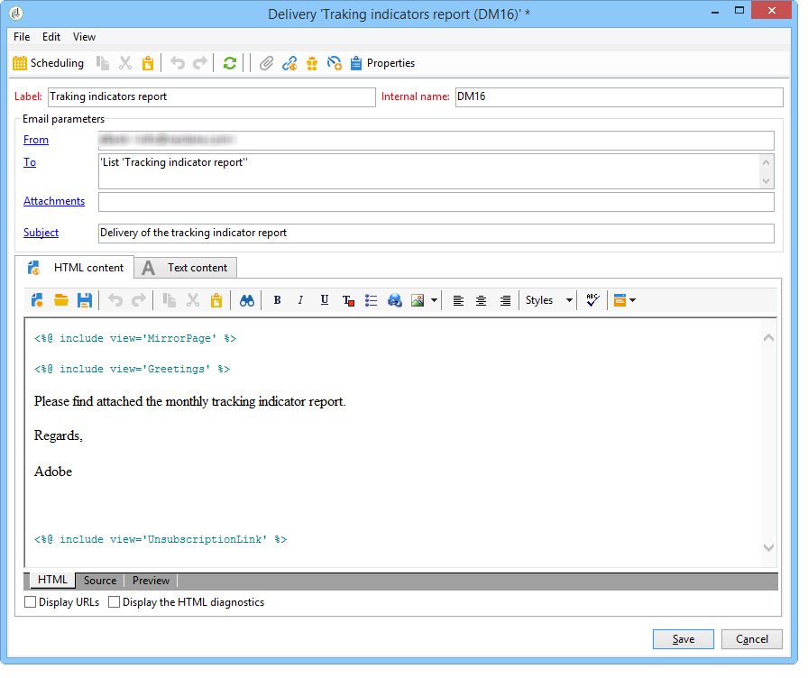

# Invio di un report a un elenco{#sending-a-report-to-a-list}

Questo caso d’uso descrive come generare un rapporto predefinito mensile **[!UICONTROL Tracking indicators]** in formato PDF e come inviarlo a un elenco di destinatari.


I passaggi principali per l’implementazione di questo caso d’uso sono:

* Creazione di un elenco di destinatari che riceveranno la consegna (consulta: [Passaggio 1: Creazione dell&#39;elenco destinatari](#step-1--creating-the-recipient-list)).
* Creazione di un modello di consegna che ti consentirà di generare una nuova consegna ogni volta che il flusso di lavoro viene eseguito (consulta: [Passaggio 2: Creazione del modello di consegna](#step-2--creating-the-delivery-template)).
* Creazione di un flusso di lavoro che ti consentirà di generare il rapporto in formato PDF e di inviarlo all’elenco dei destinatari (consulta: [Passaggio 3: Creazione del flusso di lavoro](#step-3--creating-the-workflow)).

## Passaggio 1: Creazione dell&#39;elenco dei destinatari {#step-1--creating-the-recipient-list}

Vai alla scheda **[!UICONTROL Profiles and targets]** , fai clic sul collegamento **[!UICONTROL Lists]** , quindi sul pulsante **[!UICONTROL Create]** . Seleziona **[!UICONTROL New list]** e crea un nuovo elenco di destinatari per il rapporto a cui inviare.


Per ulteriori informazioni sulla creazione di elenchi, consulta questa [sezione](../../platform/using/creating-and-managing-lists.md).

## Passaggio 2: Creazione del modello di consegna {#step-2--creating-the-delivery-template}

1. Vai al nodo **[!UICONTROL Resources > Templates > Delivery templates]** dell’explorer di Adobe Campaign e duplica il modello preconfigurato **[!UICONTROL Email delivery]** .

   

   Per ulteriori informazioni sulla creazione di un modello di consegna, consulta questa [sezione](../../delivery/using/about-templates.md).

1. Immetti i vari parametri del modello: etichetta, target (l’elenco dei destinatari creati in precedenza), oggetto e contenuto.

   

1. Ogni volta che il flusso di lavoro viene eseguito, il rapporto **[!UICONTROL Tracking indicators]** viene aggiornato (consulta [Passaggio 3: Creazione del flusso di lavoro](#step-3--creating-the-workflow)). Per includere nella consegna la versione più recente del rapporto, devi aggiungere un **[!UICONTROL Calculated attachment]**:

   Per ulteriori informazioni sulla creazione di un allegato calcolato, consulta questa sezione [sezione](../../delivery/using/attaching-files.md#creating-a-calculated-attachment).

   * Fai clic sul collegamento **[!UICONTROL Attachments]** e fai clic su **[!UICONTROL Add]**, quindi seleziona **[!UICONTROL Calculated attachment]**.

      

   * Vai al campo **[!UICONTROL Type]** e seleziona la quarta opzione: **[!UICONTROL File name is computed during delivery of each message (it may then depend on the recipient profile)]**.

      

      Il valore immesso nel campo **[!UICONTROL Label]** non verrà visualizzato nella consegna finale.

   * Passa alla zona di modifica e immetti il percorso di accesso e il nome del file.

      

      >[!CAUTION]
      >
      >Il file deve essere presente sul server. Il percorso e il nome devono essere identici a quelli immessi nell’attività di tipo **[!UICONTROL JavaScript code]** del flusso di lavoro (consulta: [Passaggio 3: Creazione del flusso di lavoro](#step-3--creating-the-workflow)).

   * Seleziona la scheda **[!UICONTROL Advanced]** e seleziona **[!UICONTROL Script the name of the file name displayed in the mails sent]**. Passa all’area di modifica e inserisci il nome da assegnare all’allegato nella consegna finale.

      

## Passaggio 3: Creazione del flusso di lavoro {#step-3--creating-the-workflow}

Il seguente flusso di lavoro è stato creato per questo caso d’uso. Ha tre attività:

* Un’attività di tipo **[!UICONTROL Scheduler]** che consente di eseguire il flusso di lavoro una volta al mese,
* Un’attività di tipo **[!UICONTROL JavaScript code]** che consente di generare il rapporto in formato PDF,
* un’attività di tipo **[!UICONTROL Delivery]** che utilizza il modello di consegna creato in precedenza.


1. Ora passa al nodo **[!UICONTROL Administration > Production > Technical workflows]** e crea un nuovo flusso di lavoro.

   

1. Per iniziare, aggiungi un’attività di tipo **[!UICONTROL Scheduler]** e configurala in modo che il flusso di lavoro venga eseguito il primo lunedì del mese.

   

   Per ulteriori informazioni sulla configurazione dello scheduler, consulta [Scheduler](../../workflow/using/scheduler.md).

1. Quindi aggiungi un’attività di tipo **[!UICONTROL JavaScript code]** .

   

   Immetti il seguente codice nella zona di modifica:

   ```
   var reportName = "deliveryFeedback";
   var path = "/tmp/deliveryFeedback.pdf";
   var exportFormat = "PDF";
   var reportURL = "<PUT THE URL OF THE REPORT HERE>";
   var _ctx = <ctx _context="global" _reportContext="deliveryFeedback" />
   var isAdhoc = 0;
   
   xtk.report.export(reportName, _ctx, exportFormat, path, isAdhoc);
   ```

   Vengono utilizzate le seguenti variabili:

   * **var reportName**: inserire il nome interno del rapporto tra virgolette doppie. In questo caso, il nome interno del rapporto **Indicatore di tracciamento** è &quot;deliveryFeedback&quot;.
   * **Percorso** var: inserisci il percorso di salvataggio del file (&quot;tmp/files/&quot;), il nome che desideri assegnare al file (&quot;deliveryFeedback&quot;) e l’estensione del file (&quot;.pdf&quot;). In questo caso, abbiamo utilizzato il nome interno come nome del file. I valori devono essere tra virgolette doppie e separati dal carattere &quot;+&quot;.

      >[!CAUTION]
      >
      >Il file deve essere salvato sul server. Immettere lo stesso percorso e lo stesso nome nella scheda **[!UICONTROL General]** della finestra di modifica per l&#39;allegato calcolato (fare riferimento a: [Passaggio 2: Creazione del modello di consegna](#step-2--creating-the-delivery-template)).

   * **var exportFormat**: immettere il formato di esportazione del file (&quot;PDF&quot;).
   * **var_ctx**  (contesto): in questo caso, utilizziamo la  **[!UICONTROL Tracking indicators]** relazione nel suo contesto globale.

1. Completa aggiungendo un’attività di tipo **[!UICONTROL Delivery]** con le seguenti opzioni:

   * **[!UICONTROL Delivery]**: seleziona  **[!UICONTROL New, created from a template]** e seleziona il modello di consegna creato in precedenza.
   * Per i campi **[!UICONTROL Recipients]** e **[!UICONTROL Content]**, selezionare **[!UICONTROL Specified in the delivery]**.
   * **[!UICONTROL Action to execute]**: seleziona  **[!UICONTROL Prepare and start]**.
   * Deseleziona **[!UICONTROL Generate an outbound transition]** e **[!UICONTROL Process errors]**.
   
