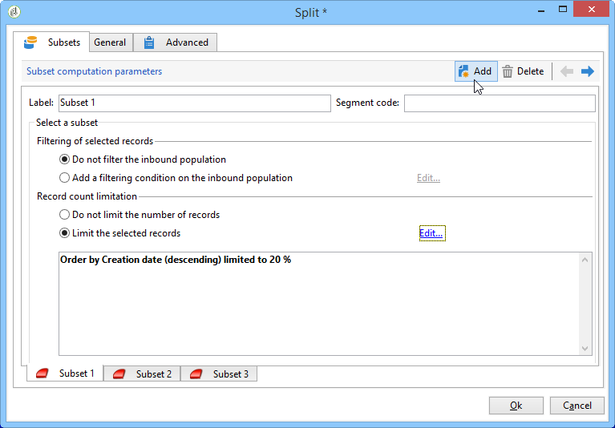
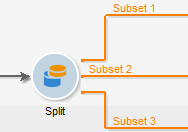
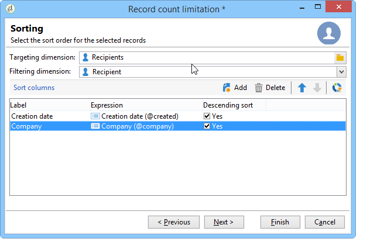
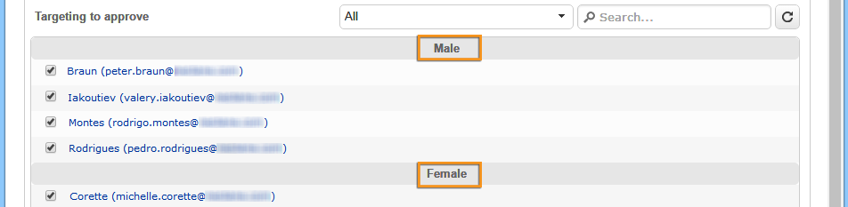

# Divisione{#split}

Un&#39;attività di tipo **Split** consente di dividere una destinazione in più sottoinsiemi. Il target è costruito con tutti i risultati ricevuti: tutte le attività precedenti devono pertanto essere state portate a termine affinché tale attività possa essere eseguita.

Questa attività non attiva un&#39;unione di popolazioni in entrata. Se più transizioni vengono eseguite in un&#39;attività divisa, si consiglia di inserire un&#39;attività **[!UICONTROL Union]** davanti ad essa.

Per un esempio dell&#39;attività divisa in uso, fare riferimento a [Creazione di sottoinsiemi tramite l&#39;attività divisa](../../workflow/using/targeting-data.md#creating-subsets-using-the-split-activity).

Un esempio che illustra come utilizzare l&#39;attività Split per segmentare il target in popolazioni diverse utilizzando le condizioni di filtro è descritto in [questa sezione](../../workflow/using/cross-channel-delivery-workflow.md).

Un esempio che mostra come utilizzare una variabile di istanza in un&#39;attività di divisione è disponibile in [questa sezione](../../workflow/using/javascript-scripts-and-templates.md).

Per configurare questa attività, definite il contenuto e l&#39;etichetta del sottoinsieme nella scheda **[!UICONTROL Subsets]**, quindi scegliete la dimensione di destinazione nella scheda **[!UICONTROL General]**.

## Creazione di sottoinsiemi {#creating-subsets}

Per creare un sottoinsieme:

1. Fare clic sull&#39;etichetta nel campo corrispondente e selezionare il filtro da applicare.
1. Per filtrare la popolazione in entrata, selezionare l&#39;opzione **[!UICONTROL Add a filtering condition]** e fare clic sul collegamento **[!UICONTROL Edit...]**.

   Selezionare il tipo di filtro da applicare ai dati per includerlo in questo set.

   Il processo è lo stesso di un&#39;attività di tipo **Query**.

   >[!NOTE]
   >
   >È possibile filtrare i dati in un massimo di due database esterni (FDA).

1. È possibile specificare il numero massimo di record da estrarre dalla destinazione per creare il sottoinsieme. A questo scopo, selezionare l&#39;opzione **[!UICONTROL Limit the selected records]** e fare clic sul collegamento **[!UICONTROL Edit...]**.

   Una procedura guidata consente di scegliere la modalità di selezione per i record di questo sottoinsieme. I passaggi sono disponibili in [Limitazione del numero di record di sottoinsiemi](#limiting-the-number-of-subset-records).

   

1. Se lo desiderate, potete **aggiungere altri sottoinsiemi** utilizzando il pulsante **[!UICONTROL Add]**.

   

   >[!NOTE]
   >
   >Se l&#39;opzione **[!UICONTROL Enable overlapping of output populations]** non è selezionata, i sottoinsiemi vengono creati nell&#39;ordine delle schede. Utilizzare le frecce nella sezione in alto a destra di questa finestra per spostarle. Se il primo sottoinsieme recupera il 70% della popolazione iniziale, ad esempio, il sottoinsieme successivo applicherà i criteri di selezione solo al restante 30%, e così via.

   Per ogni sottoinsieme creato, una transizione in uscita verrà aggiunta all&#39;attività divisa.

   

   Potete scegliere di generare una singola transizione in uscita (e identificare i set utilizzando, ad esempio, il codice del segmento): a tal fine, selezionare l&#39;opzione **[!UICONTROL Generate subsets in the same table]** nella scheda **[!UICONTROL General]**.

   Se completato, il codice del segmento di ciascun sottoinsieme viene memorizzato automaticamente in una colonna aggiuntiva. Questa colonna sarà accessibile nei campi di personalizzazione a livello di consegna.

## Limitazione del numero di record di sottoinsiemi {#limiting-the-number-of-subset-records}

Se non si desidera utilizzare l&#39;intera popolazione contenuta in un sottoinsieme, è possibile limitare il numero di record che conterrà.

1. Nella finestra di modifica del sottoinsieme, selezionare l&#39;opzione **[!UICONTROL Limit the selected records]** e fare clic sul collegamento **[!UICONTROL Edit...]**.
1. Selezionate il tipo di limite desiderato:

   * **[!UICONTROL Activate random sampling]**: questa opzione prende un esempio casuale dei record. Il tipo di campionamento casuale applicato dipende dal motore del database.
   * **[!UICONTROL Keep only the first records after sorting]**: questa opzione consente di definire un limite basato su uno o più ordini di ordinamento. Se si seleziona il campo **[!UICONTROL Age]** come criterio di ordinamento e 100 come limite, verranno mantenuti solo i 100 destinatari più giovani.
   * **[!UICONTROL Keep the first ones after sorting (criteria, random)]**: Questa opzione combina le due opzioni precedenti. Consente di definire un limite basato su uno o più ordini di ordinamento e quindi di applicare una selezione casuale ai primi record se alcuni record hanno gli stessi valori dei criteri definiti.

      Ad esempio, se si seleziona il campo **[!UICONTROL Age]** come criterio di ordinamento, e si definisce un limite di 100, ma i 2000 destinatari più giovani nel database sono tutti 18, allora 100 destinatari verranno selezionati in modo casuale tra i 2000.
   

1. Se si desidera definire i criteri di ordinamento, un passaggio aggiuntivo consente di definire le colonne e l&#39;ordine di ordinamento.

   

1. Quindi scegliete il metodo di limitazione dei dati.

   

   Esistono diversi modi per farlo:

   * **[!UICONTROL Size (in %)]**: una percentuale di record. Ad esempio, la configurazione seguente estrae il 10% della popolazione totale.

      La percentuale si applica alla popolazione iniziale, non al risultato dell&#39;attività.

   * **[!UICONTROL Size (as a % of the segment)]**: una percentuale di record relativi solo ai sottoinsiemi e non alla popolazione iniziale.
   * **[!UICONTROL Maximum size]**: un numero massimo di record.
   * **[!UICONTROL By data grouping]**: è possibile impostare un limite al numero di record in base ai valori di un campo specificato della popolazione in entrata. Per ulteriori informazioni su questo argomento, fare riferimento a [Limitazione del numero di record di sottoinsiemi per gruppo di dati](#limiting-the-number-of-subset-records-by-data-grouping).
   * **[!UICONTROL By data grouping (in %)]**: è possibile impostare un limite al numero di record in base ai valori di un campo specificato della popolazione in entrata utilizzando una percentuale. Per ulteriori informazioni su questo argomento, fare riferimento a [Limitazione del numero di record di sottoinsiemi per gruppo di dati](#limiting-the-number-of-subset-records-by-data-grouping).
   * **[!UICONTROL By data distribution]**: Se i campi di raggruppamento hanno troppi valori o se si desidera evitare di immettere nuovamente i valori per ogni nuova attività divisa,  Adobe Campaign consente di configurare una  **[!UICONTROL By data distribution]** limitazione (modulo Distributed Marketing opzionale). Per ulteriori informazioni, fare riferimento a [Limitazione del numero di record di sottoinsiemi per distribuzione di dati](#limiting-the-number-of-subset-records-per-data-distribution).

1. Fare clic su **[!UICONTROL Finish]** per approvare i criteri di selezione dei record. La configurazione definita viene quindi visualizzata nella finestra centrale dell&#39;editor.

## Limitazione del numero di record di sottoinsiemi per raggruppamento di dati {#limiting-the-number-of-subset-records-by-data-grouping}

È possibile limitare il numero di record per raggruppamento di dati. Questo limite può essere realizzato utilizzando un valore fisso o una percentuale.

Ad esempio, se si seleziona il campo **[!UICONTROL Language]** come campo di gruppo, è possibile definire un elenco di record per ogni lingua.

1. Dopo aver selezionato i valori di limitazione dei dati, selezionare **[!UICONTROL By data grouping]** o **[!UICONTROL By data grouping (as a %)]** e fare clic su **[!UICONTROL Next]**.

   

1. Selezionate quindi i campi di raggruppamento (ad esempio il campo **[!UICONTROL Language]**) e fate clic su **[!UICONTROL Next]**.

   

1. Infine, specificare le soglie di raggruppamento dei dati (utilizzando i valori fissi o le percentuali in base al metodo di raggruppamento selezionato in precedenza). Per impostare la stessa soglia per ogni valore, ad esempio se si desidera impostare su 10 il numero di record per ogni lingua, selezionare l&#39;opzione **[!UICONTROL All data groupings are the same size]**. Per impostare un limite diverso per ogni valore, selezionare l&#39;opzione **[!UICONTROL Limitations by grouping value]**. Questo vi permetterà di scegliere una limitazione diversa per inglese, francese, ecc.

   

1. Fate clic su **[!UICONTROL Finish]** per approvare il limite e tornare alla modifica dell&#39;attività divisa.

## Limitazione del numero di record di sottoinsiemi per distribuzione di dati {#limiting-the-number-of-subset-records-per-data-distribution}

Se i campi di raggruppamento contengono un numero eccessivo di valori o se si desidera evitare di reimpostare i valori per ogni nuova attività di suddivisione,  Adobe Campaign consente di creare un limite per la distribuzione dei dati. Quando si selezionano i valori di limitazione dei dati (per ulteriori informazioni sull&#39;oggetto vedere la sezione [Creazione di sottoinsiemi](#creating-subsets)), selezionare l&#39;opzione **[!UICONTROL By data distribution]** e selezionare un modello dal menu a discesa. La creazione di un modello di distribuzione dei dati è illustrata di seguito.

Per un esempio dell&#39;attività **[!UICONTROL Local approval]** con un modello di distribuzione, fare riferimento a [Utilizzo dell&#39;attività di approvazione locale](../../workflow/using/using-the-local-approval-activity.md).

>[!IMPORTANT]
>
>Per utilizzare questa funzione, è necessario acquistare il modulo Distributed Marketing, che è un&#39;opzione Campaign. Controlla il contratto di licenza.

Il modello di distribuzione dei dati consente di limitare il numero di record utilizzando un elenco di valori di raggruppamento. Per creare un modello di distribuzione dei dati, procedere come segue:

1. Per creare il modello di distribuzione dei dati, passare al nodo **[!UICONTROL Resources > Campaign management > Data distribution]** e fare clic su **[!UICONTROL New]**.

   

1. La scheda **[!UICONTROL General]** consente di inserire l&#39;etichetta e il contesto di esecuzione della distribuzione (dimensione di targeting, campo di distribuzione).

   

   È necessario inserire i campi seguenti:

   * **[!UICONTROL Label]**: etichetta per il modello di distribuzione.
   * **[!UICONTROL Targeting dimension]**: immettere la dimensione di targeting a cui verrà applicata la distribuzione dei dati,  **[!UICONTROL Recipient]** ad esempio. Questo schema deve essere sempre compatibile con i dati utilizzati nel flusso di lavoro di targeting.
   * **[!UICONTROL Distribution field]**: selezionate un campo tramite la dimensione di targeting. Ad esempio, se si seleziona il campo **[!UICONTROL Email domain]**, l&#39;elenco dei destinatari verrà suddiviso per dominio.
   * **[!UICONTROL Distribution type]**: selezionare la modalità in cui verrà suddiviso il valore di limitazione della destinazione nella  **[!UICONTROL Distribution]** scheda:  **[!UICONTROL Percentage]** o  **[!UICONTROL Set]**.
   * **[!UICONTROL Assignment type]**: selezionare il tipo di assegnazione distribuzione dati. È possibile scegliere tra l&#39;assegnazione per gruppo o operatore o l&#39;assegnazione per entità locale. L&#39;assegnazione per entità locale viene utilizzata in **Distributed Marketing**. Per ulteriori informazioni, consultare la sezione [sezione](../../campaign/using/about-distributed-marketing.md).
   * **[!UICONTROL Approval storage]**: se utilizzate un&#39; **[!UICONTROL Local approval]** attività nel flusso di lavoro di targeting (consultate approvazione locale), immettete lo schema in cui verranno memorizzati i risultati dell&#39;approvazione. È necessario specificare uno schema di memorizzazione per lo schema di targeting. Se si utilizza lo schema di destinazione **[!UICONTROL Recipients]**, inserire lo schema di memorizzazione predefinito **[!UICONTROL Local approval of recipients]**.

      In caso di limitazione semplice per raggruppamento di dati senza approvazione locale, non è necessario immettere il campo **[!UICONTROL Approvals storage]**.

1. Se si utilizza un&#39;attività **[!UICONTROL Local approval]** (fare riferimento a [Approvazione locale](../../workflow/using/local-approval.md)), inserire il **[!UICONTROL Advanced settings]** per il modello di distribuzione:

   

   È necessario inserire i campi seguenti:

   * **[!UICONTROL Approve targeted messages]**: selezionate questa opzione se desiderate che tutti i destinatari siano preselezionati dall’elenco dei destinatari da approvare. Se questa opzione è deselezionata, non verrà selezionato alcun destinatario.

      >[!NOTE]
      >
      >Questa opzione è selezionata per impostazione predefinita.

      

   * **[!UICONTROL Delivery label]**: consente di definire un&#39;espressione per visualizzare l&#39;etichetta di consegna nella notifica di restituzione. L&#39;espressione predefinita fornisce informazioni sull&#39;etichetta standard della consegna (stringa di calcolo). È possibile modificare questa espressione.

      

   * **[!UICONTROL Grouping field]**: questo campo consente di definire il raggruppamento utilizzato per visualizzare i destinatari nelle notifiche di approvazione e di restituzione.

      

   * **[!UICONTROL Web Interface]**: consente di collegare un&#39;applicazione Web all&#39;elenco dei destinatari. Nella notifica di approvazione e restituzione, ogni destinatario sarà cliccabile e collegherà all&#39;applicazione Web selezionata. Il campo **[!UICONTROL Parameters]** (ad esempio **[!UICONTROL recipientId]**) consente di configurare il parametro aggiuntivo da utilizzare nell&#39;URL e nell&#39;applicazione Web.

      

1. La scheda **[!UICONTROL Breakdown]** consente di definire l&#39;elenco dei valori di distribuzione.

   

   * **[!UICONTROL Value]**: immettere i valori di distribuzione.
   * **[!UICONTROL Percentage / Set]**: immettere il limite di record (fisso o percentuale) collegato a ciascun valore.

      Questa colonna è definita dal campo **[!UICONTROL Distribution type]** all&#39;interno della scheda **[!UICONTROL General]**.

   * **[!UICONTROL Label]**: immettere l&#39;etichetta collegata a ciascun valore.
   * **[!UICONTROL Group or operator]**: se si utilizza un&#39; **[!UICONTROL Local approval]** attività (fare riferimento all&#39;approvazione locale), selezionare l&#39;operatore o il gruppo di operatori assegnati a ciascun valore di distribuzione.

      In caso di limitazione semplice per raggruppamento di dati senza approvazione locale, non è necessario immettere il campo **[!UICONTROL Group or operator]**.

      >[!IMPORTANT]
      >
      >Accertatevi che agli operatori siano stati assegnati i diritti appropriati.

   * **[!UICONTROL Local entity]**: selezionare l&#39;entità locale assegnata a ciascun valore di distribuzione. Le entità locali vengono utilizzate in **Distributed Marketing**. Per ulteriori informazioni, consultare la sezione [sezione](../../campaign/using/about-distributed-marketing.md).

## Parametri di filtro {#filtering-parameters}

Fate clic sulla scheda **[!UICONTROL General]** per immettere l&#39;etichetta dell&#39;attività. Selezionate le dimensioni di destinazione e di filtro per la suddivisione. Se necessario, potete modificare queste dimensioni per un determinato sottoinsieme.

Selezionare l&#39;opzione **[!UICONTROL Generate complement]** se si desidera sfruttare la popolazione rimanente. Il complemento è la destinazione in entrata meno l&#39;unione dei sottoinsiemi. All&#39;attività verrà quindi aggiunta un&#39;ulteriore transizione in uscita, come segue:

Affinché questa opzione funzioni correttamente, i dati in entrata devono avere una chiave primaria.

Ad esempio, se i dati vengono letti direttamente da un database esterno come Netezza (che non supporta il concetto di indice) tramite un&#39;attività **[!UICONTROL Data loading (RDBMS)]**, il complemento generato dall&#39;attività **[!UICONTROL Split]** sarà errato.

Per evitare questo problema, potete trascinare un&#39;attività **[!UICONTROL Enrichment]** immediatamente prima dell&#39;attività **[!UICONTROL Split]**. Nell&#39;attività **[!UICONTROL Enrichment]**, controllare la **[!UICONTROL Keep all additional data from the main set]** e specificare nei dati aggiuntivi le colonne da utilizzare per configurare i filtri dell&#39;attività **[!UICONTROL Split]**. I dati provenienti dalla transizione in entrata dell&#39;attività **[!UICONTROL Split]** vengono quindi memorizzati localmente in una tabella temporanea sul server Adobe Campaign  e il complemento può essere generato correttamente.

L&#39;opzione **[!UICONTROL Enable overlapping of output populations]** consente di gestire le popolazioni appartenenti a diversi sottoinsiemi:

* Se la casella non è selezionata, l&#39;attività di divisione verifica che un destinatario non sia presente in più transizioni di output, anche se soddisfa i criteri di più sottoinsiemi. Saranno nella destinazione della prima scheda con criteri corrispondenti.
* Quando la casella è selezionata, i destinatari si trovano in diversi sottoinsiemi se soddisfano i criteri di filtro.  Adobe Campaign consiglia di utilizzare criteri esclusivi.

## Parametri di input {#input-parameters}

* tableName
* schema

Ogni evento in ingresso deve specificare una destinazione definita da questi parametri.

## Parametri di output {#output-parameters}

* tableName
* schema
* recCount

Questo insieme di tre valori identifica il target risultante dall&#39;esclusione. **[!UICONTROL tableName]** è il nome della tabella che registra gli identificatori di destinazione,  **[!UICONTROL schema]** è lo schema della popolazione (in genere nms:destinatario) ed  **[!UICONTROL recCount]** è il numero di elementi nella tabella.

La transizione associata al complemento ha gli stessi parametri.
