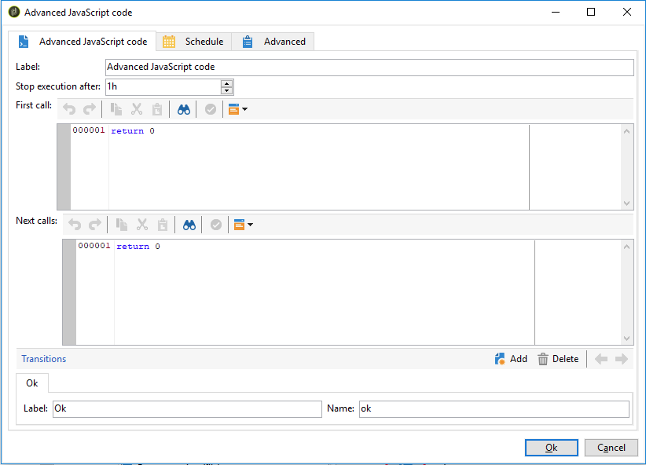

# Codice SQL e codice JavaScript{#sql-code-and-javascript-code}


## Codice SQL {#sql-code}

Un&#39;attività **[!UICONTROL SQL code]** esegue uno script SQL. Lo script è un modello JST.


* **[!UICONTROL Script]**

  L’area centrale dell’editor contiene lo script da eseguire. Questo script è un modello JST e può quindi essere configurato in base al contesto del flusso di lavoro.

* **[!UICONTROL Processing errors]**

  Consulta [Errori di elaborazione](monitoring-workflow-execution.md#processing-errors).

## Codice JavaScript e codice JavaScript avanzato {#javascript-code}

Le attività **[!UICONTROL JavaScript code]** e **[!UICONTROL Advanced JavaScript code]** eseguono uno script JavaScript nel contesto di un flusso di lavoro. Per ulteriori informazioni sugli script, consulta le sezioni seguenti:

* [Script e modelli JavaScript](javascript-scripts-and-templates.md)
* [Esempi di codice JavaScript nei flussi di lavoro](javascript-in-workflows.md)

### Ritardo di esecuzione {#exec-delay}

A partire dalla versione 20.2, è stato aggiunto un ritardo di esecuzione alle attività **[!UICONTROL JavaScript code]** e **[!UICONTROL Advanced JavaScript code]**. Per impostazione predefinita, la fase di esecuzione non può superare 1 ora. Dopo questo ritardo, il processo verrà interrotto con un messaggio di errore e l’esecuzione dell’attività avrà esito negativo.

È possibile modificare questo ritardo nel campo **[!UICONTROL Stop execution after]** disponibile in queste attività.

Per ignorare questo limite, è necessario impostare il valore su **0**.

### Codice JavaScript {#js-code-desc}


* **[!UICONTROL Script]**: l&#39;area centrale dell&#39;editor contiene lo script da eseguire.

* **[!UICONTROL Process errors]**: consultare [Errori di elaborazione](monitoring-workflow-execution.md#processing-errors).

### Codice JavaScript avanzato {#adv-js-code-desc}



* **[!UICONTROL First call]**: la prima zona dell&#39;editor contiene lo script da eseguire durante la prima chiamata.
* **[!UICONTROL Next calls]**: la seconda zona dell&#39;editor contiene lo script da eseguire durante le chiamate successive.
* **[!UICONTROL Transitions]**: è possibile definire diverse transizioni di output attività.
* **[!UICONTROL Schedule]**: la scheda **[!UICONTROL Schedule]** consente di pianificare quando attivare l&#39;attività.

Advanced JavaScript è un&#39;attività persistente che viene periodicamente richiamata se non è stata contrassegnata come completata. Per terminare l&#39;attività ed evitare richiami futuri, è necessario utilizzare il metodo **task.setCompleted()** nella sezione **[!UICONTROL Next calls]**:

```
task.postEvent(task.transitionByName("ok")); // to transition to Ok branch
task.setCompleted();

return 0;
```

