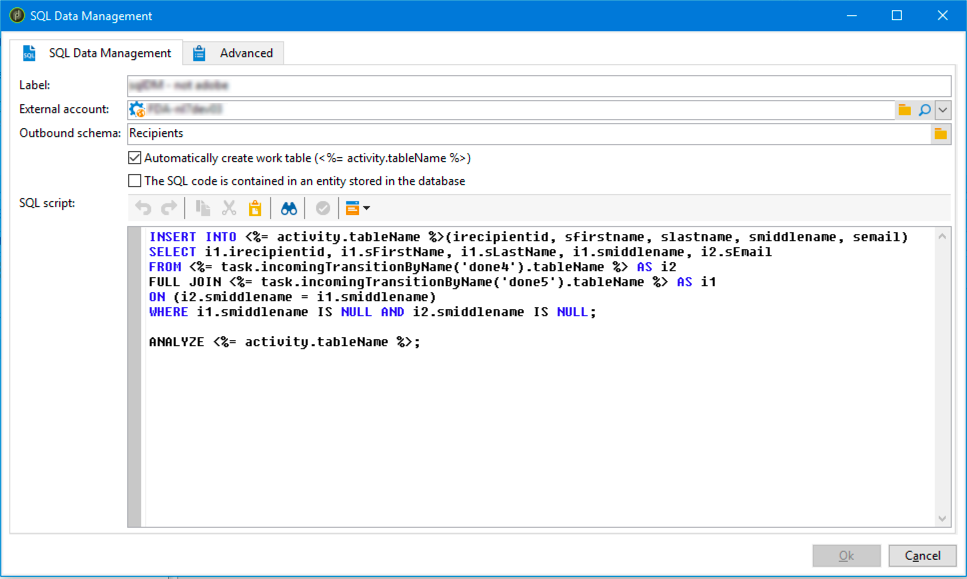

# Gestione dati SQL{#sql-data-management}


Il **Gestione dati SQL** Activity consente di scrivere script SQL personalizzati per creare e popolare tabelle di lavoro.

## Prerequisiti {#prerequisites}

Prima di configurare l’attività, assicurati di soddisfare i seguenti prerequisiti:

* L’attività è disponibile solo per le origini dati remote. Il **[!UICONTROL FDA]** Il pacchetto (Federated Data Access) deve pertanto essere installato nell’istanza. [Ulteriori informazioni](../../installation/using/about-fda.md).

  Per ulteriori informazioni, a seconda della versione di Campaign in uso, consulta le sezioni seguenti:

  [Documentazione di Campaign v7](../../installation/using/about-fda.md)

  [Documentazione di Campaign v8](https://experienceleague.adobe.com/docs/campaign/campaign-v8/connect/fda.html?lang=it)

* Lo schema in uscita deve esistere nel database ed essere collegato a un database FDA.
* L’operatore che esegue il flusso di lavoro deve disporre del **[!UICONTROL USE SQL DATA MANAGEMENT ACTIVITY (useSqlDmActivity)]** denominato right. [Ulteriori informazioni](../../platform/using/access-management-named-rights.md).

## Configurazione dell&#39;attività di gestione dati SQL {#configuring-the-sql-data-management-activity}

1. Specificare l’attività **[!UICONTROL Label]**.
1. Seleziona la **[!UICONTROL External account]** da utilizzare, quindi selezionare **[!UICONTROL Outbound schema]** collegato a questo account esterno.

   >[!CAUTION]
   >
   >Lo schema In uscita è fisso e non può essere modificato.

1. Aggiungere lo script SQL.

   >[!CAUTION]
   >
   >È responsabilità dell&#39;autore dello script SQL verificare che lo script SQL sia funzionale e che i relativi riferimenti (nomi dei campi, ecc.) sono conformi allo schema In uscita.

   Per caricare un codice SQL esistente, selezionare **[!UICONTROL The SQL script is contained in an entity stored in the database]** opzione. Gli script SQL devono essere creati e memorizzati nel **[!UICONTROL Administration]** / **[!UICONTROL Configuration]** / **[!UICONTROL SQL scripts]** menu.

   In caso contrario, digitare o copiare e incollare lo script SQL nell&#39;area dedicata.

   

   L’attività ti consente di utilizzare le seguenti variabili nello script:

   * **activity.tableName**: nome SQL della tabella di lavoro in uscita.
   * **task.incomingTransitionByName(&quot;name&quot;).tableName**: nome SQL della tabella di lavoro trasportata dalla transizione in ingresso da utilizzare (la transizione è identificata dal relativo nome).

     >[!NOTE]
     >
     >Il valore (&#39;name&#39;) corrisponde al **[!UICONTROL Name]** dalle proprietà della transizione.

1. Se lo script SQL contiene già comandi per creare una tabella di lavoro in uscita, deselezionare **[!UICONTROL Automatically create work table]** opzione. In caso contrario, una tabella di lavoro viene creata automaticamente una volta eseguito il flusso di lavoro.
1. Clic **[!UICONTROL Ok]** per confermare la configurazione dell’attività.

L’attività adesso è configurata. È pronto per essere eseguito nel flusso di lavoro.

>[!CAUTION]
>
>Una volta eseguita l’attività, il conteggio dei record di transizione in uscita è solo indicativo. Può variare in base al livello di complessità dello script SQL.
>  
>Se l’attività viene riavviata, l’intero script viene eseguito dal suo inizio, indipendentemente dallo stato di esecuzione.

## Esempi di script SQL {#sql-script-samples}

>[!NOTE]
>
>Gli esempi di script in questa sezione devono essere eseguiti in PostgreSQL.

Lo script sottostante consente di creare una tabella di lavoro e di inserire dati nella stessa tabella di lavoro:

```
CREATE UNLOGGED TABLE <%= activity.tableName %> (
  iRecipientId INTEGER DEFAULT 0,
  sFirstName VARCHAR(100),
  sMiddleName VARCHAR(100),
  sLastName VARCHAR(100),
  sEmail VARCHAR(100)
);

INSERT INTO <%= activity.tableName %>
SELECT iRecipientId, sFirstName, sMiddleName, sLastName, sEmail
FROM nmsRecipient
GROUP BY iRecipientId, sFirstName, sMiddleName, sLastName, sEmail;
```

Lo script seguente consente di eseguire un&#39;operazione CTAS (CREATE TABLE AS SELECT) e di creare un indice della tabella di lavoro:

```
CREATE TABLE <%= activity.tableName %>
AS SELECT iRecipientId, sEmail, sFirstName, sLastName, sMiddleName
FROM nmsRecipient
WHERE sEmail IS NOT NULL
GROUP BY iRecipientId, sEmail, sFirstName, sLastName, sMiddleName;

CREATE INDEX ON <%= activity.tableName %> (sEmail);

ANALYZE <%= activity.tableName %> (sEmail);
```

Lo script sottostante consente di unire due tabelle di lavoro:

```
CREATE TABLE <%= activity.tableName %>
AS SELECT i1.sFirstName, i1.sLastName, i2.sEmail
FROM <%= task.incomingTransitionByName('input1').tableName %> i1
JOIN <%= task.incomingTransitionByName('input2').tableName %> i2 ON (i1.id = i2.id)
```
