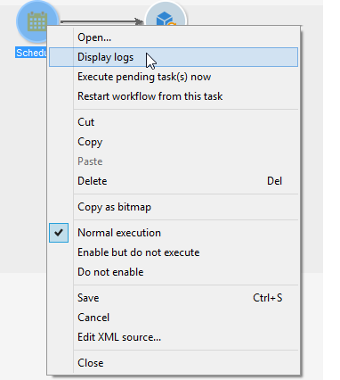

# Avvio di un flusso di lavoro {#starting-a-workflow}

Un flusso di lavoro viene sempre avviato manualmente. All&#39;avvio, tuttavia, può rimanere inattivo a seconda delle informazioni specificate tramite un pianificatore (vedere [Pianificatore](../../workflow/using/scheduler.md)) o la pianificazione delle attività.

Azioni relative all&#39;esecuzione del flusso di lavoro di targeting (avvio, arresto, pausa, ecc.) sono processi **asincroni** : l&#39;ordine viene registrato e sarà effettivo non appena il server sarà disponibile ad applicarlo.

La barra degli strumenti consente di avviare e tenere traccia dell’esecuzione del flusso di lavoro.

L&#39;elenco delle opzioni disponibili nel **[!UICONTROL Actions]** menu e il menu di scelta rapida sono descritti di seguito.

>[!IMPORTANT]
>
>Tenere presente che, quando un operatore esegue un&#39;azione su un flusso di lavoro (avvio, arresto, pausa, ecc.), l&#39;azione non viene eseguita immediatamente, ma inserita in una coda per essere elaborata dal modulo [del](../../workflow/using/architecture.md)flusso di lavoro.

## Azioni, barra degli strumenti {#actions-toolbar}

I pulsanti della barra degli strumenti sono descritti in dettaglio in questa [sezione](../../campaign/using/marketing-campaign-deliveries.md#building-the-main-target-in-a-workflow). Il **[!UICONTROL Actions]** pulsante consente di accedere a opzioni di esecuzione aggiuntive per agire su flussi di lavoro selezionati. Potete inoltre utilizzare il **[!UICONTROL File > Actions]** menu oppure fare clic con il pulsante destro del mouse su un flusso di lavoro e selezionare **[!UICONTROL Actions]**.

* **[!UICONTROL Start]**

   Questa azione consente di avviare l’esecuzione di un flusso di lavoro: un flusso di lavoro **Completato**, **In corso di modifica** o in **pausa** , cambia lo stato in **Avviato**. Il motore del flusso di lavoro gestisce quindi l&#39;esecuzione del flusso di lavoro. Se il flusso di lavoro è stato messo in pausa, viene ripreso, altrimenti il flusso di lavoro viene avviato dall&#39;inizio e le attività iniziali vengono attivate.

   Avvio è un processo asincrono: La richiesta viene salvata ed elaborata il prima possibile da un server del flusso di lavoro.

* **[!UICONTROL Pause]**

   Questa azione imposta lo stato del flusso di lavoro su **Pausa**. Nessuna attività viene attivata fino alla ripresa del flusso di lavoro; tuttavia, le operazioni in corso non vengono messe in pausa.

* **[!UICONTROL Stop]**

   Questa azione interrompe l&#39;esecuzione di un flusso di lavoro in corso. Lo stato dell’istanza è impostato su **Completato**. Se possibile, le operazioni in corso vengono interrotte. Le importazioni e le query SQL vengono annullate immediatamente.

   L&#39;arresto è un processo asincrono. La richiesta è registrata, quindi il server del flusso di lavoro o i server annullano le operazioni in corso. L’arresto di un’istanza del flusso di lavoro può richiedere del tempo, soprattutto se il flusso di lavoro è in esecuzione su più server, ciascuno dei quali deve assumersi il controllo per annullare le attività in corso.

* **[!UICONTROL Restart]**

   Questa azione si arresta e quindi riavvia il flusso di lavoro. Nella maggior parte dei casi, il riavvio è più rapido. È inoltre utile automatizzare il riavvio quando l&#39;arresto richiede un certo tempo: perché il comando &#39;Stop&#39; non è disponibile quando il flusso di lavoro viene interrotto.

   Le **[!UICONTROL Start / Pause / Stop / Restart]** azioni sono disponibili anche tramite le icone di esecuzione nella barra degli strumenti. Per ulteriori informazioni, consulta questa [sezione](../../campaign/using/marketing-campaign-deliveries.md#creating-a-targeting-workflow).

* **[!UICONTROL Purge history]**

   Questa azione consente di eliminare la cronologia del flusso di lavoro. Per ulteriori informazioni, fare riferimento a [Rimozione dei registri](../../workflow/using/monitoring-workflow-execution.md#purging-the-logs).

* **[!UICONTROL Start in simulation mode]**

   Questa opzione consente di avviare il flusso di lavoro in modalità di simulazione anziché in modalità reale. Questo significa che quando si attiva questa modalità, vengono eseguite solo le attività che non hanno alcun impatto sul database o sul file system (ad es. **[!UICONTROL Query]**, **[!UICONTROL Union]**, **[!UICONTROL Intersection]**, ecc.). Attività che hanno un impatto (ad es. **[!UICONTROL Export]**, **[!UICONTROL Import]** ecc.) e quelli successivi (nello stesso ramo) non sono eseguiti.

* **[!UICONTROL Execute pending tasks now]**

   Questa azione consente di avviare tutte le attività in sospeso il prima possibile. Per avviare un&#39;attività specifica, fare clic con il pulsante destro del mouse sulla relativa attività e selezionare **[!UICONTROL Execute pending task(s) now]**.

* **[!UICONTROL Unconditional stop]**

   Questa opzione modifica lo stato del flusso di lavoro in **[!UICONTROL Finished]**. Questa azione deve essere utilizzata come ultima risorsa solo se il normale processo di arresto ha esito negativo dopo diversi minuti. Utilizzate l&#39;interruzione non condizionale solo se siete sicuri che non siano in corso processi di flusso di lavoro effettivi.

   >[!CAUTION]
   >
   >Questa opzione è riservata agli utenti esperti.

* **[!UICONTROL Save as template]**

   Questa azione crea un nuovo modello di flusso di lavoro basato sul flusso di lavoro selezionato. È necessario specificare la cartella in cui verrà salvato (nel **[!UICONTROL Folder]** campo).

   Le opzioni **[!UICONTROL Mass update of selected lines]** e **[!UICONTROL Merge selected lines]** sono opzioni di piattaforma generiche disponibili in tutti i **[!UICONTROL Actions]** menu. Per ulteriori informazioni, consulta questa [sezione](../../platform/using/updating-data.md).

## Menu di scelta rapida {#right-click-menu}

Quando sono selezionate una o più attività del flusso di lavoro, potete fare clic con il pulsante destro del mouse per agire sulla selezione.

Nel menu di scelta rapida sono disponibili le seguenti opzioni:

**[!UICONTROL Open]**: questa opzione consente di accedere alle proprietà dell&#39;attività.

**[!UICONTROL Display logs:]** questa opzione consente di visualizzare il registro dell&#39;esecuzione delle attività per l&#39;attività selezionata. Fare riferimento a [Visualizzazione dei registri](../../workflow/using/monitoring-workflow-execution.md#displaying-logs).

**[!UICONTROL Execute pending task(s) now:]** questa azione consente di avviare al più presto le attività in sospeso.

**[!UICONTROL Workflow restart from a task:]** questa opzione consente di riavviare il flusso di lavoro utilizzando i risultati precedentemente memorizzati per questa attività.

**[!UICONTROL Cut/Copy/Paste/Delete:]** queste opzioni consentono di tagliare, copiare, incollare ed eliminare le attività.

**[!UICONTROL Copy as bitmap:]** questa opzione consente di visualizzare uno screenshot di tutte le attività.

**[!UICONTROL Normal execution / Enable but do not execute / Do not enable:]** queste opzioni sono disponibili anche nella **[!UICONTROL Advanced]** scheda delle proprietà dell&#39;attività. Sono descritti in [Execution](../../workflow/using/advanced-parameters.md#execution).

**[!UICONTROL Save / Cancel:]** consente di salvare o annullare le modifiche apportate a un flusso di lavoro.

>[!NOTE]
>
>Potete selezionare un gruppo di attività e applicare uno di questi comandi.

Anche in questa [sezione](../../campaign/using/marketing-campaign-deliveries.md#executing-a-workflow)viene illustrato il menu di scelta rapida.
