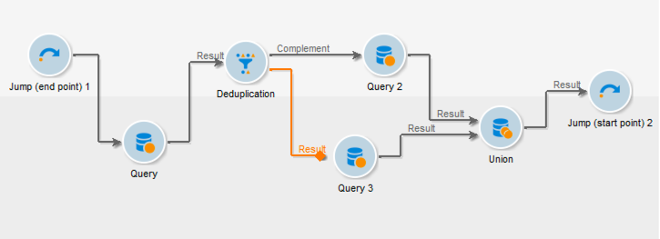

# Flusso di lavoro secondario{#sub-workflow}

L&#39; **[!UICONTROL Sub-workflow]** attività consente di attivare l&#39;esecuzione di un altro flusso di lavoro e recuperare il risultato. Questa attività consente di utilizzare flussi di lavoro complessi utilizzando un&#39;interfaccia semplificata.

Puoi chiamare più flussi di lavoro secondari in un unico flusso di lavoro. I flussi di lavoro secondari vengono eseguiti in modo sincrono.

Nell’esempio seguente, un flusso di lavoro principale chiama un flusso di lavoro secondario utilizzando i collegamenti. Per ulteriori informazioni sugli oggetti grafici di tipo &quot;salto&quot;, vedere [questa sezione](../../workflow/using/jump--start-point-and-end-point-.md).

1. Crea un flusso di lavoro da utilizzare come flusso di lavoro secondario in un altro flusso di lavoro.
1. Inserite un&#39; **[!UICONTROL Jump (end point)]** attività con priorità pari a 1 all&#39;inizio del flusso di lavoro. Se avete più salti di tipo &quot;punto finale&quot;,  Adobe Campaign utilizzerà il salto &quot;punto finale&quot; con il numero più basso.
1. Inserite un&#39; **[!UICONTROL Jump (start point)]** attività con priorità pari a 2 alla fine del flusso di lavoro. Se avete più salti di tipo &quot;punto iniziale&quot;,  Adobe Campaign utilizzerà il salto &quot;punto iniziale&quot; con il numero più alto.

   

   >[!NOTE]
   >
   >Se l&#39;attività del flusso di lavoro secondario fa riferimento a un flusso di lavoro con diverse **[!UICONTROL Jump]** attività, il flusso di lavoro secondario viene eseguito tra il tipo di &quot;salto del punto finale&quot; con il numero più basso e il tipo di &quot;salto del punto iniziale&quot; con il numero più alto.
   >
   >Affinché il flusso di lavoro secondario possa essere eseguito correttamente, è necessario che sia presente un solo salto di tipo &quot;punto finale&quot; con il numero più basso e che sia possibile effettuare un solo salto di tipo &quot;punto iniziale&quot; con il numero più alto.

1. Completa e salva questo &quot;flusso di lavoro secondario&quot;.
1. Creare un flusso di lavoro principale.
1. Inserite un&#39; **[!UICONTROL Sub-workflow]** attività e apritela.
1. Dall’elenco a **[!UICONTROL Workflow template]** discesa, selezionate il flusso di lavoro da utilizzare.

   

1. È inoltre possibile aggiungere uno script di configurazione per modificare il flusso di lavoro di riferimento.
1. Fai clic su **[!UICONTROL Ok]**. Crea automaticamente una transizione in uscita con l&#39;etichetta dell&#39; **[!UICONTROL Jump (start point)]** attività dal flusso di lavoro selezionato.

   

1. Eseguire il flusso di lavoro.

Una volta eseguito, il flusso di lavoro chiamato come flusso di lavoro secondario rimane nello **[!UICONTROL Being edited]** stato, ovvero:

* Non potete fare clic con il pulsante destro del mouse sulle transizioni per visualizzare la destinazione.
* Impossibile visualizzare il numero di popolazioni intermedie.
* I registri dei flussi di lavoro secondari vengono visualizzati nel flusso di lavoro principale.

   

>[!NOTE]
>
>Se si verifica un errore nel flusso di lavoro secondario, il flusso di lavoro principale viene messo in pausa e viene creata una copia del flusso di lavoro secondario.

## Parametri di input (facoltativo) {#input-parameters--optional-}

* tableName
* schema

Ogni evento in ingresso deve specificare una destinazione definita da questi parametri.

## Parametri di output {#output-parameters}

* tableName
* schema
* recCount

Questo insieme di tre valori identifica la popolazione oggetto della query. **[!UICONTROL tableName]** è il nome della tabella che registra gli identificatori di destinazione, **[!UICONTROL schema]** è lo schema della popolazione (in genere nms:destinatario) ed **[!UICONTROL recCount]** è il numero di elementi nella tabella.

* targetSchema: Questo valore è lo schema della tabella di lavoro. Questo parametro è valido per tutte le transizioni con **[!UICONTROL tableName]** e **[!UICONTROL schema]**.
