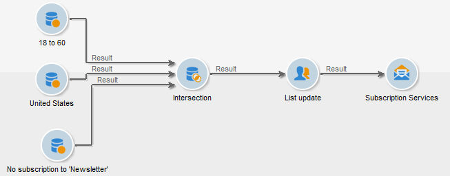

# Servizi di iscrizione{#subscription-services}

Un&#39;attività di tipo **Subscription services** consente di creare o eliminare un abbonamento a un servizio informazioni per il gruppo specificato nella transizione.

Per configurarla, modifica l’attività e immetti la relativa etichetta, quindi seleziona l’azione da eseguire (Abbonamento o Annullamento dell’abbonamento) e il servizio interessato, come nell’esempio seguente:

1. Inserisci l’etichetta dell’attività.
1. Selezionare **[!UICONTROL Generate an outbound transition]** se si desidera creare una transizione alla fine dell&#39;esecuzione.

   In genere, l’abbonamento di una destinazione a un servizio di informazioni segna la fine del flusso di lavoro di targeting, ed è per questo che l’opzione non è attivata per impostazione predefinita.

1. Fare clic su **[!UICONTROL Subscription]** o **[!UICONTROL Unsubscription]** per sottoscrivere o annullare l&#39;abbonamento della popolazione specificata al servizio informazioni selezionato.
1. Selezionare **[!UICONTROL Send a confirmation message]** per notificare ai destinatari l&#39;abbonamento o l&#39;annullamento dell&#39;abbonamento a un servizio.

   Il contenuto di questo messaggio è specificato in un modello di consegna correlato al servizio informazioni. Per ulteriori informazioni, consulta questa [sezione](../../delivery/using/managing-subscriptions.md).

## Esempio: iscrivere un elenco di destinatari a una newsletter {#example--subscribe-a-list-of-recipients-to-a-newsletter}

Con un&#39;unica operazione, il seguente flusso di lavoro intende stilare un elenco dei destinatari idonei per una newsletter, destinata ai lavoratori che vivono a Parigi, al fine di farli iscrivere.

A questo scopo, devi escludere anche i destinatari che si sono già abbonati.

>[!CAUTION]
>
>Prima di abbonare manualmente i destinatari a un servizio, verifica che accettino di ricevere comunicazioni da te.

1. Aggiungi le tre query seguenti:

   * Un’azione mirata a destinatari di età compresa tra i 18 e i 60 anni.
   * Un secondo obiettivo riguarda i destinatari che vivono a Parigi.
   * Un terzo esegue il targeting dei destinatari che non sono attualmente abbonati alla newsletter.

1. Aggiungi un’attività di intersezione per fare riferimento incrociato ai diversi risultati.
1. Se lo desideri, inserisci un aggiornamento dell’elenco per mantenere aggiornato l’elenco degli abbonati più recenti.
1. Inserisci un’attività dei servizi di abbonamento, quindi fai doppio clic su di essa per configurarla.
1. Immettere l&#39;etichetta dell&#39;attività e selezionare **[!UICONTROL Subscription]**.

   Se lo desideri, puoi informare i destinatari della loro iscrizione alla newsletter selezionando la casella **[!UICONTROL Send a confirmation message]**.

1. Seleziona la cartella in cui si trova la newsletter, quindi seleziona la newsletter dall’elenco visualizzato.
1. Lascia **[!UICONTROL Generate outbound transition]** deselezionato in modo che questa attività contrassegni la fine del flusso di lavoro, quindi fai clic su **[!UICONTROL Ok]**.

Durante l’esecuzione del flusso di lavoro, i destinatari corrispondenti a tutte e tre le query vengono aggiunti all’elenco e iscritti alla newsletter.

Per verificare che l&#39;abbonamento sia stato eseguito correttamente, vai alla scheda **[!UICONTROL Subscription]** per i destinatari.

## Parametri di input {#input-parameters}

* tableName
* schema

Ogni evento in entrata deve specificare una destinazione definita da questi parametri.

