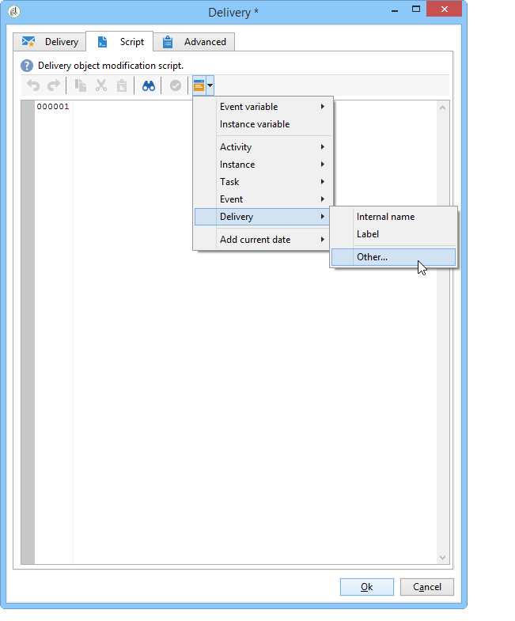

# Supervisione dei flussi di lavoro{#supervising-workflows}

Questo caso d’uso descrive in dettaglio la creazione di un flusso di lavoro che consente di monitorare lo stato di un set di flussi di lavoro che vengono &quot;messi in pausa&quot;, &quot;interrotti&quot; o &quot;con errori&quot;.

Il suo scopo è:

* Utilizza un flusso di lavoro per monitorare un gruppo di flussi di lavoro aziendali.
* Invia un messaggio a un supervisore tramite un&#39;attività di &quot;consegna&quot;.

Per monitorare lo stato di un set di flussi di lavoro, è necessario effettuare le seguenti operazioni:

1. Crea il flusso di lavoro di monitoraggio.
1. Scrivere il codice JavaScript per determinare se i flussi di lavoro vengono messi in pausa, interrotti o con errori.
1. Create l&#39; **[!UICONTROL Test]** attività.
1. Preparate il modello di consegna.

>[!NOTE]
>
>Oltre al flusso di lavoro, Campaign **Workflow Heatmap** consente di analizzare in dettaglio i flussi di lavoro attualmente in esecuzione. For more on this, refer to the [dedicated section](../../workflow/using/heatmap.md).
>
>Per ulteriori informazioni su come **monitorare l&#39;esecuzione** dei flussi di lavoro, consulta [questa sezione](../../workflow/using/monitoring-workflow-execution.md).

## Passaggio 1: Creazione del flusso di lavoro di monitoraggio {#step-1--creating-the-monitoring-workflow}

La cartella del flusso di lavoro che verrà monitorata è la cartella **&quot;CustomWorkflows&quot;** memorizzata nel nodo **Amministrazione > Produzione > Flussi** tecnici. Questa cartella contiene un set di flussi di lavoro aziendali.

Il flusso di lavoro **di** monitoraggio viene memorizzato nella directory principale della cartella Flussi di lavoro tecnici. L&#39;etichetta utilizzata è **&quot;Monitoring&quot;**.

Lo schema seguente mostra la sequenza di attività:


Questo flusso di lavoro è composto da:

* un&#39;attività **&quot;Start&quot;** .
* un&#39;attività **&quot;codice JavaScript&quot;** responsabile dell&#39;analisi della cartella dei flussi di lavoro aziendali.
* un&#39;attività **&quot;Test&quot;** per inviare una consegna al supervisore o riavviare il flusso di lavoro.
* un&#39;attività **&quot;Delivery&quot;** responsabile del layout dei messaggi.
* un&#39;attività **&quot;Wait&quot;** che controlla i tempi di lead tra le iterazioni del flusso di lavoro.

## Passaggio 2: Scrittura di JavaScript {#step-2--writing-the-javascript}

La prima parte del codice JavaScript coincide con una **query (queryDef)** che consente di identificare i flussi di lavoro con uno stato &quot;pause&quot; (@state == 13), &quot;error&quot; (@failure == 1) o &quot;stop&quot; (@state == 20).

Il nome **** interno della cartella del flusso di lavoro da monitorare è indicato nella seguente condizione:

```
<condition boolOperator="AND" expr="[folder/@name] = 'Folder20'" internalId="1"/>
```

```
var strError = "";
var strPaused = "";
var strStop = "";

var queryWkfError = xtk.queryDef.create(
  <queryDef schema="xtk:workflow" operation="select">
    <select>
      <node expr="@internalName"/>
      <node expr="@state"/>
      <node expr="@label"/>
      <node expr="@failed"/>
      <node expr="@state"/>   
    </select>
    <where id="12837805386">
      <condition boolOperator="AND" expr="[folder/@name] = 'Folder20'" internalId="1"/>
        <condition boolOperator="AND" internalId="2">
          <condition boolOperator="OR" expr="@state = 20" internalId="3"/>
          <condition expr="@state = 13" internalId="4"/>
        </condition>  
    </where>
  </queryDef>
);
var ndWkfError = queryWkfError.ExecuteQuery(); 
```

La seconda parte del codice JavaScript consente di **visualizzare un messaggio per ogni flusso di lavoro** in base allo stato recuperato durante la query.

>[!NOTE]
>
>Le stringhe create devono essere caricate nelle variabili evento del flusso di lavoro.

```
for each ( var wkf in ndWkfError.workflow ) 
{
  if ( wkf.@state == 13 )  // Status 13 = paused
  {
    if ( wkf.@failed == 1 )
      strError += "<li>Workflow '" + wkf.@internalName + "' with the label '" + wkf.@label + "'</li>";
    else
      strPaused += "<li>Workflow '" + wkf.@internalName + "' with the label '" + wkf.@label + "'</li>";
  }
  
  if ( wkf.@state == 20 )  // Status 20 = stop
    strStop += "<li>Workflow '" + wkf.@internalName + "' with the label '" + wkf.@label + "'</li>";
}

vars.strWorkflowError = strError;
vars.strWorkflowPaused = strPaused;
vars.strWorkflowStop = strStop;
```

## Passaggio 3: Creazione dell&#39;attività &#39;Test&#39; {#step-3--creating-the--test--activity}

L&#39;attività &quot;Test&quot; consente di determinare se una consegna deve essere inviata o se il flusso di lavoro di monitoraggio deve eseguire un altro ciclo in base all&#39;attività &quot;Wait&quot;.

Una consegna viene inviata al supervisore **se almeno una delle tre variabili di evento &quot;vars.strWorkflowError&quot;, &quot;vars.strWorkflowPaused&quot; o &quot;vars.strWorkflowStop&quot; non è nulla.**


L&#39;attività &quot;Wait&quot; può essere configurata per riavviare il flusso di lavoro di monitoraggio a intervalli regolari. In questo caso, **il tempo di attesa è impostato su un&#39;ora**.


## Passaggio 4: Preparazione della consegna {#step-4--preparing-the-delivery}

L&#39;attività &quot;Consegna&quot; si basa su un modello **di** consegna memorizzato nel nodo **Risorse > Modelli > Modelli** di consegna.

Questo modello deve includere:

* **l&#39;indirizzo e-mail del supervisore**.
* **Contenuto** HTML per l&#39;inserimento di testo personalizzato.

   

   Le tre variabili dichiarate (WF_Stop, WF_Paused, WF_Error) corrispondono alle tre variabili di evento del flusso di lavoro.

   Queste variabili devono essere dichiarate nella scheda **Variabili** delle proprietà del modello di consegna.

   Per recuperare **il contenuto delle variabili** evento del flusso di lavoro, è necessario dichiarare le variabili specifiche per la consegna che verranno inizializzate con i valori restituiti dal codice JavaScript.

   Il modello di consegna include il contenuto seguente:

   

Dopo aver creato e approvato il modello, devi configurare l&#39;attività **Consegna** per:

* collegate l&#39;attività &quot;Consegna&quot; al modello di consegna creato in precedenza.
* collegate le variabili evento del flusso di lavoro a quelle specifiche per il modello di consegna.

Fate doppio clic sull&#39;attività **Consegna** e selezionate le seguenti opzioni:

* Consegna: selezionate **Nuovo, creato da un modello**, quindi selezionate il modello di consegna creato in precedenza.
* Per i campi **Destinatari e Contenuto** , selezionate **Specificato nella consegna**.
* Azione da eseguire: selezionate **Prepara e avviate**.
* Deselezionate l’opzione Errori **** processo.

   

* Andate alla scheda **Script** dell&#39;attività **Consegna** , aggiungete tre variabili di tipo stringa **di** caratteri tramite il menu del campo di personalizzazione.

   

   

   Le tre variabili dichiarate sono:

   ```
   delivery.variables._var[0].stringValue = vars.strWorkflowError;
   delivery.variables._var[1].stringValue = vars.strWorkflowPaused;
   delivery.variables._var[2].stringValue = vars.strWorkflowStop; 
   ```

Dopo l’avvio del flusso di lavoro di monitoraggio, invia il seguente riepilogo al destinatario:


