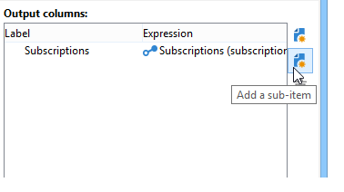

# Dati di targeting{#targeting-data}

## Creazione di query {#creating-queries}

### Selezione dei dati {#selecting-data}

Un&#39; **[!UICONTROL Query]** attività consente di selezionare i dati di base per creare la popolazione di destinazione. Per ulteriori informazioni, vedere [Creazione di una query](../../workflow/using/query.md#creating-a-query).

Per eseguire query e perfezionare i dati del database è inoltre possibile utilizzare le attività seguenti: [Query](../../workflow/using/incremental-query.md)incrementale, elenco di lettura.

È possibile raccogliere dati aggiuntivi da inoltrare ed elaborare per tutto il ciclo di vita del flusso di lavoro. Per ulteriori informazioni, vedere [Aggiunta di dati](../../workflow/using/query.md#adding-data) e [Modifica di dati](#editing-additional-data)aggiuntivi.

### Modifica di dati aggiuntivi {#editing-additional-data}

Una volta aggiunti i dati aggiuntivi, è possibile modificarli o utilizzarli per ridefinire la destinazione definita nell&#39;attività di query.

Il **[!UICONTROL Edit additional data...]** collegamento consente di visualizzare i dati aggiunti e modificarli o aggiungerli.

Per aggiungere dati alle colonne di output definite in precedenza, selezionarle nell&#39;elenco dei campi disponibili. Per creare una nuova colonna di output, fai clic sull’ **[!UICONTROL Add]** icona, quindi seleziona il campo e fai clic su **[!UICONTROL Edit expression]**.

Definire una modalità di calcolo per il campo da aggiungere, ad esempio un aggregato.

L&#39; **[!UICONTROL Add a sub-item]** opzione consente di allegare dati calcolati alla raccolta. Questo consente di selezionare i dati aggiuntivi dalla raccolta o definire i calcoli aggregati per gli elementi della raccolta.

I sottoelementi saranno rappresentati nella sottostruttura della raccolta a cui sono mappati.

Le raccolte sono visualizzate nella **[!UICONTROL Collections]** sottoscheda. Potete filtrare gli elementi raccolti facendo clic sull&#39; **[!UICONTROL Detail]** icona della raccolta selezionata. La procedura guidata filtro consente di selezionare i dati raccolti e specificare le condizioni di filtraggio da applicare ai dati della raccolta.

### Ottimizzazione del target con dati aggiuntivi {#refining-the-target-using-additional-data}

I dati aggiuntivi raccolti possono consentire di perfezionare il filtraggio dei dati nel database. A questo scopo, fate clic sul **[!UICONTROL Refine the target using additional data...]** collegamento: questo consente di filtrare eccessivamente i dati aggiunti.

### Omogenealizzazione dei dati {#homogenizing-data}

Nelle attività **[!UICONTROL Union]** o nel **[!UICONTROL Intersection]** tipo, potete scegliere di mantenere solo i dati aggiuntivi condivisi per mantenere la coerenza dei dati. In questo caso, la tabella di lavoro dell&#39;output temporaneo di questa attività conterrà solo i dati aggiuntivi rilevati in tutti i set in entrata.

### Riconciliazione con dati aggiuntivi {#reconciliation-with-additional-data}

Durante le fasi di riconciliazione dei dati (**[!UICONTROL Union]**, **[!UICONTROL Intersection]** ecc.) attività), è possibile selezionare le colonne da utilizzare per la riconciliazione dei dati dalle colonne aggiuntive. A questo scopo, configurate una riconciliazione su una selezione di colonne e specificate il set principale. Selezionate quindi le colonne nella colonna inferiore della finestra, come illustrato nell’esempio seguente:

### Creazione di sottoinsiemi {#creating-subsets}

L&#39; **[!UICONTROL Split]** attività consente di creare sottoinsiemi in base a criteri definiti tramite query di estrazione. Per ciascun sottoinsieme, quando si modifica una condizione di filtro sulla popolazione, si accede all&#39;attività di query standard che consente di definire le condizioni di segmentazione di destinazione.

Potete dividere una destinazione in più sottoinsiemi utilizzando solo dati aggiuntivi come condizioni di filtraggio, o in aggiunta ai dati di destinazione. È inoltre possibile utilizzare dati esterni se è stata acquistata l&#39;opzione **Federated Data Access** .

Per ulteriori informazioni, consultate [Creazione di sottoinsiemi tramite l&#39;attività](#creating-subsets-using-the-split-activity)Dividi.

## Segmentazione dei dati {#segmenting-data}

### Combinazione di più obiettivi (Unione) {#combining-several-targets--union-}

L&#39;attività dell&#39;unione consente di combinare il risultato di diverse attività all&#39;interno di un&#39;unica transizione. I set non devono necessariamente essere omogenei.

Sono disponibili le seguenti opzioni di riconciliazione dei dati:

* **[!UICONTROL Keys only]**

   Questa opzione può essere utilizzata se le popolazioni di input sono omogenee.

* **[!UICONTROL All columns in common]**

   Questa opzione consente di riconciliare i dati in base a tutte le colonne comuni alle diverse popolazioni della destinazione.

    Adobe Campaign identifica le colonne in base al nome. È accettata una soglia di tolleranza: ad esempio, una colonna &#39;E-mail&#39; può essere riconosciuta identica a una colonna &#39;@email&#39;.

* **[!UICONTROL A selection of columns]**

   Selezionare questa opzione per definire l&#39;elenco delle colonne a cui verrà applicata la riconciliazione dei dati.

   Per iniziare, selezionate il set principale (quello contenente i dati di origine), quindi le colonne da utilizzare per il join.

   

   >[!CAUTION]
   >
   >Durante la riconciliazione dei dati, le popolazioni non vengono deduplicate.

   È possibile limitare la dimensione della popolazione a un determinato numero di record. A tal fine, fare clic sull&#39;opzione appropriata e specificare il numero di record da conservare.

   Inoltre, specificate la priorità delle popolazioni in entrata: la sezione inferiore della finestra elenca le transizioni in entrata dell&#39;attività dell&#39;unione e consente di ordinarle utilizzando le frecce blu a destra della finestra.

   I record saranno presi prima dalla popolazione della prima transizione in entrata nella lista, quindi, se il massimo non è stato raggiunto, saranno presi dalla popolazione della seconda transizione in ingresso, ecc.

   

### Estrazione di dati comuni (intersezione) {#extracting-joint-data--intersection-}

L&#39;intersezione consente di recuperare solo le righe condivise dalle popolazioni di transizioni in entrata. Questa attività deve essere configurata come l&#39;attività dell&#39;unione.

Inoltre, è possibile mantenere solo una selezione di colonne, o solo le colonne condivise dalla popolazione in entrata.

L&#39;attività di intersezione è dettagliata nella sezione [Intersezione](../../workflow/using/intersection.md) .

### Esclusione di una popolazione (Esclusione) {#excluding-a-population--exclusion-}

L&#39;attività di esclusione consente di escludere gli elementi di un target da una popolazione target diversa. La dimensione di targeting dell&#39;output di questa attività sarà quella del set principale.

Se necessario, è possibile manipolare le tabelle in entrata. Infatti, per escludere un target da un&#39;altra dimensione, questo obiettivo deve essere restituito alla stessa dimensione di targeting dell&#39;obiettivo principale. A questo scopo, fare clic sul **[!UICONTROL Add]** pulsante e specificare le condizioni di modifica della dimensione.

La riconciliazione dei dati viene eseguita tramite un identificatore, un asse di modifica o un join. Un esempio è disponibile in [Uso dei dati da un elenco: Leggi l&#39;elenco](../../workflow/using/importing-data.md#using-data-from-a-list--read-list).

### Creazione di sottoinsiemi tramite l&#39;attività Dividi {#creating-subsets-using-the-split-activity}

L&#39; **[!UICONTROL Split]** attività è un&#39;attività standard che consente di creare un numero illimitato di set tramite una o più dimensioni di filtraggio, nonché di generare una transizione di output per sottoinsieme o una transizione univoca.

I dati aggiuntivi trasmessi dalla transizione in entrata possono essere utilizzati nei criteri di filtro.

Per configurarlo, è innanzitutto necessario selezionare i criteri:

1. Nel flusso di lavoro, trascinate e rilasciate un’ **[!UICONTROL Split]** attività.
1. Nella **[!UICONTROL General]** scheda, selezionare l&#39;opzione desiderata: **[!UICONTROL Use data from the target and additional data]**, **[!UICONTROL Use the additional data only]** o **[!UICONTROL Use external data]**.
1. Se l&#39; **[!UICONTROL Use data from the target and additional data]** opzione è selezionata, la dimensione di targeting consente di utilizzare tutti i dati trasmessi dalla transizione in ingresso.

   

   Quando si creano i sottoinsiemi, vengono utilizzati i parametri di filtro indicati sopra.

   Per definire le condizioni di filtro, scegliete l’ **[!UICONTROL Add a filtering condition on the inbound population]** opzione e fate clic sul **[!UICONTROL Edit...]** collegamento. Quindi specificate le condizioni di filtraggio per creare questo sottoinsieme.

   

   Un esempio che mostra come utilizzare le condizioni di filtraggio nell&#39; **[!UICONTROL Split]** attività per segmentare il target in popolazioni diverse è descritto in [questa sezione](../../workflow/using/cross-channel-delivery-workflow.md).

   Il **[!UICONTROL Label]** campo consente di assegnare al sottoinsieme creato un nome che corrisponda alla transizione in uscita.

   È inoltre possibile assegnare un codice del segmento al sottoinsieme per identificarlo e utilizzarlo per il targeting della popolazione.

   Se necessario, potete modificare le dimensioni di targeting e filtro singolarmente per ciascun sottoinsieme da creare. A questo scopo, modificate la condizione di filtraggio del sottoinsieme e verificate l&#39; **[!UICONTROL Use a specific filtering dimension]** opzione.

   

1. Se l&#39; **[!UICONTROL Use the additional data only]** opzione è selezionata, per il filtro dei sottoinsiemi vengono offerti solo dati aggiuntivi.

   

1. Se l&#39;opzione **Federated Data Access** è abilitata, **[!UICONTROL Use external data]** consente di elaborare i dati in un database esterno già configurato oppure di creare una nuova connessione a un database.

   

   Per ulteriori informazioni, consulta questa [sezione](../../platform/using/about-fda.md).

Quindi, è necessario aggiungere nuovi sottoinsiemi:

1. Fare clic sul **[!UICONTROL Add]** pulsante e definire le condizioni di filtraggio.

   

1. Definite la dimensione di filtraggio nella **[!UICONTROL General]** scheda dell&#39;attività (vedete sopra). Si applica a tutti i sottoinsiemi per impostazione predefinita.

   

1. Se necessario, potete modificare singolarmente la dimensione di filtro per ciascun sottoinsieme. Questo consente di creare un set per tutti i possessori di carte Gold, uno per tutti i destinatari che hanno fatto clic sulla newsletter più recente e un terzo per le persone di età compresa tra i 18 e i 25 anni che hanno effettuato un acquisto in-store negli ultimi 30 giorni, utilizzando la stessa attività di divisione. A questo scopo, selezionare l&#39; **[!UICONTROL Use a specific filtering dimension]** opzione e selezionare il contesto di filtraggio dei dati.

   

   >[!NOTE]
   >
   >Se hai acquisito l&#39;opzione **Federated Data Access** , puoi creare sottoinsiemi in base alle informazioni in una base esterna. A tal fine, selezionare lo schema della tabella esterna nel **[!UICONTROL Targeting dimension]** campo. Per ulteriori informazioni, vedere [Accesso a un database esterno (FDA)](../../workflow/using/accessing-an-external-database--fda-.md).

Una volta creati i sottoinsiemi, per impostazione predefinita l&#39;attività divisa mostra tutte le transizioni di output possibili:

Potete raggruppare tutti questi sottoinsiemi in una singola transizione di output. In questo caso, il collegamento ai rispettivi sottoinsiemi sarà visibile, ad esempio, nel codice del segmento. To do this, select the **[!UICONTROL Generate all subsets in the same table]** option.

Ad esempio, puoi inserire una singola attività di consegna e personalizzare il contenuto di consegna in base al codice del segmento di ciascun set di destinatari:

I sottoinsiemi possono anche essere creati utilizzando l&#39; **[!UICONTROL Cells]** attività. For more on this, refer to the [Cells](../../workflow/using/cells.md) section.

### Utilizzo di dati di destinazione {#using-targeted-data}

Una volta identificati e preparati, i dati possono essere utilizzati nei seguenti contesti:

* È possibile aggiornare i dati nel database dopo la manipolazione dei dati nelle varie fasi del flusso di lavoro.

   Per ulteriori informazioni, [aggiorna i dati](../../workflow/using/update-data.md).

* Potete anche aggiornare il contenuto degli elenchi esistenti.

   For more on this, refer to [List update](../../workflow/using/list-update.md).

* Puoi preparare o avviare direttamente le consegne nel flusso di lavoro.

   Per maggiori informazioni, consulta [Consegna](../../workflow/using/delivery.md), Controllo  Consegna e Consegna continua.

## Data Management {#data-management}

In  Adobe Campaign, Data Management combina una serie di attività per risolvere problemi di targeting complessi offrendo strumenti più efficienti e flessibili. Questo consente di implementare una gestione coerente di tutte le comunicazioni con un contatto utilizzando le informazioni relative ai contratti, alle sottoscrizioni, alla reattività alle consegne, ecc. La gestione dati ti consente di eseguire il tracciamento del ciclo di vita dei dati durante le operazioni di segmentazione, in particolare:

* Semplificazione e ottimizzazione dei processi di targeting, includendo dati non modellati nel data mart (creazione di nuove tabelle: estensione locale per ogni flusso di lavoro di targeting, a seconda della configurazione).
* Mantenimento e trasmissione dei calcoli di buffer, soprattutto durante le fasi di costruzione del target o per l’amministrazione del database.
* Accesso a basi esterne (facoltativo): database eterogenei presi in considerazione durante il processo di targeting.

Per implementare queste operazioni,  Adobe Campaign offre:

* Attività di raccolta dati: [Trasferimento](../../workflow/using/file-transfer.md)dei file, caricamento [dei dati (file)](../../workflow/using/data-loading--file-.md), caricamento dei [dati (RDBMS)](../../workflow/using/data-loading--rdbms-.md), [aggiornamento dei dati](../../workflow/using/update-data.md). Questa prima fase della raccolta dei dati prepara i dati per consentirne l&#39;elaborazione in altre attività. È necessario monitorare diversi parametri per garantire che il flusso di lavoro venga eseguito correttamente e fornire i risultati previsti. Ad esempio, quando si importano i dati, la chiave primaria (Pkey) per questi dati deve essere univoca per ciascun record.
* Il targeting delle attività è stato arricchito con le opzioni di gestione dei dati: [Query](../../workflow/using/query.md), [Unione](../../workflow/using/union.md), [Intersezione](../../workflow/using/intersection.md), [Dividi](../../workflow/using/split.md). Questo consente di configurare un&#39;unione o un&#39;intersezione tra dati provenienti da diverse dimensioni di targeting, purché sia possibile la riconciliazione dei dati.
* Attività di trasformazione dei dati: [Arricchimento](../../workflow/using/enrichment.md), [Modifica dimensione](../../workflow/using/change-dimension.md).

>[!CAUTION]
>
>Quando due flussi di lavoro sono collegati, l&#39;eliminazione di un elemento tabella di origine non comporta l&#39;eliminazione di tutti i dati ad esso collegati.
>  
>Ad esempio, l&#39;eliminazione di un destinatario tramite un flusso di lavoro non comporta l&#39;eliminazione di tutta la cronologia di consegna del destinatario. Tuttavia, eliminando un destinatario direttamente nella cartella &quot;Destinatari&quot;, tutti i dati collegati a tale destinatario verranno effettivamente eliminati.

### Arricchimento e modifica dei dati {#enriching-and-modifying-data}

Oltre alla dimensione di targeting, la dimensione di filtro consente di specificare la natura dei dati raccolti. Fate riferimento alle dimensioni [di](../../workflow/using/building-a-workflow.md#targeting-and-filtering-dimensions)targeting e filtro.

I dati identificati e raccolti possono essere arricchiti, aggregati e manipolati per ottimizzare la costruzione del target. A questo scopo, oltre alle attività di manipolazione dei dati descritte nella sezione [Segmentazione dei dati](#segmenting-data) , utilizza quanto segue:

* L&#39; **[!UICONTROL Enrichment]** attività consente di aggiungere momentaneamente le colonne a uno schema, nonché di aggiungere informazioni ad alcuni elementi. È dettagliata nella sezione [Arricchimento](../../workflow/using/enrichment.md) del repository delle attività.
* L&#39; **[!UICONTROL Edit schema]** attività consente di modificare la struttura di uno schema. È dettagliata nella sezione [Modifica schema](../../workflow/using/edit-schema.md) della directory archivio delle attività.
* L&#39; **[!UICONTROL Change dimension]** attività consente di modificare la dimensione di targeting durante il ciclo di costruzione di destinazione. È illustrato nella sezione [Cambia dimensione](../../workflow/using/change-dimension.md) .

