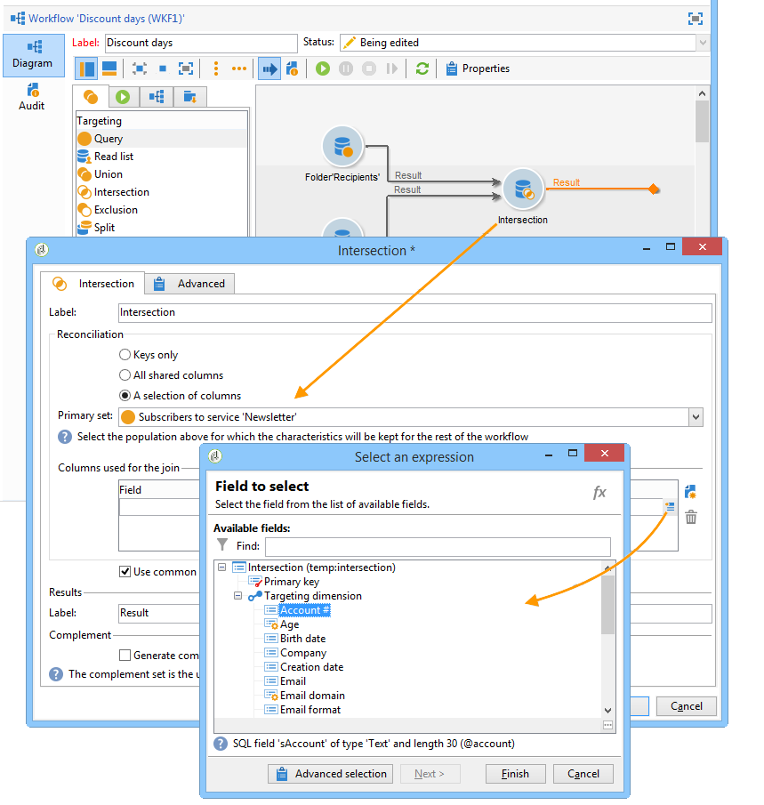

# Targeting dei dati{#targeting-data}

## Creare le query {#creating-queries}

### Selezionare i dati {#selecting-data}

A **[!UICONTROL Query]** attività consente di selezionare dati di base per generare la popolazione target. Per ulteriori informazioni, consulta [Creazione di una query](query.md#creating-a-query).

Puoi inoltre utilizzare le seguenti attività per eseguire query e perfezionare i dati dal database: [Query incrementale](incremental-query.md), [Leggi elenco](read-list.md).

È possibile raccogliere dati aggiuntivi da inoltrare ed elaborare durante l’intero ciclo di vita del flusso di lavoro. Per ulteriori informazioni, consulta [Aggiunta di dati](query.md#adding-data) e [Modifica di dati aggiuntivi](#editing-additional-data).

### Modifica dati aggiuntivi {#editing-additional-data}

Una volta aggiunti i dati aggiuntivi, puoi modificarli o utilizzarli per perfezionare il target definito nell’attività di query.

Il **[!UICONTROL Edit additional data...]** consente di visualizzare i dati aggiunti, modificarli o aggiungerli.

Per aggiungere dati alle colonne di output definite in precedenza, selezionarli nell&#39;elenco dei campi disponibili. Per creare una nuova colonna di output, fare clic su **[!UICONTROL Add]** , quindi seleziona il campo e fai clic su **[!UICONTROL Edit expression]**.

Definisci una modalità di calcolo per il campo da aggiungere, ad esempio un aggregato.

Il **[!UICONTROL Add a sub-item]** consente di allegare dati calcolati alla raccolta. Questo consente di selezionare i dati aggiuntivi dalla raccolta o di definire calcoli di aggregazione sugli elementi della raccolta.

I sottoelementi verranno rappresentati nella sottostruttura della raccolta a cui sono mappati.

Le raccolte sono visualizzate nella **[!UICONTROL Collections]** scheda secondaria. Puoi filtrare gli elementi raccolti facendo clic sul pulsante **[!UICONTROL Detail]** dell&#39;insieme selezionato. La procedura guidata di filtro consente di selezionare i dati raccolti e specificare le condizioni di filtro da applicare ai dati della raccolta.

### Ottimizzare il target utilizzando dati aggiuntivi {#refining-the-target-using-additional-data}

I dati aggiuntivi raccolti possono consentire di perfezionare il filtro dei dati nel database. A questo scopo, fai clic su **[!UICONTROL Refine the target using additional data...]** collegamento: consente di filtrare in modo eccessivo i dati aggiunti.

### Omogeneizzare i dati {#homogenizing-data}

In entrata **[!UICONTROL Union]** o **[!UICONTROL Intersection]** attività di tipo, puoi scegliere di mantenere solo i dati aggiuntivi condivisi per mantenere la coerenza dei dati. In questo caso, la tabella di lavoro di output temporanea di questa attività conterrà solo i dati aggiuntivi trovati in tutti i set in entrata.

### Riconciliazione con dati aggiuntivi {#reconciliation-with-additional-data}

Durante le fasi di riconciliazione dei dati (**[!UICONTROL Union]**, **[!UICONTROL Intersection]**, ecc. attività), è possibile selezionare le colonne da utilizzare per la riconciliazione dei dati dalle colonne aggiuntive. A questo scopo, configura una riconciliazione su una selezione di colonne e specifica il set principale. Selezionare quindi le colonne nella colonna inferiore della finestra, come illustrato nell&#39;esempio seguente:

### Creare sottoinsiemi {#creating-subsets}

Il **[!UICONTROL Split]** l’attività ti consente di creare sottoinsiemi in base ai criteri definiti tramite le query di estrazione. Per ogni sottoinsieme, quando modifichi una condizione di filtro sulla popolazione, accedi all’attività di query standard che consente di definire le condizioni di segmentazione di destinazione.

È possibile suddividere una destinazione in diversi sottoinsiemi utilizzando solo dati aggiuntivi come condizioni di filtro o in aggiunta ai dati di destinazione. Puoi anche utilizzare dati esterni se hai acquistato **Federated Data Access** opzione.

Per ulteriori informazioni, consulta [Creazione di sottoinsiemi tramite l’attività Dividi](#creating-subsets-using-the-split-activity).

## Dati del segmento {#segmenting-data}

### Combinare più target (Unione) {#combining-several-targets--union-}

L’attività di unione ti consente di combinare il risultato di più attività in una sola transizione. Gli insiemi non devono necessariamente essere omogenei.

Sono disponibili le seguenti opzioni di riconciliazione dei dati:

* **[!UICONTROL Keys only]**

  Questa opzione può essere utilizzata se le popolazioni di input sono omogenee.

* **[!UICONTROL All columns in common]**

  Questa opzione consente di riconciliare i dati in base a tutte le colonne comuni alle varie popolazioni del target.

  Adobe Campaign identifica le colonne in base al loro nome. È accettata una soglia di tolleranza: ad esempio, una colonna &quot;E-mail&quot; può essere riconosciuta come identica a una colonna &quot;@email&quot;.

* **[!UICONTROL A selection of columns]**

  Seleziona questa opzione per definire l’elenco di colonne alle quali verrà applicata la riconciliazione dei dati.

  Inizia selezionando il set principale (quello contenente i dati di origine), quindi le colonne da utilizzare per il join.

  

  >[!CAUTION]
  >
  >Durante la riconciliazione dei dati, le popolazioni non vengono deduplicate.

  È possibile limitare la dimensione della popolazione a un determinato numero di record. A questo scopo, fai clic sull’opzione appropriata e specifica il numero di record da conservare.

  Inoltre, specifica la priorità delle popolazioni in entrata: la sezione inferiore della finestra elenca le transizioni in entrata dell’attività unione e ti consente di ordinarle utilizzando le frecce blu a destra della finestra.

  I record verranno ricavati prima dalla popolazione della prima transizione in entrata nell’elenco, quindi, se non è stato raggiunto il massimo, verranno ricavati dalla popolazione della seconda transizione in entrata e così via.

  

### Estrai dati articolari (intersezione) {#extracting-joint-data--intersection-}

L’intersezione ti consente di recuperare solo le linee condivise dalle popolazioni delle transizioni in entrata. Questa attività deve essere configurata come l’attività dell’unione.

Inoltre, è possibile mantenere solo una selezione di colonne o solo le colonne condivise dal gruppo in entrata.

L’attività di intersezione è descritta nel [Intersezione](intersection.md) sezione.

### Escludere una popolazione (esclusione) {#excluding-a-population--exclusion-}

L’attività di esclusione ti consente di escludere gli elementi di un target da una popolazione target diversa. La dimensione di targeting di output di questa attività sarà quella del set principale.

Se necessario, è possibile manipolare le tabelle in entrata. In effetti, per escludere un target da un’altra dimensione, tale target deve essere restituito nella stessa dimensione targeting del target principale. A questo scopo, fai clic su **[!UICONTROL Add]** e specificare le condizioni per la modifica delle quote.

La riconciliazione dei dati viene eseguita tramite un identificatore, la modifica dell’asse o un join. Un esempio è disponibile in [Utilizzo di dati da un elenco: Leggi elenco](../../platform/using/import-export-workflows.md#using-data-from-a-list--read-list).

### Creare sottoinsiemi utilizzando l’attività Dividi {#creating-subsets-using-the-split-activity}

Il **[!UICONTROL Split]** attività è un’attività standard che consente di creare tutti i set necessari tramite una o più dimensioni di filtro e di generare una transizione di output per sottoinsieme o una transizione univoca.

I dati aggiuntivi trasmessi dalla transizione in entrata possono essere utilizzati nei criteri di filtro.

Per configurarlo, devi innanzitutto selezionare i criteri:

1. Nel flusso di lavoro, trascina **[!UICONTROL Split]** attività.
1. In **[!UICONTROL General]** , seleziona l’opzione desiderata: **[!UICONTROL Use data from the target and additional data]**, **[!UICONTROL Use the additional data only]** o **[!UICONTROL Use external data]**.
1. Se il **[!UICONTROL Use data from the target and additional data]** è selezionata, la dimensione di targeting ti consente di utilizzare tutti i dati trasmessi dalla transizione in entrata.

   

   Quando si creano sottoinsiemi, vengono utilizzati i parametri di filtro sopra indicati.

   Per definire le condizioni di filtro, scegliere **[!UICONTROL Add a filtering condition on the inbound population]** e fare clic sul pulsante **[!UICONTROL Edit...]** collegamento. Quindi specifica le condizioni di filtro per la creazione di questo sottoinsieme.

   

   Un esempio che mostra come utilizzare le condizioni di filtro nel **[!UICONTROL Split]** per segmentare il target in popolazioni diverse è descritta in [questa sezione](cross-channel-delivery-workflow.md).

   Il **[!UICONTROL Label]** consente di assegnare al sottoinsieme appena creato un nome che corrisponderà alla transizione in uscita.

   Puoi anche assegnare un codice di segmento al sottoinsieme per identificarlo e utilizzarlo per eseguire il targeting della sua popolazione.

   Se necessario, puoi modificare le dimensioni di targeting e filtro singolarmente per ogni sottoinsieme che desideri creare. A questo scopo, modifica la condizione di filtro del sottoinsieme e seleziona la **[!UICONTROL Use a specific filtering dimension]** opzione.

   

1. Se il **[!UICONTROL Use the additional data only]** opzione è selezionata, vengono offerti solo dati aggiuntivi per il filtro del sottoinsieme.

   

1. Se il **Federated Data Access** è attivata, la **[!UICONTROL Use external data]** consente di elaborare i dati in un database esterno già configurato o di creare una nuova connessione a un database.

   

   Per ulteriori informazioni, a seconda della versione di Campaign in uso, consulta le sezioni seguenti:

   [Documentazione di Campaign v7](../../installation/using/about-fda.md)

   [Documentazione di Campaign v8](https://experienceleague.adobe.com/docs/campaign/campaign-v8/connect/fda.html?lang=it)

Quindi, è necessario aggiungere nuovi sottoinsiemi:

1. Fai clic su **[!UICONTROL Add]** e definiscono le condizioni di filtro.

   

1. Definisci la dimensione di filtro in **[!UICONTROL General]** (vedi sopra).Si applica a tutti i sottoinsiemi per impostazione predefinita.

   

1. Se necessario, puoi modificare la dimensione di filtro per ogni sottoinsieme singolarmente. Questo ti consente di creare un set per tutti i titolari di carte Gold, uno per tutti i destinatari che hanno fatto clic nell’ultima newsletter e un terzo per le persone di età compresa tra i 18 e i 25 anni che hanno effettuato un acquisto in-store negli ultimi 30 giorni, tutti utilizzando la stessa attività di suddivisione. A questo scopo, seleziona la **[!UICONTROL Use a specific filtering dimension]** e selezionare il contesto di filtro dei dati.

   

   >[!NOTE]
   >
   >Se hai acquisito **Federated Data Access** , è possibile creare sottoinsiemi in base alle informazioni contenute in una base esterna. A questo scopo, seleziona lo schema della tabella esterna in **[!UICONTROL Targeting dimension]** campo. Per ulteriori informazioni, consulta [Accesso a un database esterno (FDA)](accessing-an-external-database-fda.md).

Una volta creati i sottoinsiemi, per impostazione predefinita l’attività divisa mostra tante transizioni di output quanti sono i sottoinsiemi:

Potete raggruppare tutti questi sottoinsiemi in un&#39;unica transizione di output. In questo caso, ad esempio, il collegamento ai rispettivi sottoinsiemi sarà visibile nel codice del segmento. A questo scopo, seleziona la **[!UICONTROL Generate all subsets in the same table]** opzione.

Ad esempio, puoi inserire una singola attività di consegna e personalizzare il contenuto della consegna in base al codice di segmento di ciascun set di destinatari:

I sottoinsiemi possono essere creati anche utilizzando **[!UICONTROL Cells]** attività. Per ulteriori informazioni, consulta [Celle](cells.md) sezione.

### Utilizzare dati di destinazione {#using-targeted-data}

Una volta identificati e preparati i dati, è possibile utilizzarli nei seguenti contesti:

* Puoi aggiornare i dati nel database seguendo la manipolazione dei dati nelle varie fasi del flusso di lavoro.

  Per ulteriori informazioni, [Aggiorna dati](update-data.md).

* È inoltre possibile aggiornare il contenuto degli elenchi esistenti.

  Per ulteriori informazioni, consulta [Aggiornamento elenco](list-update.md).

* Puoi preparare o avviare le consegne direttamente nel flusso di lavoro.

  Per ulteriori informazioni, consulta [Consegna](delivery.md), [Controllo della consegna](delivery-control.md) e [Consegna continua](continuous-delivery.md).

## Gestione dati {#data-management}

In Adobe Campaign, Data Management combina una serie di attività per risolvere problemi di targeting complessi offrendo strumenti più efficienti e flessibili. Questo consente di implementare una gestione coerente di tutte le comunicazioni con un contatto utilizzando informazioni relative ai contratti, agli abbonamenti, alla reattività alle consegne, ecc. La gestione dati ti consente di eseguire il tracciamento del ciclo di vita dei dati durante le operazioni di segmentazione, in particolare:

* Semplificazione e ottimizzazione dei processi di targeting, includendo dati non modellati nel data mart (creazione di nuove tabelle: estensione locale per ogni flusso di lavoro di targeting, a seconda della configurazione).
* Mantenimento e trasmissione dei calcoli di buffer, soprattutto durante le fasi di costruzione del target o per l’amministrazione del database.
* Accesso a basi esterne (facoltativo): database eterogenei presi in considerazione durante il processo di targeting.

Per implementare queste operazioni, Adobe Campaign offre:

* Attività di raccolta dati: [Trasferimento file](file-transfer.md), [Caricamento dati (file)](data-loading-file.md), [Caricamento dati (RDBMS)](data-loading-rdbms.md), [Aggiorna dati](update-data.md). Questo primo passaggio di raccolta dei dati prepara i dati per consentirne l’elaborazione in altre attività. È necessario monitorare diversi parametri per garantire che il flusso di lavoro venga eseguito correttamente e dia i risultati previsti. Ad esempio, quando si importano dati, la chiave primaria (Pkey) per questi dati deve essere univoca per ciascun record.
* Le attività di targeting sono state arricchite con opzioni di gestione dati: [Query](query.md), [Union](union.md), [Intersezione](intersection.md), [Dividi](split.md). Questo consente di configurare un’unione o un’intersezione tra dati provenienti da diverse dimensioni di targeting diverse, purché sia possibile la riconciliazione dei dati.
* Attività di trasformazione dei dati: [Arricchimento](enrichment.md), [Cambia dimensione](change-dimension.md).

>[!CAUTION]
>
>Quando due flussi di lavoro sono collegati, l’eliminazione di un elemento della tabella di origine non comporta l’eliminazione di tutti i dati ad esso collegati.
>  
>Ad esempio, l’eliminazione di un destinatario tramite un flusso di lavoro non determinerà l’eliminazione di tutta la cronologia delle consegne del destinatario. Tuttavia, l’eliminazione diretta di un destinatario nella cartella &quot;Destinatari&quot; determinerà l’eliminazione di tutti i dati collegati a questo destinatario.

### Arricchire e modificare i dati {#enriching-and-modifying-data}

Oltre alla dimensione di targeting, la dimensione di filtro consente di specificare la natura dei dati raccolti. Fai riferimento a [Dimensioni di targeting e filtro](building-a-workflow.md#targeting-and-filtering-dimensions).

I dati identificati e raccolti possono essere arricchiti, aggregati e manipolati per ottimizzare la costruzione del target. A questo scopo, oltre alle attività di manipolazione dei dati descritte nella [Segmentazione dei dati](#segmenting-data) , utilizza quanto segue:

* Il **[!UICONTROL Enrichment]** l’attività ti consente di aggiungere momentaneamente colonne a uno schema, nonché informazioni a determinati elementi. È descritto nella sezione [Arricchimento](enrichment.md) sezione dell’archivio delle attività.
* Il **[!UICONTROL Edit schema]** attività di consente di modificare la struttura di uno schema. È descritto nella sezione [Modifica schema](edit-schema.md) sezione dell’archivio delle attività.
* Il **[!UICONTROL Change dimension]** attività consente di modificare la dimensione di targeting durante il ciclo di costruzione del target. È descritto nella sezione [Cambia dimensione](change-dimension.md) sezione.
