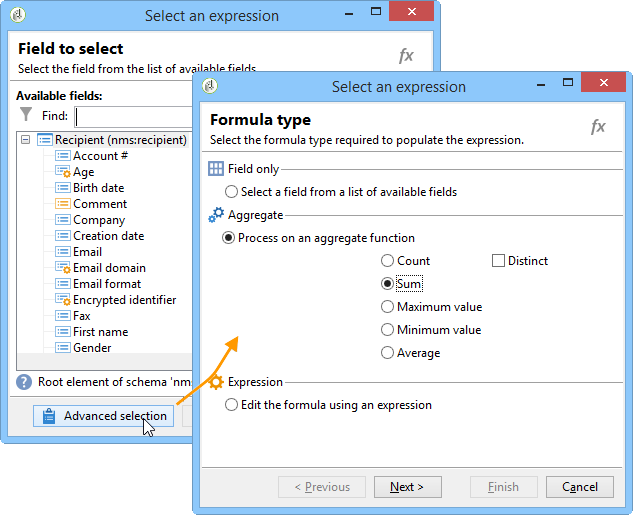
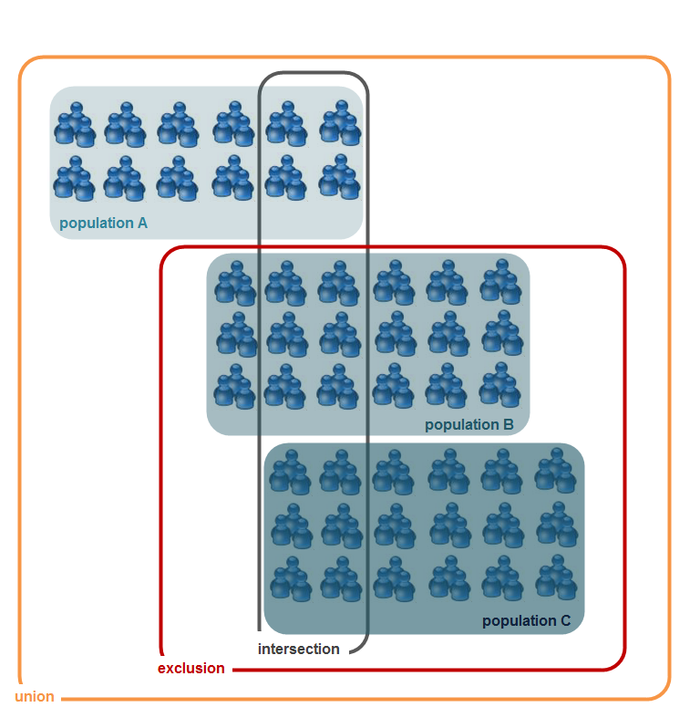

# Dati di targeting{#targeting-data}

## Creazione di query {#creating-queries}

### Selezione dei dati {#selecting-data}

Un’attività **[!UICONTROL Query]** ti consente di selezionare i dati di base per creare la popolazione target. Per ulteriori informazioni, consulta [Creazione di una query](../../workflow/using/query.md#creating-a-query).

Puoi inoltre utilizzare le seguenti attività per eseguire query e perfezionare i dati dal database: [Query incrementale](../../workflow/using/incremental-query.md), [Leggi elenco](../../workflow/using/read-list.md).

È possibile raccogliere dati aggiuntivi da inoltrare ed elaborare per tutto il ciclo di vita del flusso di lavoro. Per ulteriori informazioni, consulta [Aggiunta di dati](../../workflow/using/query.md#adding-data) e [Modifica di dati aggiuntivi](#editing-additional-data).

### Modifica di dati aggiuntivi {#editing-additional-data}

Una volta aggiunti i dati aggiuntivi, puoi modificarli o utilizzarli per perfezionare la destinazione definita nell’attività di query.

Il collegamento **[!UICONTROL Edit additional data...]** ti consente di visualizzare i dati aggiunti e modificarli o aggiungerli.

Per aggiungere dati alle colonne di output definite in precedenza, selezionalo nell’elenco dei campi disponibili. Per creare una nuova colonna di output, fai clic sull’icona **[!UICONTROL Add]** , quindi seleziona il campo e fai clic su **[!UICONTROL Edit expression]**.

Definire una modalità di calcolo per il campo da aggiungere, ad esempio un aggregato.

L’opzione **[!UICONTROL Add a sub-item]** ti consente di allegare i dati calcolati alla raccolta. Ciò ti consente di selezionare i dati aggiuntivi dalla raccolta o di definire i calcoli aggregati sugli elementi di raccolta.

I sottoelementi saranno rappresentati nel sottoalbero della raccolta a cui sono mappati.

Le raccolte vengono visualizzate nella sottoscheda **[!UICONTROL Collections]** . Per filtrare gli elementi raccolti, fai clic sull’icona **[!UICONTROL Detail]** della raccolta selezionata. La procedura guidata di filtro consente di selezionare i dati raccolti e specificare le condizioni di filtro da applicare ai dati della raccolta.

### Ottimizzazione del target utilizzando dati aggiuntivi {#refining-the-target-using-additional-data}

I dati aggiuntivi raccolti possono consentirti di perfezionare il filtraggio dei dati nel database. A questo scopo, fai clic sul collegamento **[!UICONTROL Refine the target using additional data...]** : questo consente di filtrare eccessivamente i dati aggiunti.

### Omogenealizzazione dei dati {#homogenizing-data}

Nelle attività di tipo **[!UICONTROL Union]** o **[!UICONTROL Intersection]**, puoi scegliere di mantenere la coerenza dei dati solo per i dati aggiuntivi condivisi. In questo caso, la tabella di lavoro dell’output temporaneo di questa attività conterrà solo i dati aggiuntivi presenti in tutti i set in entrata.

### Riconciliazione con dati aggiuntivi {#reconciliation-with-additional-data}

Durante le fasi di riconciliazione dei dati (**[!UICONTROL Union]**, **[!UICONTROL Intersection]**, ecc. attività), puoi selezionare le colonne da utilizzare per la riconciliazione dei dati dalle colonne aggiuntive. A questo scopo, configura una riconciliazione su una selezione di colonne e specifica il set principale. Quindi selezionate le colonne nella colonna inferiore della finestra, come illustrato nell’esempio seguente:

### Creazione di sottoinsiemi {#creating-subsets}

L’attività **[!UICONTROL Split]** ti consente di creare sottoinsiemi in base a criteri definiti tramite query di estrazione. Per ogni sottoinsieme, quando modifichi una condizione di filtro sulla popolazione, accederai all’attività di query standard che ti consente di definire le condizioni di segmentazione di destinazione.

Puoi dividere una destinazione in più sottoinsiemi utilizzando solo dati aggiuntivi come condizioni di filtro o in aggiunta ai dati di destinazione. Puoi anche utilizzare dati esterni se hai acquistato l’opzione **Federated Data Access** .

Per ulteriori informazioni, consulta [Creazione di sottoinsiemi tramite l’attività Split](#creating-subsets-using-the-split-activity).

## Segmentazione dei dati {#segmenting-data}

### Combinazione di più obiettivi (Union) {#combining-several-targets--union-}

L’attività di unione ti consente di combinare il risultato di più attività all’interno di una transizione. I set non devono necessariamente essere omogenei.

Sono disponibili le seguenti opzioni di riconciliazione dei dati:

* **[!UICONTROL Keys only]**

   Questa opzione può essere utilizzata se le popolazioni di input sono omogenee.

* **[!UICONTROL All columns in common]**

   Questa opzione consente di riconciliare i dati in base a tutte le colonne comuni alle diverse popolazioni del target.

   Adobe Campaign identifica le colonne in base al loro nome. È accettata una soglia di tolleranza: ad esempio, una colonna &quot;E-mail&quot; può essere riconosciuta identica a una colonna &quot;@email&quot;.

* **[!UICONTROL A selection of columns]**

   Seleziona questa opzione per definire l’elenco di colonne alle quali verrà applicata la riconciliazione dei dati.

   Inizia selezionando il set principale (quello contenente i dati di origine), quindi le colonne da utilizzare per il join.

   

   >[!CAUTION]
   >
   >Durante la riconciliazione dei dati, le popolazioni non vengono deduplicate.

   È possibile limitare la dimensione della popolazione a un determinato numero di record. A questo scopo, fai clic sull’opzione appropriata e specifica il numero di record da conservare.

   Inoltre, specifica la priorità delle popolazioni in entrata: la sezione inferiore della finestra elenca le transizioni in entrata dell’attività di unione e consente di ordinarle utilizzando le frecce blu a destra della finestra.

   I record verranno prelevati prima dalla popolazione della prima transizione in entrata nell’elenco, quindi, se il massimo non è stato raggiunto, verranno prelevati dalla popolazione della seconda transizione in entrata, ecc.

   

### Estrazione di dati comuni (intersezione) {#extracting-joint-data--intersection-}

L’intersezione ti consente di recuperare solo le righe condivise dalle popolazioni di transizioni in entrata. Questa attività deve essere configurata come l&#39;attività dell&#39;unione.

Inoltre, è possibile mantenere solo una selezione di colonne, o solo le colonne condivise dalla popolazione in entrata.

L’attività di intersezione è descritta nella sezione [Intersezione](../../workflow/using/intersection.md) .

### Esclusione di una popolazione (Esclusione) {#excluding-a-population--exclusion-}

L’attività di esclusione ti consente di escludere gli elementi di un target da una popolazione target diversa. La dimensione di targeting dell’output di questa attività sarà quella del set principale.

Se necessario, è possibile manipolare le tabelle in entrata. Infatti, per escludere un target da un’altra dimensione, questo deve essere restituito alla stessa dimensione di targeting del target principale. A questo scopo, fai clic sul pulsante **[!UICONTROL Add]** e specifica le condizioni di modifica della dimensione.

La riconciliazione dei dati viene eseguita tramite un identificatore, un asse di modifica o un join. Un esempio è disponibile in [Uso dei dati di un elenco: Leggi elenco](../../platform/using/import-export-workflows.md#using-data-from-a-list--read-list).

### Creazione di sottoinsiemi tramite l’attività Split {#creating-subsets-using-the-split-activity}

L’ attività **[!UICONTROL Split]** è un’attività standard che consente di creare tutti i set necessari tramite una o più dimensioni di filtro e di generare una transizione di output per sottoinsieme o una transizione univoca.

I dati aggiuntivi trasmessi dalla transizione in entrata possono essere utilizzati nei criteri di filtro.

Per configurarlo, devi prima selezionare i criteri:

1. Nel flusso di lavoro, trascina e rilascia un’attività **[!UICONTROL Split]** .
1. Nella scheda **[!UICONTROL General]** , seleziona l’opzione desiderata: **[!UICONTROL Use data from the target and additional data]**, **[!UICONTROL Use the additional data only]** o **[!UICONTROL Use external data]**.
1. Se è selezionata l’opzione **[!UICONTROL Use data from the target and additional data]** , la dimensione di targeting ti consente di utilizzare tutti i dati trasmessi dalla transizione in entrata.

   

   Quando si creano i sottoinsiemi, vengono utilizzati i parametri di filtro sopra indicati.

   Per definire le condizioni di filtro, scegli l’opzione **[!UICONTROL Add a filtering condition on the inbound population]** e fai clic sul collegamento **[!UICONTROL Edit...]** . Quindi specifica le condizioni di filtro per la creazione di questo sottoinsieme.

   

   Un esempio che mostra come utilizzare le condizioni di filtro nell&#39;attività **[!UICONTROL Split]** per segmentare il target in popolazioni diverse è descritto in [questa sezione](../../workflow/using/cross-channel-delivery-workflow.md).

   Il campo **[!UICONTROL Label]** ti consente di assegnare un nome al sottoinsieme appena creato, che corrisponde alla transizione in uscita.

   Puoi anche assegnare un codice di segmento al sottoinsieme per identificarlo e utilizzarlo per eseguire il targeting della sua popolazione.

   Se necessario, puoi modificare le dimensioni di targeting e filtro singolarmente per ogni sottoinsieme che desideri creare. A questo scopo, modifica la condizione di filtro del sottoinsieme e seleziona l’opzione **[!UICONTROL Use a specific filtering dimension]** .

   

1. Se è selezionata l’opzione **[!UICONTROL Use the additional data only]** , vengono offerti solo dati aggiuntivi per il filtro dei sottoinsiemi.

   

1. Se l&#39;opzione **Federated Data Access** è abilitata, **[!UICONTROL Use external data]** consente di elaborare i dati in un database esterno già configurato oppure di creare una nuova connessione a un database.

   

   Per ulteriori informazioni, consulta questa [sezione](../../installation/using/about-fda.md).

Quindi, è necessario aggiungere nuovi sottoinsiemi:

1. Fai clic sul pulsante **[!UICONTROL Add]** e definisci le condizioni di filtro.

   

1. Definisci la dimensione di filtro nella scheda **[!UICONTROL General]** dell’attività (vedi sopra). Si applica a tutti i sottoinsiemi per impostazione predefinita.

   

1. Se necessario, puoi modificare singolarmente la dimensione di filtro per ciascun sottoinsieme. Questo consente di creare un set per tutti i titolari di carte Gold, uno per tutti i destinatari che hanno fatto clic sulla newsletter più recente e un terzo per le persone di età compresa tra i 18 e i 25 anni che hanno effettuato un acquisto in negozio negli ultimi 30 giorni, il tutto utilizzando la stessa attività di suddivisione. A questo scopo, seleziona l’opzione **[!UICONTROL Use a specific filtering dimension]** e seleziona il contesto di filtraggio dei dati.

   

   >[!NOTE]
   >
   >Se hai acquisito l’opzione **Federated Data Access** , puoi creare sottoinsiemi in base alle informazioni in una base esterna. A questo scopo, seleziona lo schema della tabella esterna nel campo **[!UICONTROL Targeting dimension]** . Per ulteriori informazioni, consulta [Accesso a un database esterno (FDA)](../../workflow/using/accessing-an-external-database--fda-.md).

Una volta creati i sottoinsiemi, per impostazione predefinita l’attività divisa mostra quante transizioni di output sono presenti nei sottoinsiemi:

Puoi raggruppare tutti questi sottoinsiemi in una singola transizione di output. In questo caso, ad esempio, il collegamento ai rispettivi sottoinsiemi sarà visibile nel codice del segmento. A questo scopo, seleziona l’opzione **[!UICONTROL Generate all subsets in the same table]** .

Ad esempio, puoi inserire una singola attività di consegna e personalizzare il contenuto della consegna in base al codice del segmento di ciascun set di destinatari:

I sottoinsiemi possono essere creati anche utilizzando l’attività **[!UICONTROL Cells]** . Per ulteriori informazioni, consulta la sezione [Celle](../../workflow/using/cells.md) .

### Utilizzo di dati di destinazione {#using-targeted-data}

Una volta identificati e preparati, i dati possono essere utilizzati nei seguenti contesti:

* Puoi aggiornare i dati nel database in seguito alla manipolazione dei dati nelle varie fasi del flusso di lavoro.

   Per ulteriori informazioni, [Aggiorna dati](../../workflow/using/update-data.md).

* È inoltre possibile aggiornare il contenuto degli elenchi esistenti.

   Per ulteriori informazioni, consulta [Aggiornamento elenco](../../workflow/using/list-update.md).

* Puoi preparare o avviare direttamente le consegne nel flusso di lavoro.

   Per ulteriori informazioni, consulta [Consegna](../../workflow/using/delivery.md), [Controllo consegna](../../workflow/using/delivery-control.md) e [Consegna continua](../../workflow/using/continuous-delivery.md).

## Gestione dati {#data-management}

In Adobe Campaign, la gestione dei dati combina una serie di attività per risolvere problemi di targeting complessi offrendo strumenti più efficienti e flessibili. Questo ti consente di implementare una gestione coerente di tutte le comunicazioni con un contatto utilizzando informazioni relative ai loro contratti, abbonamenti, reattività alle consegne, ecc. La gestione dati ti consente di eseguire il tracciamento del ciclo di vita dei dati durante le operazioni di segmentazione, in particolare:

* Semplificazione e ottimizzazione dei processi di targeting, includendo dati non modellati nel data mart (creazione di nuove tabelle: estensione locale per ogni flusso di lavoro di targeting, a seconda della configurazione).
* Mantenimento e trasmissione dei calcoli di buffer, soprattutto durante le fasi di costruzione del target o per l’amministrazione del database.
* Accesso a basi esterne (facoltativo): database eterogenei presi in considerazione durante il processo di targeting.

Per implementare queste operazioni, Adobe Campaign offre:

* Attività di raccolta dati: [Trasferimento file](../../workflow/using/file-transfer.md), [Caricamento dati (file)](../../workflow/using/data-loading--file-.md), [Caricamento dati (RDBMS)](../../workflow/using/data-loading--rdbms-.md), [Aggiornamento dati](../../workflow/using/update-data.md). Questa prima fase della raccolta dei dati prepara i dati per consentirne l’elaborazione in altre attività. È necessario monitorare diversi parametri per garantire che il flusso di lavoro venga eseguito correttamente e fornisca i risultati previsti. Ad esempio, quando importi i dati, la chiave primaria (Pkey) per questi dati deve essere univoca per ciascun record.
* Attività di targeting arricchite con opzioni di gestione dati: [Query](../../workflow/using/query.md), [Unione](../../workflow/using/union.md), [Intersezione](../../workflow/using/intersection.md), [Dividi](../../workflow/using/split.md). Questo ti consente di configurare un’unione o un’intersezione tra dati provenienti da diverse dimensioni di targeting, purché sia possibile la riconciliazione dei dati.
* Attività di trasformazione dei dati: [Arricchimento](../../workflow/using/enrichment.md), [Cambia dimensione](../../workflow/using/change-dimension.md).

>[!CAUTION]
>
>Quando due flussi di lavoro sono collegati, l’eliminazione di un elemento della tabella di origine non comporta l’eliminazione di tutti i dati ad esso collegati.
>  
>Ad esempio, l’eliminazione di un destinatario tramite un flusso di lavoro non comporta l’eliminazione di tutta la cronologia della consegna del destinatario. Tuttavia, l’eliminazione di un destinatario direttamente nella cartella &quot;Destinatari&quot; comporterà l’eliminazione di tutti i dati collegati a tale destinatario.

### Arricchimento e modifica dei dati {#enriching-and-modifying-data}

Oltre alla dimensione di targeting, la dimensione di filtro consente di specificare la natura dei dati raccolti. Fai riferimento a [Dimensioni di targeting e filtro](../../workflow/using/building-a-workflow.md#targeting-and-filtering-dimensions).

I dati identificati e raccolti possono essere arricchiti, aggregati e manipolati per ottimizzare la costruzione del target. A questo scopo, oltre alle attività di manipolazione dati descritte nella sezione [Segmentazione dei dati](#segmenting-data) , utilizza quanto segue:

* L’attività **[!UICONTROL Enrichment]** ti consente di aggiungere momentaneamente colonne a uno schema e di aggiungere informazioni ad alcuni elementi. È descritto nella sezione [Enrichment](../../workflow/using/enrichment.md) dell&#39;archivio delle attività.
* L’attività **[!UICONTROL Edit schema]** ti consente di modificare la struttura di uno schema. È descritto in dettaglio nella sezione [Modifica schema](../../workflow/using/edit-schema.md) dell&#39;archivio delle attività.
* L’ attività **[!UICONTROL Change dimension]** ti consente di modificare la dimensione di targeting durante il ciclo di costruzione di destinazione. È descritto nella sezione [Cambia dimensione](../../workflow/using/change-dimension.md) .
