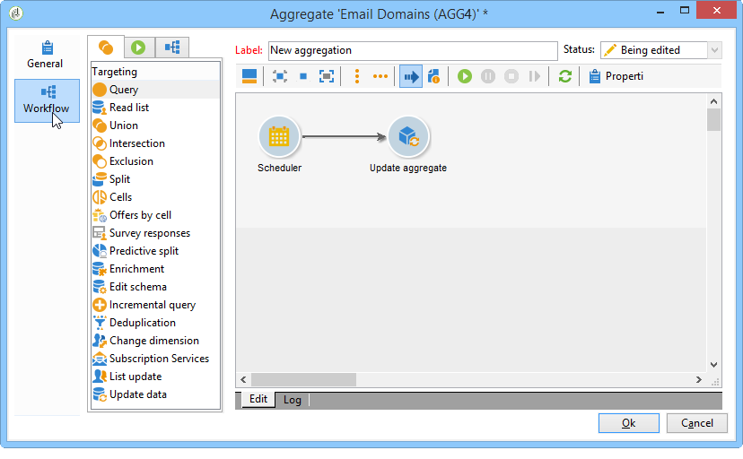

# Aggregato di aggiornamento{#update-aggregate}

Gli aggregati sono definiti a livello di cubo a scopo di reporting. È disponibile una scheda **[!UICONTROL Workflow]** durante la configurazione di un aggregato.

Gli aggregati sono utili quando si manipolano grandi volumi di dati. Vengono aggiornati automaticamente in base alle impostazioni definite nella casella del flusso di lavoro dedicato, per integrare negli indicatori i dati raccolti più di recente

Gli aggregati vengono definiti nella scheda relativa di ciascun cubo.

L&#39;attività **[!UICONTROL Update aggregate]** consente di selezionare la modalità di aggiornamento da applicare: completo o parziale.

Per impostazione predefinita, durante ogni calcolo viene eseguito un aggiornamento completo. Per abilitare un aggiornamento parziale, seleziona l’opzione pertinente e definisci le condizioni di aggiornamento.

**Buona pratica**: è possibile utilizzare un&#39;attività **[!UICONTROL Scheduler]** per specificare la frequenza degli aggiornamenti dei calcoli.

