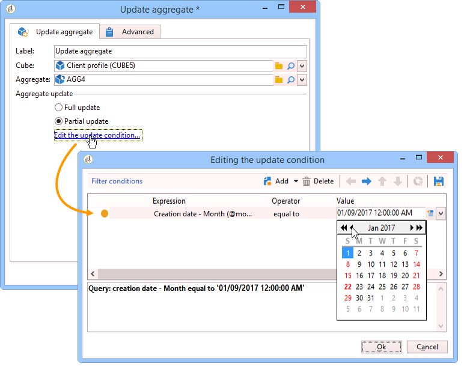

# Aggiorna aggregato{#update-aggregate}

Gli aggregati sono definiti a livello di cubo ai fini del reporting. Quando si configura un aggregato è disponibile una **[!UICONTROL Workflow]** scheda.

Per ulteriori informazioni sui cubi e sull&#39;utilizzo degli aggregati in Adobe Campaign, consulta la [sezione](../../reporting/using/concepts-and-methodology.md#calculating-and-using-aggregates)dedicata.

L&#39; **[!UICONTROL Update aggregate]** attività consente di selezionare la modalità di aggiornamento da applicare: pieno o parziale.

Per impostazione predefinita, durante ogni calcolo viene eseguito un aggiornamento completo. Per abilitare un aggiornamento parziale, selezionate l&#39;opzione pertinente e definite le condizioni di aggiornamento.

**Buona pratica**: un&#39; **[!UICONTROL Scheduler]** attività può essere utilizzata per specificare la frequenza degli aggiornamenti di calcolo.

