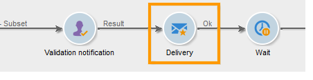

# Utilizzo dell’attività di approvazione locale{#using-the-local-approval-activity}

L’attività **[!UICONTROL Local approval]** integrata in un flusso di lavoro di targeting ti consente di impostare un processo di approvazione del destinatario prima che la consegna venga inviata.

>[!CAUTION]
>
>Per utilizzare questa funzione, è necessario acquistare il modulo Marketing distribuito , che è un’opzione Campaign. Controlla il contratto di licenza.

Per impostare questo caso d’uso, abbiamo creato il seguente flusso di lavoro di targeting:

Le fasi principali del processo di approvazione locale sono:

1. La popolazione risultante dal targeting può essere limitata grazie a un’attività di tipo **[!UICONTROL Split]** che utilizza un modello di distribuzione dati.

   

1. L’attività **[!UICONTROL Local approval]** assume quindi il controllo e invia un messaggio e-mail di notifica a ciascun supervisore locale. L’attività viene aperta finché ogni supervisore locale non approva i destinatari assegnati.

   

1. Una volta raggiunta la scadenza di approvazione, il flusso di lavoro viene riavviato. In questo esempio, viene avviata l’attività **[!UICONTROL Delivery]** e la consegna viene inviata alle destinazioni approvate.

   >[!NOTE]
   >
   >Una volta raggiunta la scadenza, i destinatari che non sono stati approvati vengono esclusi dal targeting.

   

1. Alcuni giorni dopo, la seconda attività di tipo **[!UICONTROL Local approval]** invia un messaggio e-mail di notifica a ogni supervisore locale con un riepilogo delle azioni eseguite dai contatti (clic, aperture, ecc.).

   

## Passaggio 1: Creazione del modello di distribuzione dei dati {#step-1--creating-the-data-distribution-template-}

Il modello di distribuzione dei dati ti consente di limitare la popolazione risultante dal targeting in base al raggruppamento dei dati, consentendo al contempo di assegnare ogni valore a un supervisore locale. In questo esempio, abbiamo definito il campo **[!UICONTROL Email address domain]** come campo di distribuzione e assegnato un dominio a ogni supervisore locale

Per ulteriori informazioni sulla creazione di un modello di distribuzione dei dati, consulta [Limitazione del numero di record di sottoinsiemi per distribuzione dei dati](split.md#limiting-the-number-of-subset-records-per-data-distribution).

1. Per creare il modello di distribuzione dati, vai al nodo **[!UICONTROL Resources > Campaign management > Data distribution]** e fai clic su **[!UICONTROL New]**.

   

1. Seleziona la scheda **[!UICONTROL General]**.

   

1. Inserisci i valori **[!UICONTROL Label]** e **[!UICONTROL Distribution context]**. In questo esempio, abbiamo selezionato lo schema di targeting **[!UICONTROL Recipient]** e il campo **[!UICONTROL Email domain]** come campo di distribuzione. L’elenco dei destinatari verrà suddiviso per dominio.
1. Nel campo **[!UICONTROL Distribution type]** , seleziona come il valore di limitazione del target verrà espresso nella scheda **[!UICONTROL Distribution]** . Qui abbiamo scelto **[!UICONTROL Percentage]**.
1. Nel campo **[!UICONTROL Approval storage]** , immetti lo schema di archiviazione delle approvazioni che corrispondono allo schema di targeting in uso. In questo esempio verrà utilizzato lo schema di archiviazione predefinito: **[!UICONTROL Local approval of recipients]**.
1. Quindi fai clic sul collegamento **[!UICONTROL Advanced parameters]** .

   

1. Mantieni selezionata l’opzione **[!UICONTROL Approve the targeted messages]** in modo che tutti i destinatari siano preselezionati dall’elenco dei destinatari da approvare.
1. Nel campo **[!UICONTROL Delivery label]** abbiamo lasciato l’espressione predefinita (stringa di calcolo della consegna). L’etichetta standard della consegna verrà utilizzata nella notifica di feedback.
1. Nella sezione **[!UICONTROL Grouping field]** abbiamo selezionato il campo **[!UICONTROL Gender]** come campo di raggruppamento per visualizzare i destinatari nelle notifiche di approvazione e feedback.
1. Nella sezione **[!UICONTROL Edit targeted messages]** abbiamo selezionato l&#39;applicazione Web **[!UICONTROL Edit recipients]** e il parametro **[!UICONTROL recipientId]** . Nelle notifiche di approvazione e feedback, i destinatari saranno cliccabili e indirizzeranno verso l&#39;URL dell&#39;applicazione web. Il parametro URL aggiuntivo sarà **[!UICONTROL recipientId]**.
1. Quindi fai clic sulla scheda **[!UICONTROL Distribution]** . Per ciascun dominio, immetti i campi seguenti:

   

   * **[!UICONTROL Value]**: immettere il valore del nome di dominio.
   * **[!UICONTROL Percentage / Fixed]**: per ogni dominio, immetti il valore massimo. numero di destinatari a cui desideri inviare la consegna. In questo esempio, vogliamo limitare la consegna al 10% per dominio.
   * **[!UICONTROL Label]**: immetti l’etichetta del dominio da visualizzare nelle notifiche di approvazione e feedback.
   * **[!UICONTROL Group or operator]**: seleziona l’operatore o il gruppo di operatori assegnati al dominio.

      >[!CAUTION]
      >
      >Assicurati che agli operatori siano stati assegnati i diritti appropriati.

## Passaggio 2: Creazione del flusso di lavoro di targeting {#step-2--creating-the-targeting-workflow}

Per impostare questo caso d’uso, abbiamo creato il seguente flusso di lavoro di targeting:

Sono state aggiunte le seguenti attività:

* Due attività **[!UICONTROL Query]**,
* Un&#39;attività **[!UICONTROL Intersection]**,
* Un&#39;attività **[!UICONTROL Split]**,
* Un&#39;attività **[!UICONTROL Local approval]**,
* Un&#39;attività **[!UICONTROL Delivery]**,
* Un&#39;attività **[!UICONTROL Wait]**,
* Una seconda attività **[!UICONTROL Local approval]**,
* Un’attività **[!UICONTROL End]**.

### Query, intersezione e divisione {#queries--intersection-and-split}

Il targeting a monte è costituito da due query, una intersezione e una divisione. La popolazione risultante dal targeting può essere limitata utilizzando un’attività **[!UICONTROL Split]** utilizzando un modello di distribuzione dati.

Per ulteriori informazioni sulla configurazione di un’attività di suddivisione, consulta [Dividi](split.md). La creazione di un modello di distribuzione dei dati è descritta in [Limitazione del numero di record di sottoinsiemi per distribuzione dei dati](split.md#limiting-the-number-of-subset-records-per-data-distribution).

Se non si desidera limitare la popolazione dalla query, non è necessario utilizzare le attività **[!UICONTROL Query]**, **[!UICONTROL Intersection]** e **[!UICONTROL Split]**. In questo caso, completa il modello di distribuzione dati nella prima attività **[!UICONTROL Local approval]**.

1. Nella sezione **[!UICONTROL Record count limitation]** , seleziona l’opzione **[!UICONTROL Limit the selected records]** e fai clic sul collegamento **[!UICONTROL Edit]** .

   

1. Seleziona l’opzione **[!UICONTROL Keep only the first records after sorting]** e fai clic su **[!UICONTROL Next]**.

   

1. Nella sezione **[!UICONTROL Sort columns]** , aggiungi il campo a cui viene applicato l’ordinamento. In questo caso, abbiamo scelto il campo **[!UICONTROL Email]** . Fai clic su **[!UICONTROL Next]**.

   

1. Seleziona l’opzione **[!UICONTROL By data distribution]** , seleziona il modello di distribuzione creato in precedenza (consulta [Passaggio 1: Creazione del modello di distribuzione dati](#step-1--creating-the-data-distribution-template-)) e clic su **[!UICONTROL Finish]**.

   

Nel modello di distribuzione, abbiamo scelto di limitare la popolazione al 10% per valore di raggruppamento, che coincide con i valori visualizzati nel flusso di lavoro (340 come input e 34 come output).

### Notifica di approvazione {#approval-notification}

L’attività **[!UICONTROL Local approval]** ti consente di inviare una notifica a ogni supervisore locale.

Per ulteriori informazioni sulla configurazione dell&#39;attività **[!UICONTROL Local approval]**, consulta [Approvazione locale](local-approval.md).

È necessario inserire i campi seguenti:

1. Nella sezione **[!UICONTROL Action to execute]**, seleziona l’opzione **[!UICONTROL Target approval notification]**.
1. Nella sezione **[!UICONTROL Distribution context]**, seleziona l’opzione **[!UICONTROL Specified in the transition]**.

   Se non desideri limitare la popolazione target, seleziona l’opzione **[!UICONTROL Explicit]** e immetti il modello di distribuzione creato in precedenza nel campo **[!UICONTROL Data distribution]** .

1. Nella sezione **[!UICONTROL Notification]** , seleziona il modello di consegna e l’oggetto da utilizzare per l’e-mail di notifica. In questo caso, abbiamo scelto il modello predefinito: **[!UICONTROL Local approval notification]**.
1. Nella sezione **[!UICONTROL Approval schedule]** abbiamo mantenuto la scadenza di approvazione predefinita (3 giorni) e aggiunto un promemoria. La consegna lascerà 3 giorni dopo l’inizio dell’approvazione. Una volta raggiunta la scadenza di approvazione, i destinatari che non sono stati approvati non vengono presi in considerazione dal targeting.

L&#39;e-mail di notifica inviata dall&#39;attività **[!UICONTROL Local approval]** ai supervisori locali è la seguente:

### Attività Wait {#wait}

L’attività di attesa ti consente di posticipare l’inizio della seconda attività di approvazione locale che invierà la notifica del feedback di consegna. Nel campo **[!UICONTROL Duration]** è stato immesso il valore **[!UICONTROL 5d]** (5 giorni). Le azioni eseguite dai destinatari per 5 giorni dopo l’invio della consegna saranno incluse nella notifica di feedback.

### Notifica di feedback {#feedback-notification}

La seconda attività **[!UICONTROL Local approval]** ti consente di inviare una notifica di feedback sulla consegna a ogni supervisore locale.

È necessario inserire i campi seguenti.

1. Nella sezione **[!UICONTROL Action to execute]**, scegli **[!UICONTROL Delivery feedback report]**.
1. Nella sezione **[!UICONTROL Delivery]**, scegli **[!UICONTROL Specified in the transition]**.
1. Nella sezione **[!UICONTROL Notification]** , seleziona il modello di consegna e l’oggetto da utilizzare per l’e-mail di notifica.

Una volta raggiunta la scadenza configurata nell’attività di attesa, la seconda attività di tipo **[!UICONTROL Local approval]** invia il seguente messaggio e-mail di notifica a ogni supervisore locale:

### Monitoraggio dell’approvazione da parte dell’amministratore {#approval-tracking-by-the-administrator}

Ogni volta che viene avviata l&#39;attività di approvazione locale, viene creata un&#39;attività di approvazione. L&#39;amministratore può controllare ciascuna di queste attività di approvazione.

Vai al flusso di lavoro di targeting della campagna e fai clic sulla scheda **[!UICONTROL Local approval tasks]** .

È inoltre possibile accedere all’elenco delle attività di approvazione locale tramite la scheda **[!UICONTROL Approval tasks]** del modello di distribuzione dei dati.

Selezionare l&#39;attività da monitorare e fare clic sul pulsante **[!UICONTROL Detail]**. La scheda **[!UICONTROL General]** dell’attività di approvazione locale consente di visualizzare informazioni sull’attività. Se necessario, puoi modificare l’approvazione e le date del promemoria.

Questa scheda mostra le seguenti informazioni:

* l’etichetta dell’attività e il relativo ID
* il modello di distribuzione utilizzato
* il numero di messaggi di destinazione
* il flusso di lavoro e la campagna collegati
* la pianificazione delle attività

La scheda **[!UICONTROL Distribution]** dell’attività ti consente di visualizzare i registri di approvazione, il loro stato, il numero di messaggi interessati, la data di approvazione e l’operatore che ha approvato la consegna.

Seleziona un registro di approvazione e fai clic sul pulsante **[!UICONTROL Detail]** per visualizzare ulteriori informazioni. La scheda **[!UICONTROL General]** del registro di approvazione locale consente di visualizzare le informazioni generali sul registro. È inoltre possibile modificare lo stato di approvazione.

Questa scheda mostra le seguenti informazioni:

* attività di approvazione collegata
* lo stato di approvazione (**[!UICONTROL Approved]** o **[!UICONTROL Pending]**)
* il modello di distribuzione utilizzato
* l&#39;autorità di vigilanza locale che ha approvato e la data di approvazione
* il numero di messaggi oggetto di targeting e approvati

La scheda **[!UICONTROL Targeted]** del registro di approvazione visualizza l’elenco dei destinatari con il relativo stato di approvazione. Se necessario, puoi modificare questo stato.

