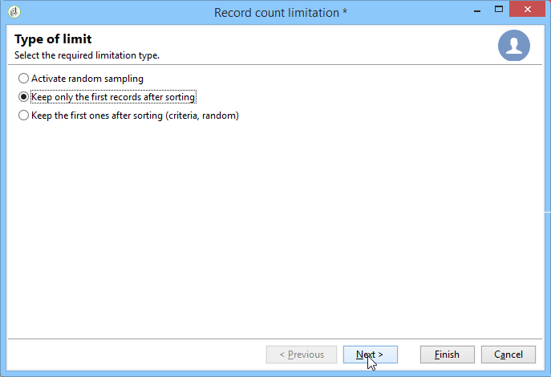
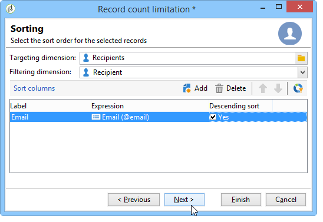
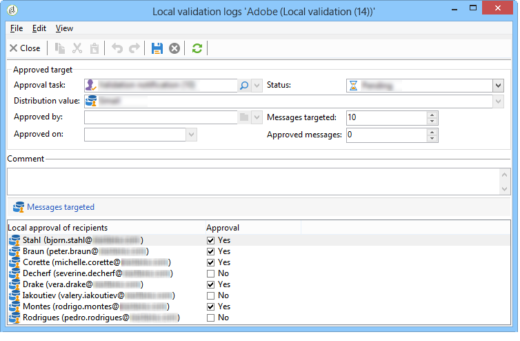

# Utilizzo dell’attività di approvazione locale{#using-the-local-approval-activity}

L&#39;attività **[!UICONTROL Local approval]** integrata in un flusso di lavoro di targeting consente di impostare un processo di approvazione del destinatario prima dell&#39;invio.

>[!CAUTION]
>
>Per utilizzare questa funzione, è necessario acquistare il modulo Distributed Marketing, che è un&#39;opzione Campaign. Controlla il contratto di licenza.

Per impostare questo caso di utilizzo, abbiamo creato il seguente flusso di lavoro di targeting:

Le fasi principali del processo di approvazione locale sono:

1. La popolazione risultante dal targeting può essere limitata grazie a un&#39;attività di tipo **[!UICONTROL Split]** che utilizza un modello di distribuzione dei dati.

   

1. L&#39;attività **[!UICONTROL Local approval]** prende il sopravvento e invia un&#39;e-mail di notifica a ciascun supervisore locale. L&#39;attività viene interrotta finché ogni supervisore locale non approva i destinatari assegnati.

   

1. Una volta raggiunta la scadenza di approvazione, il flusso di lavoro viene riavviato. In questo esempio, l&#39;attività **[!UICONTROL Delivery]** inizia e la consegna viene inviata alle destinazioni approvate.

   >[!NOTE]
   >
   >Una volta raggiunta la scadenza, i destinatari che non sono stati approvati vengono esclusi dal targeting.

   

1. Alcuni giorni dopo, la seconda attività di tipo **[!UICONTROL Local approval]** invia un messaggio e-mail di notifica a ogni supervisore locale con un riepilogo delle azioni eseguite dai contatti (clic, aperture, ecc.).

   

## Passaggio 1: Creazione del modello di distribuzione dei dati {#step-1--creating-the-data-distribution-template-}

Il modello di distribuzione dei dati consente di limitare la popolazione risultante dal targeting in base al raggruppamento dei dati, consentendo al contempo di assegnare ogni valore a un supervisore locale. In questo esempio, abbiamo definito il campo **[!UICONTROL Email address domain]** come campo di distribuzione e assegnato un dominio a ogni supervisore locale

Per ulteriori informazioni sulla creazione di un modello di distribuzione dei dati, fare riferimento a [Limitazione del numero di record di sottoinsiemi per distribuzione dei dati](../../workflow/using/split.md#limiting-the-number-of-subset-records-per-data-distribution).

1. Per creare il modello di distribuzione dei dati, passare al nodo **[!UICONTROL Resources > Campaign management > Data distribution]** e fare clic su **[!UICONTROL New]**.

   

1. Seleziona la scheda **[!UICONTROL General]**.

   

1. Immettere **[!UICONTROL Label]** e **[!UICONTROL Distribution context]**. In questo esempio, abbiamo selezionato lo schema di targeting **[!UICONTROL Recipient]** e il campo **[!UICONTROL Email domain]** come campo di distribuzione. L&#39;elenco dei destinatari sarà suddiviso per dominio.
1. Nel campo **[!UICONTROL Distribution type]**, selezionare il modo in cui il valore di limitazione della destinazione verrà espresso nella scheda **[!UICONTROL Distribution]**. Qui abbiamo scelto **[!UICONTROL Percentage]**.
1. Nel campo **[!UICONTROL Approval storage]**, immettere lo schema di memorizzazione delle approvazioni che corrispondono allo schema di targeting in uso. Qui si utilizza lo schema di memorizzazione predefinito: **[!UICONTROL Local approval of recipients]**.
1. Fate clic sul collegamento **[!UICONTROL Advanced parameters]**.

   

1. Tenere l&#39;opzione **[!UICONTROL Approve the targeted messages]** selezionata in modo che tutti i destinatari siano preselezionati dall&#39;elenco dei destinatari da approvare.
1. Nel campo **[!UICONTROL Delivery label]**, abbiamo lasciato l&#39;espressione predefinita (stringa di calcolo del recapito). L&#39;etichetta standard della consegna verrà utilizzata nella notifica di feedback.
1. Nella sezione **[!UICONTROL Grouping field]**, abbiamo selezionato il campo **[!UICONTROL Gender]** come campo di raggruppamento per visualizzare i destinatari nelle notifiche di approvazione e feedback.
1. Nella sezione **[!UICONTROL Edit targeted messages]**, abbiamo selezionato l&#39;applicazione Web **[!UICONTROL Edit recipients]** e il parametro **[!UICONTROL recipientId]**. Nelle notifiche di approvazione e feedback, i destinatari potranno fare clic e indirizzare l’URL dell’applicazione Web. Il parametro URL aggiuntivo sarà **[!UICONTROL recipientId]**.
1. Fate clic sulla scheda **[!UICONTROL Distribution]**. Per ciascun dominio, immettete i campi seguenti:

   

   * **[!UICONTROL Value]**: immettere il valore del nome di dominio.
   * **[!UICONTROL Percentage / Fixed]**: per ciascun dominio, immettete il valore massimo. il numero di destinatari a cui si desidera inviare la consegna. In questo esempio, vogliamo limitare la consegna al 10% per dominio.
   * **[!UICONTROL Label]**: immettete l’etichetta del dominio da visualizzare nelle notifiche di approvazione e feedback.
   * **[!UICONTROL Group or operator]**: selezionare l&#39;operatore o il gruppo di operatori assegnati al dominio.

      >[!CAUTION]
      >
      >Accertatevi che agli operatori siano stati assegnati i diritti appropriati.

## Passaggio 2: Creazione del flusso di lavoro di targeting {#step-2--creating-the-targeting-workflow}

Per impostare questo caso di utilizzo, abbiamo creato il seguente flusso di lavoro di targeting:

Sono state aggiunte le seguenti attività:

* Due attività **[!UICONTROL Query]**,
* Una **[!UICONTROL Intersection]** attività,
* Una **[!UICONTROL Split]** attività,
* Una **[!UICONTROL Local approval]** attività,
* Una **[!UICONTROL Delivery]** attività,
* Una **[!UICONTROL Wait]** attività,
* Una seconda attività **[!UICONTROL Local approval]**,
* Un&#39;attività **[!UICONTROL End]**.

### Query, intersezione e divisione {#queries--intersection-and-split}

Il targeting upstream è composto da due query, una intersezione e una divisione. La popolazione risultante dal targeting può essere limitata utilizzando un&#39;attività **[!UICONTROL Split]** utilizzando un modello di distribuzione dei dati.

Per ulteriori informazioni sulla configurazione di un&#39;attività divisa, vedere [Split](../../workflow/using/split.md). La creazione di un modello di distribuzione dei dati è dettagliata in [Limitazione del numero di record di sottoinsiemi per distribuzione dei dati](../../workflow/using/split.md#limiting-the-number-of-subset-records-per-data-distribution).

Se non si desidera limitare la popolazione dalla query, non è necessario utilizzare le attività **[!UICONTROL Query]**, **[!UICONTROL Intersection]** e **[!UICONTROL Split]**. In questo caso, completa il modello di distribuzione dei dati nella prima attività **[!UICONTROL Local approval]**.

1. Nella sezione **[!UICONTROL Record count limitation]**, selezionare l&#39;opzione **[!UICONTROL Limit the selected records]** e fare clic sul collegamento **[!UICONTROL Edit]**.

   

1. Selezionare l&#39;opzione **[!UICONTROL Keep only the first records after sorting]** e fare clic su **[!UICONTROL Next]**.

   

1. Nella sezione **[!UICONTROL Sort columns]**, aggiungere il campo a cui viene applicato l&#39;ordinamento. Qui abbiamo scelto il campo **[!UICONTROL Email]**. Fai clic su **[!UICONTROL Next]**.

   

1. Selezionare l&#39;opzione **[!UICONTROL By data distribution]**, selezionare il modello di distribuzione creato in precedenza (fare riferimento a [Passaggio 1: Creazione del modello di distribuzione dei dati](#step-1--creating-the-data-distribution-template-)) e fare clic su **[!UICONTROL Finish]**.

   

Nel modello di distribuzione, abbiamo scelto di limitare la popolazione al 10% per valore di raggruppamento, che coincide con i valori visualizzati nel flusso di lavoro (340 come input e 34 come output).

### Notifica di approvazione {#approval-notification}

L&#39;attività **[!UICONTROL Local approval]** consente di inviare una notifica a ogni supervisore locale.

Per ulteriori informazioni sulla configurazione dell&#39;attività **[!UICONTROL Local approval]**, fare riferimento a [Approvazione locale](../../workflow/using/local-approval.md).

È necessario inserire i campi seguenti:

1. Nella sezione **[!UICONTROL Action to execute]**, seleziona l’opzione **[!UICONTROL Target approval notification]**.
1. Nella sezione **[!UICONTROL Distribution context]**, seleziona l’opzione **[!UICONTROL Specified in the transition]**.

   Se non si desidera limitare la popolazione di destinazione, selezionare l&#39;opzione **[!UICONTROL Explicit]** qui e immettere il modello di distribuzione creato in precedenza nel campo **[!UICONTROL Data distribution]**.

1. Nella sezione **[!UICONTROL Notification]**, selezionate il modello di consegna e l&#39;oggetto da utilizzare per l&#39;e-mail di notifica. Qui è stato scelto il modello predefinito: **[!UICONTROL Local approval notification]**.
1. Nella sezione **[!UICONTROL Approval schedule]**, abbiamo mantenuto la scadenza di approvazione predefinita (3 giorni) e aggiunto un promemoria. La consegna partirà 3 giorni dopo l&#39;inizio dell&#39;approvazione. Una volta raggiunta la scadenza di approvazione, i destinatari che non sono stati approvati non vengono presi in considerazione dal targeting.

L&#39;e-mail di notifica inviata dall&#39;attività **[!UICONTROL Local approval]** ai supervisori locali è la seguente:

### Wait {#wait}

L&#39;attività di attesa consente di posticipare l&#39;inizio della seconda attività di approvazione locale che invierà la notifica di feedback sulla consegna. Nel campo **[!UICONTROL Duration]**, è stato immesso il valore **[!UICONTROL 5d]** (5 giorni). Le azioni eseguite dai destinatari per 5 giorni dopo l&#39;invio della consegna saranno incluse nella notifica di feedback.

### Notifica di feedback {#feedback-notification}

La seconda **[!UICONTROL Local approval]** attività consente di inviare una notifica di feedback per la consegna a ogni supervisore locale.

È necessario inserire i campi seguenti.

1. Nella sezione **[!UICONTROL Action to execute]**, scegliere **[!UICONTROL Delivery feedback report]**.
1. Nella sezione **[!UICONTROL Delivery]**, scegliere **[!UICONTROL Specified in the transition]**.
1. Nella sezione **[!UICONTROL Notification]**, selezionate il modello di consegna e l&#39;oggetto da utilizzare per l&#39;e-mail di notifica.

Una volta raggiunta la scadenza configurata nell&#39;attività di attesa, la seconda attività di tipo **[!UICONTROL Local approval]** invia il seguente messaggio e-mail di notifica a ogni supervisore locale:

### Tracciamento approvazione da parte dell&#39;amministratore {#approval-tracking-by-the-administrator}

Ogni volta che viene avviata l&#39;attività di approvazione locale, viene creata un&#39;attività di approvazione. L’amministratore può controllare ciascuna di queste attività di approvazione.

Andate al flusso di lavoro di targeting della campagna e fate clic sulla scheda **[!UICONTROL Local approval tasks]**.

È inoltre possibile accedere all&#39;elenco delle attività di approvazione locale tramite la scheda **[!UICONTROL Approval tasks]** del modello di distribuzione dei dati.

Selezionare l&#39;attività da monitorare e fare clic sul pulsante **[!UICONTROL Detail]**. La scheda **[!UICONTROL General]** dell&#39;attività di approvazione locale consente di visualizzare informazioni sull&#39;attività. Se necessario, puoi modificare l&#39;approvazione e le date del promemoria.

Questa scheda mostra le informazioni seguenti:

* l’etichetta dell’attività e il relativo ID
* il modello di distribuzione utilizzato
* il numero di messaggi con targeting
* il flusso di lavoro e la campagna collegati
* la programmazione delle attività

La scheda **[!UICONTROL Distribution]** dell&#39;attività consente di visualizzare i registri di approvazione, il relativo stato, il numero di messaggi di destinazione, la data di approvazione e l&#39;operatore che ha approvato la consegna.

Selezionate un registro di approvazione e fate clic sul pulsante **[!UICONTROL Detail]** per visualizzare ulteriori informazioni. La scheda **[!UICONTROL General]** del registro di approvazione locale consente di visualizzare informazioni generali sul registro. Potete inoltre modificare lo stato di approvazione.

Questa scheda mostra le informazioni seguenti:

* l&#39;attività di approvazione collegata
* lo stato di approvazione (**[!UICONTROL Approved]** o **[!UICONTROL Pending]**)
* il modello di distribuzione utilizzato
* l&#39;autorità di vigilanza locale che ha approvato e la data di approvazione
* il numero di messaggi mirati e approvati

Nella scheda **[!UICONTROL Targeted]** del registro di approvazione viene visualizzato l&#39;elenco dei destinatari e il relativo stato di approvazione. Se necessario, potete modificare questo stato.

